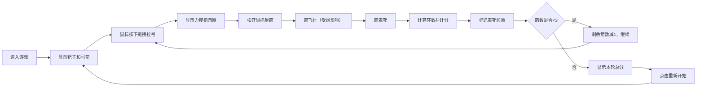

## 1. 产品概述

蒙古族传统射箭"萨仁靶"模拟游戏，让用户体验蒙古族传统射箭文化。通过鼠标拖拽弓弦的操作方式，模拟真实射箭的力度和方向感，结合风向系统增加游戏趣味性和挑战性。

- 主要目的：模拟蒙古族传统射箭运动，传承民族文化，提供有趣的休闲娱乐体验
- 目标用户：对射箭运动、民族文化感兴趣的休闲游戏玩家
- 产品价值：将传统射箭运动数字化，让更多人了解和体验蒙古族"萨仁靶"射箭文化

## 2. 核心功能

### 2.1 用户角色

| 角色 | 注册方式 | 核心权限 |
|------|----------|----------|
| 玩家 | 无需注册 | 进行射箭游戏、查看分数、重新开始 |

### 2.2 功能模块

1. **游戏主界面**：Canvas游戏画布、靶子渲染、弓箭渲染
2. **射箭操作系统**：鼠标拖拽拉弓、力度计算、射箭物理模拟
3. **风向系统**：随机风向和风速显示、风向对箭轨迹的影响
4. **计分系统**：按环数计分、每箭着靶位置标记、本轮总分统计
5. **轮次管理**：每轮3箭、轮次切换、游戏重置

### 2.3 页面详情

| 页面名称 | 模块名称 | 功能描述 |
|----------|----------|----------|
| 游戏主页面 | 游戏画布 | 渲染靶子、弓箭、箭飞行轨迹、着靶位置 |
| 游戏主页面 | 风向显示 | 显示当前风向箭头和风速数值 |
| 游戏主页面 | 力度指示器 | 显示当前拉弓力度 |
| 游戏主页面 | 计分板 | 显示每箭得分、本轮总分、剩余箭数 |
| 游戏主页面 | 操作按钮 | 重新开始游戏按钮 |

## 3. 核心流程

用户进入游戏后，看到彩色五环靶子和弓箭。按住鼠标左键拖拽弓弦向后拉，拉弓距离决定射箭力度。松开鼠标后箭射出，受风向影响产生左右偏移。箭射中靶子后，根据着靶环数计分并标记位置。每轮3箭，完成后显示本轮总分，可点击重新开始。

## 4. 用户界面设计

### 4.1 设计风格

- 设计理念：蒙古族传统风格与现代游戏美学结合，采用民族特色配色
- 主色调：深蓝色（蒙古蓝天）、金色（尊贵）、红色（热情）
- 辅助色：白色、绿色、黄色（对应靶环颜色）
- 背景：渐变的蒙古草原风格背景，带有传统祥云纹理
- 字体：采用具有民族特色的衬线字体，标题使用粗体装饰性字体
- 按钮风格：圆角矩形，带有传统纹饰边框，悬停时有金色光效

### 4.2 页面设计概述

| 页面名称 | 模块名称 | UI元素 |
|----------|----------|--------|
| 游戏主页面 | 游戏画布 | 居中显示的五环彩色靶子，左侧为弓和箭，射箭后显示飞行轨迹和着靶点 |
| 游戏主页面 | 风向显示 | 右上角显示风向箭头图标 + 风速数值（m/s），箭头方向随风向旋转 |
| 游戏主页面 | 力度指示器 | 左侧垂直进度条，拉弓时从下往上填充，颜色从绿到红渐变 |
| 游戏主页面 | 计分板 | 右下角显示三箭得分和总分，已射箭显示对应环数颜色 |
| 游戏主页面 | 重新开始 | 左下角按钮，带有传统花纹装饰 |

### 4.3 响应式

- 采用桌面端优先设计，游戏画布居中显示
- 支持窗口大小变化时自动调整画布尺寸
- 移动端可触摸操作，但主要针对桌面端鼠标操作优化

### 4.4 视觉动效

- 拉弓时弓弦有弹性形变效果
- 箭飞行时有拖尾轨迹
- 着靶时有命中动画和分数弹出效果
- 风向箭头有轻微摆动动画
- 计分数字更新时有跳动动画
