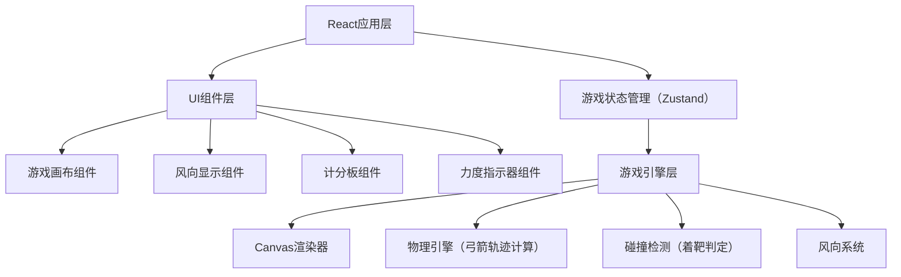

## 1. 架构设计

本游戏为纯前端单页应用，采用React + TypeScript技术栈，使用Canvas进行游戏画面渲染，无需后端服务。



## 2. 技术描述

- 前端框架：React 18 + TypeScript
- 构建工具：Vite 5
- 样式方案：TailwindCSS 3
- 状态管理：Zustand
- 渲染技术：HTML5 Canvas 2D
- 图标库：Lucide React
- 初始化工具：vite-init

## 3. 路由定义

| 路由 | 用途 |
|------|------|
| / | 游戏主页面 |

## 4. 数据模型

### 4.1 游戏状态类型定义

```typescript
interface GameState {
  // 游戏状态
  currentRound: number;
  arrowsRemaining: number;
  scores: number[];
  totalScore: number;
  
  // 弓箭状态
  isDrawing: boolean;
  drawStrength: number;
  drawStartX: number;
  drawStartY: number;
  
  // 箭状态
  arrows: Arrow[];
  
  // 风向状态
  windDirection: number; // 角度，0为右，90为上，180为左，270为下
  windSpeed: number; // m/s
  
  // 靶子配置
  targetConfig: TargetConfig;
}

interface Arrow {
  id: number;
  x: number;
  y: number;
  vx: number;
  vy: number;
  active: boolean;
  score: number;
  hitPosition: { x: number; y: number } | null;
}

interface TargetConfig {
  centerX: number;
  centerY: number;
  rings: Ring[];
}

interface Ring {
  color: string;
  radius: number;
  score: number;
  name: string;
}
```

### 4.2 靶子配置

| 环名 | 颜色 | 半径（相对） | 得分 |
|------|------|-------------|------|
| 白环 | #FFFFFF | 100% | 2分 |
| 绿环 | #22C55E | 80% | 4分 |
| 蓝环 | #3B82F6 | 60% | 6分 |
| 黄环 | #EAB308 | 40% | 8分 |
| 红心 | #EF4444 | 20% | 10分 |
