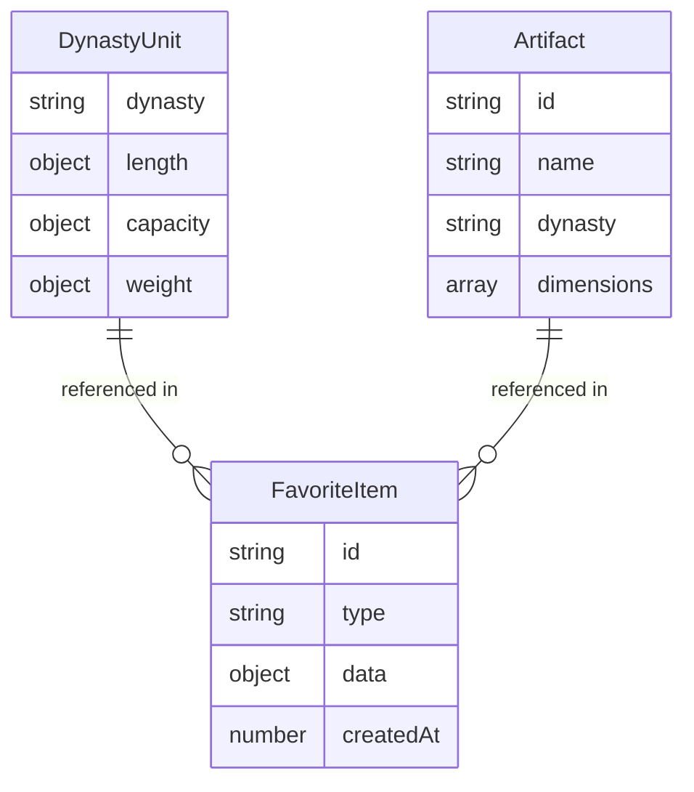

## 1. 架构设计

```mermaid
flowchart TB
    "前端 React SPA" --> "度量衡数据模块"
    "前端 React SPA" --> "器物数据模块"
    "前端 React SPA" --> "收藏模块(LocalStorage)"
    "度量衡数据模块" --> "静态JSON数据"
    "器物数据模块" --> "静态JSON数据"
    "收藏模块(LocalStorage)" --> "浏览器 LocalStorage"
```

纯前端单页应用，无需后端服务。所有度量衡与器物数据以内置JSON形式提供，收藏功能使用浏览器LocalStorage持久化。

## 2. 技术说明

- **前端**: React@18 + TailwindCSS@3 + Vite
- **初始化工具**: Vite (npm create vite@latest)
- **后端**: 无
- **数据库**: 无，使用内置静态数据 + LocalStorage

## 3. 路由定义

| 路由 | 用途 |
|------|------|
| / | 度量衡对照表页，展示历代度量衡单位对照数据与直观对比图 |
| /convert | 单位换算工具页，输入数值和单位进行跨朝代换算 |
| /artifact | 器物尺寸推定页，选择器物查看典型尺寸并反向推算古代单位值 |

## 4. API定义

无后端API。所有数据为前端静态数据。

### 4.1 数据接口定义（TypeScript类型）

```typescript
interface DynastyUnit {
  dynasty: string;
  length: { chi: number; cun: number; zhang: number };
  capacity: { sheng: number; dou: number; hu: number };
  weight: { jin: number; liang: number; zhu: number | null };
}

interface Artifact {
  id: string;
  name: string;
  dynasty: string;
  dimensions: {
    label: string;
    min: number;
    max: number;
    unit: string;
  }[];
}

interface ConversionResult {
  input: { value: number; unit: string; dynasty: string };
  modernValue: { value: number; unit: string };
  targets: { dynasty: string; value: number; unit: string }[];
}

interface FavoriteItem {
  id: string;
  type: 'conversion' | 'artifact';
  data: ConversionResult | ArtifactEstimation;
  createdAt: number;
}

interface ArtifactEstimation {
  artifact: Artifact;
  adjustedDimensions: { label: string; value: number; unit: string }[];
  dynastyValues: { dynasty: string; unit: string; values: { label: string; value: number }[] }[];
}
```

## 5. 数据模型

### 5.1 数据模型图



### 5.2 数据文件

度量衡数据与器物数据以TypeScript常量形式内置于代码中，收藏数据存储于LocalStorage。

**度量衡数据**: 7个朝代（周、秦、汉、唐、宋、明、清）×3个类别（长度、容量、重量）的换算系数

**器物数据**: 6种典型器物的考古尺寸范围数据

## 6. 项目结构

```
src/
├── App.tsx                 # 主应用，路由与布局
├── main.tsx                # 入口文件
├── data/
│   ├── dynastyUnits.ts     # 历代度量衡换算系数数据
│   └── artifacts.ts        # 器物考古尺寸数据
├── components/
│   ├── Navigation.tsx      # 顶部导航栏
│   ├── DynastyTimeline.tsx # 朝代时间轴组件
│   ├── ComparisonTable.tsx # 度量衡对照表
│   ├── ComparisonChart.tsx # 直观对比条形图
│   ├── UnitConverter.tsx   # 单位换算工具
│   ├── ConversionResult.tsx# 换算结果展示
│   ├── ArtifactSelector.tsx# 器物选择器
│   ├── ArtifactDetail.tsx  # 器物尺寸详情与调节
│   ├── ReverseCalculation.tsx # 反向推算结果
│   └── FavoritesPanel.tsx  # 收藏面板
├── hooks/
│   ├── useConversion.ts    # 换算逻辑Hook
│   └── useFavorites.ts     # 收藏功能Hook
├── types/
│   └── index.ts            # TypeScript类型定义
└── index.css               # 全局样式与Tailwind
```
