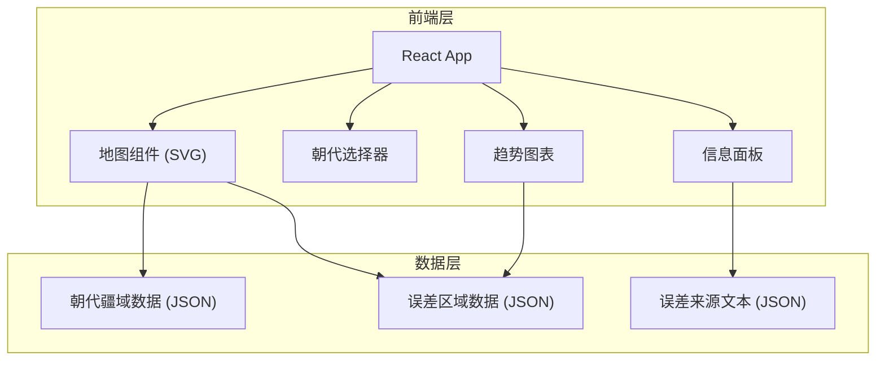

## 1. 架构设计



## 2. 技术说明

- **前端**：React@18 + Tailwind CSS@3 + Vite
- **初始化工具**：Vite (react-ts 模板)
- **地图渲染**：纯 SVG 路径绘制，不依赖第三方地图库
- **图表**：CSS + SVG 手绘柱状图（无需第三方图表库）
- **后端**：无，全部前端静态数据
- **数据库**：无，使用内嵌 JSON 数据

## 3. 路由定义

| 路由 | 用途 |
|------|------|
| / | 主页面，包含地图视图与信息面板 |

## 4. 数据模型

### 4.1 朝代数据结构

```typescript
interface DynastyData {
  id: string;
  name: string;
  period: string;
  mapName: string;
  cartographer: string;
  mapYear: string;
  territoryPaths: string[];
  errorPaths: string[];
  errorLevel: number;
  errorSources: ErrorSource[];
}

interface ErrorSource {
  type: string;
  title: string;
  description: string;
  severity: number;
  icon: string;
}

interface ErrorTrend {
  dynastyId: string;
  dynastyName: string;
  overallError: number;
  scaleError: number;
  directionError: number;
  mythologyError: number;
}
```

### 4.2 各朝代核心数据

**唐代（《海内华夷图》，贾耽，801年）**
- 误差等级：高（3/5）
- 比例尺失调：西北地区疆域过度夸张，西域面积偏大
- 方向偏差：东西方向基本准确，南北方向有压缩
- 山海经影响：保留部分传说地理（如昆仑山西侧虚构区域）

**宋代（《禹迹图》，1136年刻石）**
- 误差等级：中高（2.5/5）
- 比例尺失调：已有网格方格，但边远地区比例仍失调
- 方向偏差：海岸线形状有明显偏差，山东半岛过于方正
- 山海经影响：大幅减少，但仍保留部分河流源头传说

**元代（《大元一统志》附图，1286年后）**
- 误差等级：中（2/5）
- 比例尺失调：因蒙古帝国实测，内地比例大幅改善
- 方向偏差：西北方向准确性显著提升，但南方仍偏移
- 山海经影响：大幅消退，以实地测量替代传说

**明代（《广舆图》，罗洪先，1555年）**
- 误差等级：中低（1.5/5）
- 比例尺失调：采用计里画方，全国比例较为统一
- 方向偏差：海岸线仍有偏差，但整体方向大幅改善
- 山海经影响：基本消除，转为实测为主
