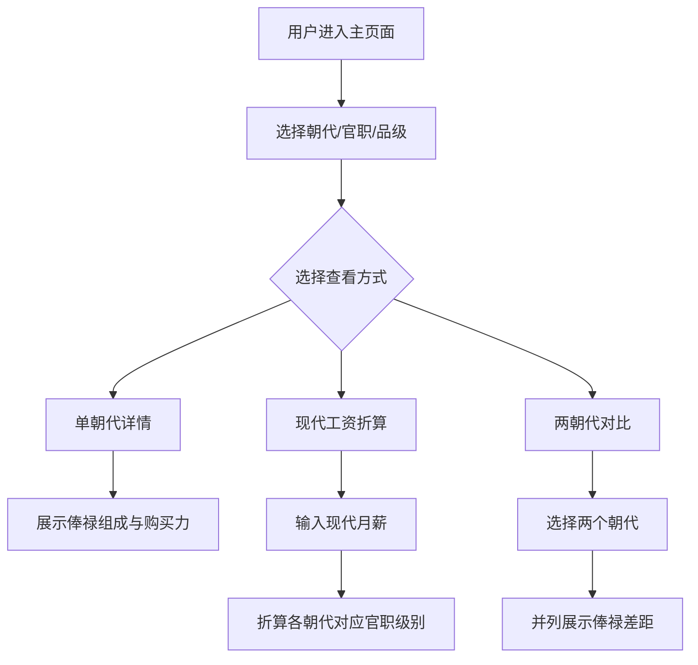

## 1. 产品概述

历代职官品秩与俸禄购买力对比系统，旨在将中国历史上六大朝代（汉、唐、宋、元、明、清）的官职体系与俸禄制度以可视化、交互式的方式呈现。用户可选择官职或品级，查看其在不同朝代的俸禄组成与实际购买力，并通过输入现代工资进行跨时代购买力折算。

- 目标用户：历史爱好者、学术研究者、教育工作者及对中国古代官制感兴趣的大众用户
- 核心价值：以直观方式理解古代俸禄的实际经济价值，打破"数字即购买力"的认知误区

## 2. 核心功能

### 2.1 用户角色

| 角色 | 注册方式 | 核心权限 |
|------|----------|----------|
| 普通访客 | 无需注册 | 浏览全部功能 |

### 2.2 功能模块

1. **主页面**：朝代时间轴导航、官职/品级选择器、俸禄详情展示、现代工资折算、朝代对比

### 2.3 页面详情

| 页面名称 | 模块名称 | 功能描述 |
|----------|----------|----------|
| 主页面 | 朝代时间轴 | 横向展示汉→唐→宋→元→明→清时间轴，点击切换朝代，高亮当前选中朝代 |
| 主页面 | 官职/品级选择器 | 支持按官职名称（如县令、尚书）或品级（如五品）筛选，下拉选择 |
| 主页面 | 俸禄详情面板 | 展示选中官职在指定朝代的俸禄组成（钱/粮/田/职田），以堆叠柱状图+数据卡片形式呈现 |
| 主页面 | 购买力折算 | 用户输入现代月薪，系统以米价为基准折算各朝代同等购买力的官职级别 |
| 主页面 | 朝代对比 | 选择两个朝代，对比同一官职的俸禄差距，以雷达图或并列柱状图呈现 |

## 3. 核心流程

**流程一：查看某官职在各朝代俸禄**
用户点击时间轴选择朝代 → 选择官职名称或品级 → 系统展示该朝代下该官职的俸禄组成详情（钱、粮、田、职田）及米价折算购买力

**流程二：现代工资折算**
用户在折算区输入现代月薪 → 系统以米价为基准，将现代工资折算为各朝代同等购买力 → 显示各朝代对应官职级别

**流程三：朝代俸禄对比**
用户选择两个朝代和一个官职 → 系统以并列对比方式展示两朝代该官职的俸禄差距 → 包含绝对差值和百分比差异

## 4. 用户界面设计

### 4.1 设计风格

- **主色调**：以古铜色（#8B6914）与墨色（#2C2C2C）为主，搭配宣纸色（#F5F0E8）背景，营造古韵氛围
- **辅色调**：朱砂红（#C73E3A）作为强调色，靛蓝（#2B5B84）作为信息色
- **按钮风格**：圆角矩形，hover时产生古卷轴展开动效
- **字体**：标题使用"思源宋体"（Noto Serif SC），正文使用"霞鹜文楷"（LXGW WenKai），数字使用"DM Serif Display"
- **布局风格**：单页面纵向滚动布局，顶部固定时间轴导航
- **图标风格**：使用古风线条图标，配合水墨晕染效果

### 4.2 页面设计概述

| 页面名称 | 模块名称 | UI元素 |
|----------|----------|--------|
| 主页面 | 朝代时间轴 | 横向时间轴线条，朝代节点为圆形印章样式，选中态有朱砂红光晕动画 |
| 主页面 | 官职/品级选择器 | 双模式切换Tab（官职/品级），下拉选择器带毛笔字效果 |
| 主页面 | 俸禄详情面板 | 堆叠柱状图（Chart.js）+ 四宫格数据卡片（钱/粮/田/职田），背景为淡墨山水纹理 |
| 主页面 | 购买力折算 | 输入框（月薪资）+ 六朝代横向条形图结果展示，每个朝代一张"委任状"样式卡片 |
| 主页面 | 朝代对比 | 左右双栏布局，雷达图对比+数据差异高亮，差异值用朱砂红标注 |

### 4.3 响应式设计

- 桌面优先设计（1920×1080基准）
- 平板端：时间轴可横向滚动，对比面板改为上下排列
- 移动端：时间轴改为下拉选择，卡片单列堆叠

### 4.4 动画效果

- 时间轴切换：朝代节点切换时带墨迹晕染过渡动画
- 数据面板：数值变化时有计数器滚动效果
- 卡片出现：带毛笔书写式渐入动画
- 图表：带渐进式绘制动画
