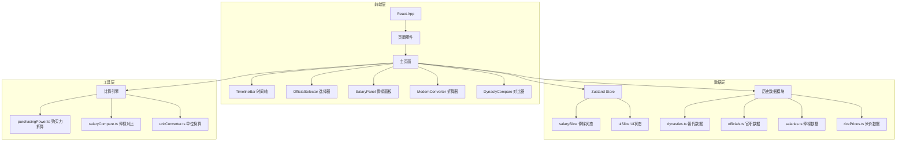

## 1. 架构设计



## 2. 技术说明

- **前端**：React@18 + TypeScript + Tailwind CSS@3 + Vite
- **初始化工具**：vite-init
- **后端**：无（纯前端项目，数据为静态历史数据）
- **数据库**：无（使用静态 TypeScript 数据文件）
- **图表库**：Chart.js + react-chartjs-2
- **状态管理**：Zustand

## 3. 路由定义

| 路由 | 用途 |
|------|------|
| / | 主页面，包含所有功能模块 |

## 4. 数据模型

### 4.1 核心数据结构

```typescript
interface Dynasty {
  id: string;
  name: string;
  period: string;
  yearRange: [number, number];
}

interface OfficialTitle {
  id: string;
  name: string;
  category: string;
  defaultRank: Record<string, number>;
}

interface SalaryComposition {
  money: number;
  moneyUnit: string;
  grain: number;
  grainUnit: string;
  land: number;
  landUnit: string;
  officeLand: number;
  officeLandUnit: string;
}

interface SalaryRecord {
  dynastyId: string;
  officialId: string;
  rank: number;
  salary: SalaryComposition;
  note: string;
}

interface RicePrice {
  dynastyId: string;
  pricePerShi: number;
  currencyUnit: string;
}

interface PurchasingPowerResult {
  dynastyId: string;
  equivalentRank: number;
  equivalentTitle: string;
  equivalentSalary: string;
  riceQuantity: number;
}
```

### 4.2 数据来源说明

- 汉代俸禄以"石"为单位，参考《汉书·百官公卿表》
- 唐代俸禄参考《新唐书·食货志》，含禄米、职分田、俸钱
- 宋代俸禄参考《宋史·职官志》，含俸钱、添支、职田
- 元代俸禄参考《元史·食货志》，以锭/两为单位
- 明代俸禄参考《明史·食货志》，以石为本位
- 清代俸禄参考《清史稿·食货志》，含正俸、养廉银

## 5. 项目结构

```
src/
├── components/
│   ├── TimelineBar.tsx          # 朝代时间轴
│   ├── OfficialSelector.tsx     # 官职/品级选择器
│   ├── SalaryPanel.tsx          # 俸禄详情面板
│   ├── SalaryChart.tsx          # 俸禄图表组件
│   ├── ModernConverter.tsx      # 现代工资折算
│   ├── DynastyCompare.tsx       # 朝代对比
│   ├── CompareChart.tsx         # 对比图表组件
│   └── RicePriceCard.tsx        # 米价购买力卡片
├── pages/
│   └── Home.tsx                 # 主页面
├── store/
│   └── useAppStore.ts           # Zustand全局状态
├── data/
│   ├── dynasties.ts             # 朝代基本信息
│   ├── officials.ts             # 官职与品级映射
│   ├── salaries.ts              # 各朝代俸禄数据
│   └── ricePrices.ts            # 各朝代米价数据
├── utils/
│   ├── purchasingPower.ts       # 购买力折算引擎
│   ├── salaryCompare.ts         # 俸禄对比计算
│   └── unitConverter.ts         # 古今单位换算
├── types/
│   └── index.ts                 # TypeScript类型定义
├── App.tsx
└── main.tsx
```
