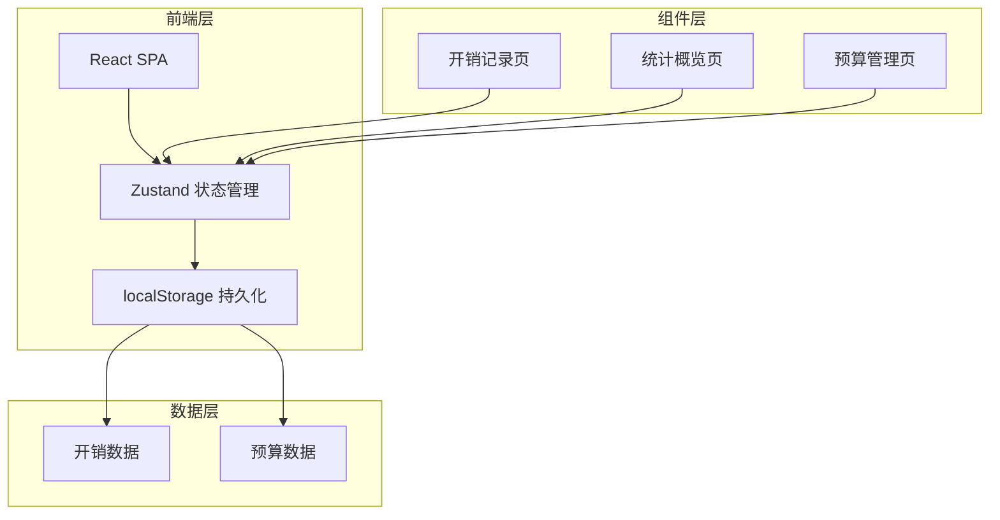
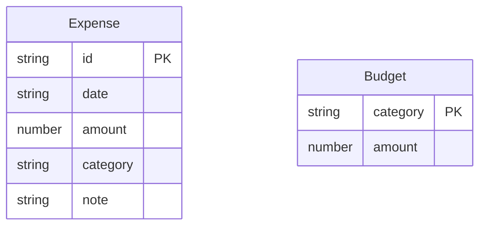

## 1. 架构设计

纯前端架构，无需后端服务。所有数据存储于浏览器 localStorage，状态管理使用 Zustand + persist 中间件自动同步。

## 2. 技术说明

- **前端框架**：React@18 + TypeScript + Vite
- **样式方案**：Tailwind CSS@3
- **状态管理**：Zustand（含 persist 中间件）
- **图表库**：recharts（轻量级 React 图表库）
- **路由**：react-router-dom@6
- **图标**：lucide-react
- **数据存储**：浏览器 localStorage
- **后端**：无

## 3. 路由定义

| 路由 | 用途 |
|------|------|
| / | 统计概览页，显示当月总支出、环比、分类柱状图、月份切换 |
| /expenses | 开销记录页，添加/查看/删除开销记录 |
| /budget | 预算管理页，设置分类月预算、查看预算进度 |

## 4. API定义

无后端API。所有数据通过 Zustand store + localStorage 直接操作。

## 5. 服务器架构图

不适用（纯前端项目）

## 6. 数据模型

### 6.1 数据模型定义

### 6.2 数据定义

**Expense（开销记录）**

| 字段 | 类型 | 说明 |
|------|------|------|
| id | string | 唯一标识，使用 Date.now() + 随机数生成 |
| date | string | 开销日期，格式 YYYY-MM-DD |
| amount | number | 开销金额，单位元 |
| category | string | 分类：餐饮/交通/购物/娱乐/医疗/教育 |
| note | string | 备注，可选 |

**Budget（预算设置）**

| 字段 | 类型 | 说明 |
|------|------|------|
| category | string | 分类名称（作为唯一键） |
| amount | number | 月预算金额，单位元 |

**localStorage 键名**：
- `expense-storage`：Zustand persist 自动管理的开销数据
- `budget-storage`：Zustand persist 自动管理的预算数据

**分类常量定义**：

| 分类 | 标识 | 颜色 |
|------|------|------|
| 餐饮 | dining | #F97316 |
| 交通 | transport | #3B82F6 |
| 购物 | shopping | #EC4899 |
| 娱乐 | entertainment | #8B5CF6 |
| 医疗 | medical | #10B981 |
| 教育 | education | #06B6D4 |
