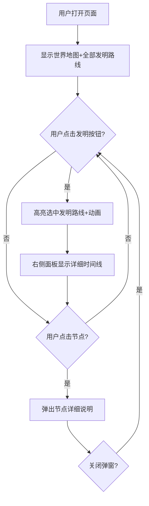

## 1. 产品概述

四大发明（造纸术、印刷术、火药、指南针）向世界传播的交互式地图应用，通过可视化的世界地图展示每项技术从中国起源向外传播的路线、关键节点和历史事件。
- 目标用户：历史文化爱好者、学生、教育工作者
- 核心价值：以直观的地理空间视角呈现中国古代科技对世界文明的深远影响，让复杂的历史传播过程变得一目了然

## 2. 核心功能

### 2.1 功能模块

1. **地图主页**：世界地图展示、发明选择、传播路线可视化、节点交互

### 2.2 页面详情

| 页面名称 | 模块名称 | 功能描述 |
|----------|----------|----------|
| 地图主页 | 世界地图区域 | 简版SVG世界地图，展示各大陆轮廓，标注关键地理节点位置 |
| 地图主页 | 发明选择栏 | 左侧/顶部四个发明按钮（造纸术、印刷术、火药、指南针），点击切换高亮路线 |
| 地图主页 | 传播路线层 | 用不同颜色曲线标注每项发明从中国向外传播的路径，带动画流动效果 |
| 地图主页 | 传播节点标记 | 地图上标注主要传播节点城市，悬停/点击显示简要信息 |
| 地图主页 | 右侧信息面板 | 展示选中发明的关键传播事件时间线、对欧洲的影响 |
| 地图主页 | 节点详情弹窗 | 点击节点弹出详细说明（如"撒马尔罕：751年怛罗斯之战后，造纸工匠被俘，造纸术传入伊斯兰世界"） |

## 3. 核心流程

用户打开页面 → 看到世界地图和四项发明选项 → 默认显示全部发明路线（淡色） → 点击某项发明 → 该发明路线高亮并动画流动，其他路线淡化 → 右侧面板显示该发明的详细时间线 → 用户点击地图上的节点 → 弹出节点详细说明 → 可切换不同发明查看

## 4. 用户界面设计

### 4.1 设计风格

- **主色调**：深墨色背景（#0a0e17），搭配古卷纸色调（#f5e6c8）作为点缀，营造古典历史感
- **四项发明专属配色**：
  - 造纸术：琥珀金 #E8A838
  - 印刷术：朱砂红 #C23B22
  - 火药：焰紫 #9B59B6
  - 指南针：碧玉青 #2ECC71
- **按钮风格**：圆角胶囊形，带发光边框效果，选中状态有脉冲动画
- **字体**：标题使用衬线体（Noto Serif SC），正文使用无衬线体（Noto Sans SC），营造文化气质
- **布局风格**：左主右副布局，左侧大面积地图，右侧信息面板
- **路线风格**：贝塞尔曲线，带流动粒子动画，选中时发光增亮

### 4.2 页面设计概览

| 页面名称 | 模块名称 | UI元素 |
|----------|----------|--------|
| 地图主页 | 顶部标题栏 | 古典卷轴风格标题"四大发明·世界传播图"，半透明深色背景 |
| 地图主页 | 发明选择栏 | 四个胶囊按钮横排，带图标和发明名称，选中时发光+下划线 |
| 地图主页 | 世界地图 | 深色底图，大陆轮廓线淡金色，节点为圆形标记，路线为流动曲线 |
| 地图主页 | 右侧面板 | 半透明暗色面板，时间线竖排，事件卡片带年份标签 |
| 地图主页 | 节点详情弹窗 | 毛玻璃效果浮层，居中显示，含城市名、年份、详细描述 |

### 4.3 响应式

- 桌面优先设计（1920x1080最佳），最小支持1366x768
- 地图区域自适应缩放
- 右侧面板可收起/展开

## 5. 传播数据

### 5.1 造纸术传播路线
长安 → 敦煌 → 撒马尔罕 → 巴格达 → 开罗 → 西班牙（菲斯/哈蒂瓦）→ 法国 → 德国 → 英国

### 5.2 印刷术传播路线
成都/杭州 → 北京 → 吐鲁番 → 伊朗大不里士 → 威尼斯 → 德国（古腾堡）→ 法国 → 英国

### 5.3 火药传播路线
成都/开封 → 北京 → 阿拉伯 → 西班牙 → 意大利 → 法国 → 德国 → 英国

### 5.4 指南针传播路线
广州/泉州 → 印度 → 波斯湾 → 亚丁 → 威尼斯 → 地中海各港口 → 北欧
