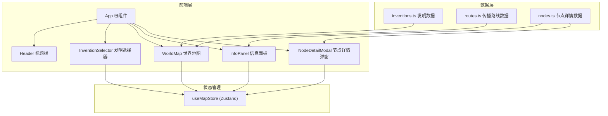

## 1. 架构设计



## 2. 技术说明

- **前端**：React@18 + TypeScript + Tailwind CSS@3 + Vite
- **初始化工具**：vite-init
- **后端**：无（纯前端项目）
- **数据库**：无（使用本地静态数据）
- **地图渲染**：SVG（内联SVG世界地图，简版大陆轮廓）
- **动画**：CSS动画 + SVG动画（路径流动效果）
- **状态管理**：Zustand

## 3. 路由定义

| 路由 | 用途 |
|------|------|
| / | 主页面，包含世界地图和所有交互功能 |

单页应用，无需多路由。

## 4. 核心组件架构

### 4.1 组件职责

| 组件 | 职责 |
|------|------|
| App | 根布局，组合所有子组件 |
| Header | 显示标题，营造古典氛围 |
| InventionSelector | 四项发明选择按钮，控制当前选中发明 |
| WorldMap | SVG世界地图，渲染大陆轮廓、传播路线、节点标记 |
| RoutePath | 单条传播路线（SVG path + 动画） |
| MapNode | 单个节点标记（SVG circle + 交互） |
| InfoPanel | 右侧信息面板，显示选中发明的时间线和欧洲影响 |
| TimelineItem | 时间线中的单个事件卡片 |
| NodeDetailModal | 节点详情弹窗，毛玻璃效果 |
| Legend | 图例，说明各颜色对应的发明 |

### 4.2 状态管理（Zustand Store）

```typescript
interface MapState {
  selectedInvention: string | null;
  selectedNode: NodeData | null;
  hoveredNode: string | null;
  isPanelOpen: boolean;
  selectInvention: (id: string | null) => void;
  selectNode: (node: NodeData | null) => void;
  setHoveredNode: (id: string | null) => void;
  togglePanel: () => void;
}
```

### 4.3 数据模型

```typescript
interface Invention {
  id: string;
  name: string;
  color: string;
  icon: string;
  description: string;
  europeImpact: string;
}

interface RouteNode {
  id: string;
  name: string;
  x: number;
  y: number;
  year: string;
  description: string;
  inventionId: string;
}

interface SpreadRoute {
  inventionId: string;
  nodes: RouteNode[];
  path: string;
}
```

## 5. SVG地图坐标系

使用viewBox坐标系（0 0 1200 600），基于等距圆柱投影：
- X轴：经度 -180° 到 180° → 0 到 1200
- Y轴：纬度 90° 到 -90° → 0 到 600
- 节点坐标通过经纬度换算为SVG坐标

## 6. 动画方案

- **路线流动**：SVG stroke-dashoffset 动画，模拟路线上的流动粒子
- **路线高亮**：选中路线增加opacity和stroke-width，添加发光滤镜
- **节点脉冲**：选中发明的节点使用CSS pulse动画
- **面板滑入**：右侧面板使用transform: translateX过渡动画
- **弹窗淡入**：毛玻璃弹窗使用opacity+scale过渡
