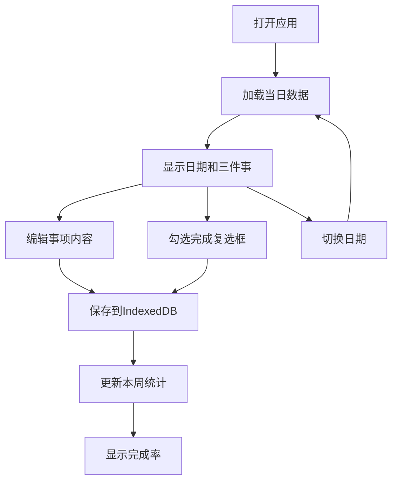

## 1. 产品概述

"每日三件事"计划本是一款极简高效的个人效率工具，帮助用户每天专注于最重要的三件事，通过完成小目标建立成就感。

- **核心价值**：化繁为简，每天只聚焦三件最重要的事，降低决策成本，提升执行力
- **目标用户**：需要提升日常效率、养成良好习惯的所有人群
- **产品特色**：极简设计、离线可用、数据本地存储、历史记录可追溯

## 2. 核心功能

### 2.1 用户角色
无需注册登录，纯单机应用，所有数据存储在用户本地浏览器。

| 角色 | 注册方式 | 核心权限 |
|------|----------|----------|
| 普通用户 | 无需注册 | 记录、编辑、完成每日事项，查看历史记录和统计数据 |

### 2.2 功能模块
1. **主页面**：日期导航、今日三件事卡片列表、本周完成率统计
2. **事项编辑**：支持添加、修改、删除每日三件事内容
3. **完成状态**：复选框标记完成/未完成状态
4. **日期切换**：前后切换日期查看历史记录
5. **数据统计**：底部显示本周完成率（已完成事项数/总事项数）

### 2.3 页面详情
| 页面名称 | 模块名称 | 功能描述 |
|----------|----------|----------|
| 主页面 | 日期导航栏 | 显示当前日期，左右箭头切换日期，"今天"按钮快速返回 |
| 主页面 | 事项卡片列表 | 三个独立卡片，每个包含复选框、可编辑内容区域 |
| 主页面 | 统计栏 | 底部显示本周完成率进度条和百分比数字 |

## 3. 核心流程

用户打开应用 → 显示今日日期和三个待填写事项 → 点击事项区域编辑内容 → 勾选复选框标记完成 → 切换日期查看历史记录 → 底部实时显示本周完成进度

## 4. 用户界面设计

### 4.1 设计风格
- **设计理念**：极简主义，柔和温暖的色调，营造宁静专注的氛围
- **主色调**：米白色背景（#FAF8F5），柔和的薄荷绿作为完成状态色
- **辅助色**：暖橙色作为强调色，用于日期和交互元素
- **字体**：标题使用"Noto Serif SC"衬线字体，正文使用"Noto Sans SC"无衬线字体
- **卡片风格**：圆角、微阴影、柔和的边框，悬停时有轻微上浮效果
- **整体感觉**：如同纸质笔记本般温暖、友好、无压力

### 4.2 页面设计概述
| 页面名称 | 模块名称 | UI元素 |
|----------|----------|--------|
| 主页面 | 日期导航 | 居中显示大号日期，左右箭头按钮，今日快捷按钮 |
| 主页面 | 事项卡片 | 三个垂直排列的卡片，左侧圆形复选框，右侧多行可编辑文本 |
| 主页面 | 统计栏 | 底部固定栏，进度条动画，百分比文字，本周日期小标记 |

### 4.3 响应性
- 桌面端：最大宽度640px居中布局，卡片横向有足够内边距
- 移动端：全屏自适应，卡片宽度占满屏幕
- 触摸优化：复选框和按钮最小尺寸44x44px，便于点击

### 4.4 交互动效
- 页面加载：卡片从下往上依次淡入，间隔100ms
- 勾选完成：复选框填充绿色动画，文字添加删除线并变灰
- 编辑模式：点击文字区域变为输入框，自动聚焦
- 日期切换：内容区域左右滑动过渡
- 进度条：数值变化时有平滑的过渡动画
