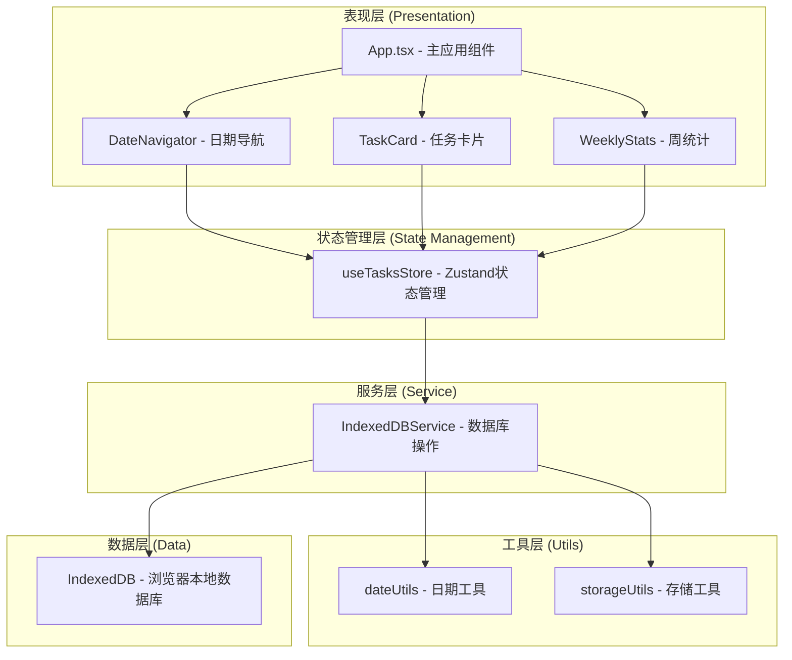
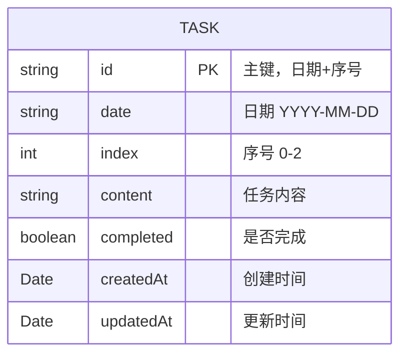

## 1. 架构设计

本应用为纯前端单页应用，采用分层架构设计，确保职责清晰、易于维护。



## 2. 技术描述

- **前端框架**：React@18 + TypeScript
- **构建工具**：Vite@5
- **样式方案**：TailwindCSS@3
- **状态管理**：Zustand
- **图标库**：lucide-react
- **本地存储**：IndexedDB（原生API封装）
- **初始化工具**：vite-init

## 3. 目录结构

```
src/
├── components/           # UI组件
│   ├── DateNavigator.tsx # 日期导航组件
│   ├── TaskCard.tsx      # 单个任务卡片组件
│   ├── TaskList.tsx      # 任务列表容器
│   └── WeeklyStats.tsx   # 本周统计组件
├── hooks/                # 自定义Hooks
│   └── useIndexedDB.ts   # IndexedDB操作Hook
├── store/                # 状态管理
│   └── useTasksStore.ts  # 任务状态管理
├── types/                # 类型定义
│   └── index.ts          # 全局类型定义
├── utils/                # 工具函数
│   ├── dateUtils.ts      # 日期处理工具
│   └── db.ts             # IndexedDB封装
├── App.tsx               # 主应用组件
├── main.tsx              # 入口文件
└── index.css             # 全局样式
```

## 4. 数据模型

### 4.1 数据模型定义



### 4.2 IndexedDB 存储结构

- **数据库名**：DailyThreeThingsDB
- **版本**：1
- **对象存储空间**：tasks
  - 主键：`id`（格式：`YYYY-MM-DD_${index}`）
  - 索引：`date`（按日期查询）

### 4.3 TypeScript 类型定义

```typescript
interface Task {
  id: string;
  date: string;
  index: number;
  content: string;
  completed: boolean;
  createdAt: number;
  updatedAt: number;
}

interface DailyTasks {
  date: string;
  tasks: Task[];
}

interface WeeklyStats {
  completedCount: number;
  totalCount: number;
  percentage: number;
  dailyStats: { date: string; completed: number; total: number }[];
}
```

## 5. 核心模块职责

### 5.1 utils/db.ts - IndexedDB 封装层
- 负责数据库的初始化、版本升级
- 封装CRUD操作：getTask、saveTask、getTasksByDate、getTasksByDateRange
- 对外返回 Promise，统一异步接口

### 5.2 store/useTasksStore.ts - 状态管理层
- 管理当前选中日期
- 管理当前日期的三件事数据
- 管理本周统计数据
- 提供操作方法：setDate、updateTaskContent、toggleTaskComplete、loadWeeklyStats

### 5.3 components/TaskCard.tsx - 任务卡片组件
- 展示单个任务的复选框和内容
- 处理编辑模式切换
- 处理内容修改
- 处理完成状态切换

### 5.4 components/DateNavigator.tsx - 日期导航组件
- 显示当前选中日期
- 提供前后日期切换按钮
- 提供"今天"快捷按钮
- 日期格式化显示

### 5.5 components/WeeklyStats.tsx - 周统计组件
- 计算并展示本周完成率
- 展示进度条动画
- 显示本周每日完成情况小标记

### 5.6 utils/dateUtils.ts - 日期工具函数
- 日期格式化：formatDate、parseDate
- 获取本周日期范围：getWeekRange
- 日期加减操作：addDays、isToday
- 生成任务ID：generateTaskId

## 6. 关键流程设计

### 6.1 应用初始化流程
1. App.tsx 挂载
2. 初始化 IndexedDB 连接
3. 初始化 Zustand store，默认日期为今天
4. 加载今日任务数据
5. 加载本周统计数据
6. 渲染所有组件

### 6.2 任务编辑流程
1. 用户点击 TaskCard 内容区域
2. 切换为编辑模式（textarea 自动聚焦）
3. 用户输入内容，自动防抖保存（500ms）
4. 调用 store.updateTaskContent
5. store 调用 IndexedDBService.saveTask
6. 更新本周统计数据

### 6.3 日期切换流程
1. 用户点击日期导航按钮
2. store.setDate 更新当前日期
3. 触发 loadTasksByDate 副作用
4. 从 IndexedDB 查询该日期数据
5. 如无数据则创建三个空任务
6. 更新本周统计数据
