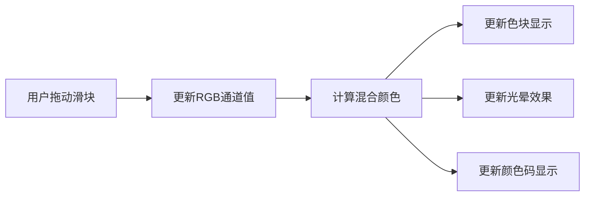

## 1. 产品概述
三原色光混合实验交互页面，让用户通过调节红、绿、蓝三种色光的强度，直观体验加色法混色原理。
- 主要用途：物理光学教学演示、设计师配色参考、RGB颜色直观理解
- 目标用户：学生、设计师、编程初学者、对色彩原理感兴趣的用户

## 2. 核心功能

### 2.1 功能模块
1. **颜色控制面板**：三个独立的RGB滑块组件，控制0-255范围的色光强度
2. **颜色预览区**：圆形色块实时显示混合后的颜色，带光晕效果
3. **颜色信息显示**：实时显示RGB数值和十六进制颜色码

### 2.2 页面详情
| 页面名称 | 模块名称 | 功能描述 |
|-----------|-------------|---------------------|
| 主页面 | RGB滑块控制 | 三个独立滑块，分别标记R/G/B，范围0-255 |
| 主页面 | 颜色预览 | 大圆形色块展示混合颜色，周围有动态光晕 |
| 主页面 | 颜色信息 | 实时显示RGB(xxx, xxx, xxx)和#xxxxxx格式 |

## 3. 核心流程
用户拖动任意滑块 → 系统更新对应颜色通道值 → 实时计算混合颜色 → 更新色块显示和光晕效果 → 更新RGB值和十六进制码显示

## 4. 用户界面设计

### 4.1 设计风格
- **主色调**：纯黑色背景（#000000）模拟暗室环境
- **强调色**：红(#FF0000)、绿(#00FF00)、蓝(#0000FF)三原色
- **整体风格**：科技感、极简、沉浸式暗室体验
- **字体**：现代无衬线字体，等宽字体显示颜色代码
- **动画**：滑块调节时平滑过渡，光晕呼吸效果

### 4.2 页面设计概述
| 页面名称 | 模块名称 | UI元素 |
|-----------|-------------|-------------|
| 主页面 | RGB滑块控制 | 左侧垂直排列，滑块轨道对应颜色，数值实时显示 |
| 主页面 | 颜色预览 | 右侧居中大圆形，多层光晕向外扩散 |
| 主页面 | 颜色信息 | 底部居中，等宽字体，清晰易读 |

### 4.3 响应式
- 桌面端：左右布局（控制区+预览区）
- 移动端：上下布局（预览区在上，控制区在下）
- 触摸优化：滑块支持触摸拖动

### 4.4 视觉效果
- 背景：纯黑色，营造暗室氛围
- 光晕：色块周围多层box-shadow光晕，颜色随混合色动态变化
- 滑块：自定义样式，轨道和拇指对应颜色
- 过渡：所有颜色变化使用平滑过渡动画
