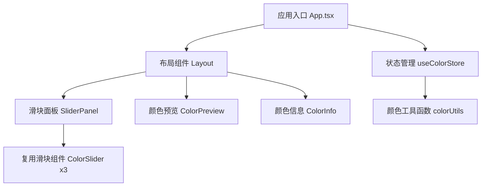

## 1. 架构设计



## 2. 技术描述
- **前端**：React@18 + TypeScript + Vite
- **样式**：TailwindCSS@3 + CSS动画
- **状态管理**：Zustand（轻量级状态管理）
- **工具库**：lucide-react（图标）

## 3. 目录结构
```
src/
├── components/
│   ├── ColorSlider.tsx      # 单颜色滑块组件
│   ├── SliderPanel.tsx      # 滑块面板容器
│   ├── ColorPreview.tsx     # 颜色预览+光晕组件
│   └── ColorInfo.tsx        # 颜色信息显示组件
├── hooks/
│   └── useColorStore.ts     # 颜色状态管理
├── utils/
│   └── colorUtils.ts        # 颜色转换工具函数
├── App.tsx                  # 主应用组件
├── main.tsx                 # 入口文件
└── index.css                # 全局样式
```

## 4. 核心数据模型

### 4.1 颜色状态
```typescript
interface ColorState {
  red: number;      // 0-255
  green: number;    // 0-255
  blue: number;     // 0-255
  setRed: (value: number) => void;
  setGreen: (value: number) => void;
  setBlue: (value: number) => void;
  getHex: () => string;
  getRgbString: () => string;
}
```

## 5. 工具函数定义
```typescript
// RGB转十六进制
function rgbToHex(r: number, g: number, b: number): string

// 确保值在0-255范围内
function clamp(value: number): number

// 计算光晕颜色（降低透明度）
function getGlowColor(r: number, g: number, b: number, opacity: number): string
```

## 6. 组件职责划分

| 组件 | 职责 |
|------|------|
| App.tsx | 整体布局，组合各子组件 |
| ColorSlider.tsx | 单个颜色滑块，负责UI和值变化回调 |
| SliderPanel.tsx | 管理三个滑块，调用状态更新 |
| ColorPreview.tsx | 渲染圆形色块和光晕效果 |
| ColorInfo.tsx | 显示RGB值和十六进制码 |
| useColorStore.ts | 集中管理RGB状态，提供计算属性 |
| colorUtils.ts | 纯函数工具，颜色转换逻辑 |
