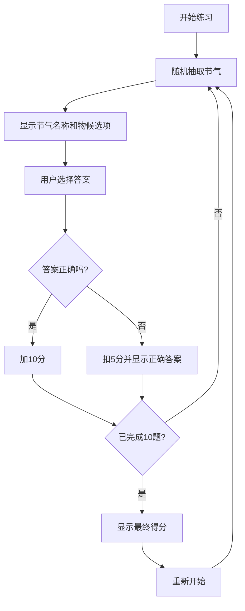

## 1. 产品概述
节气物候配对练习是一款传统文化学习工具，通过互动答题形式帮助用户学习二十四节气相关知识。
- 主要目的：通过游戏化方式普及二十四节气的物候、农谚和习俗知识
- 目标用户：学生、传统文化爱好者、需要了解节气知识的普通大众
- 产品价值：寓教于乐，传承中华传统文化

## 2. 核心功能

### 2.1 用户角色
| 角色 | 注册方式 | 核心权限 |
|------|----------|----------|
| 普通用户 | 无需注册 | 进行答题练习、查看分数 |

### 2.2 功能模块
1. **练习主页面**：节气展示、物候选项、农谚习俗提示
2. **结果反馈页面**：答题反馈、分数显示
3. **总分结算页面**：最终得分、重新开始功能

### 2.3 页面详情
| 页面名称 | 模块名称 | 功能描述 |
|---------|----------|----------|
| 练习主页 | 节气展示区 | 显示当前节气名称和进度 |
| 练习主页 | 物候选项区 | 展示3个物候描述供用户选择 |
| 练习主页 | 提示信息区 | 显示当前节气的农谚和习俗 |
| 练习主页 | 分数状态栏 | 实时显示当前得分 |
| 结果反馈页 | 答案反馈 | 正确/错误提示，正确答案展示 |
| 总分结算页 | 成绩展示 | 显示最终得分，提供重新开始按钮 |

## 3. 核心流程
用户进入应用后，系统随机抽取10个节气中的一个作为题目，显示节气名称和3个物候选项。用户选择答案后，系统判断对错并更新分数，然后自动进入下一题。完成10题后显示最终得分。

## 4. 用户界面设计

### 4.1 设计风格
- 主色调：中国传统配色，采用水墨风格的青绿色系（#1a4d4d、#2d7d7d、#8fbcbc）
- 辅助色：朱砂红（#c23a3a）用于错误提示，翠绿色（#3a7d3a）用于正确提示
- 按钮风格：圆角矩形，带有轻微阴影，悬停有上浮效果
- 字体：标题使用书法风格字体（Ma Shan Zheng），正文使用优雅的衬线体（Noto Serif SC）
- 布局风格：卡片式布局，层次分明，留白充足
- 图标风格：使用中国风图标元素，如祥云、水墨笔触装饰

### 4.2 页面设计概述
| 页面名称 | 模块名称 | UI元素 |
|---------|----------|--------|
| 练习主页 | 节气展示区 | 大号书法字体节气名称，装饰性边框，进度指示器 |
| 练习主页 | 物候选项区 | 三张卡片并排，悬停效果，选中动画 |
| 练习主页 | 提示信息区 | 折叠式面板，农谚和习俗分别展示，图标点缀 |
| 练习主页 | 分数状态栏 | 顶部固定栏，分数动态变化效果 |
| 结果反馈页 | 答案反馈 | 全屏遮罩，正确/错误动画，答案高亮 |
| 总分结算页 | 成绩展示 | 大字号分数，评价文字，重新开始按钮 |

### 4.3 响应式
- Desktop-first设计，适配1280px以上屏幕
- 平板端：选项卡片改为2列布局
- 移动端：选项卡片改为垂直堆叠，字体大小适配
- 触摸优化：按钮最小高度44px，点击区域放大

### 4.4 动效设计
- 页面加载：淡入动画，元素依次出现
- 选项选择：点击缩放效果，正确答案绿色光晕，错误答案红色抖动
- 分数变化：数字滚动动画
- 切换题目：平滑过渡，旧内容淡出新内容淡入
