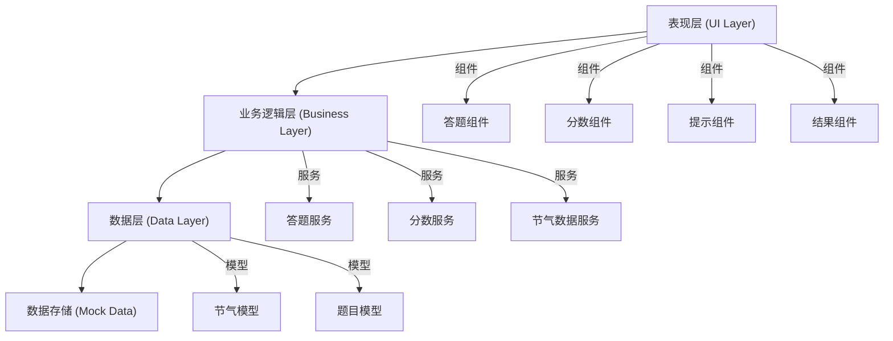

## 1. 架构设计
采用分层架构设计，确保高扩展性和可维护性。



## 2. 技术描述
- **前端框架**：React@18 + TypeScript
- **构建工具**：Vite@5
- **样式方案**：TailwindCSS@3 + CSS Modules
- **状态管理**：React Hooks (useState, useReducer)
- **动画方案**：CSS Animations + Framer Motion
- **后端**：无（纯前端应用）
- **数据**：内置Mock数据

## 3. 目录结构
```
src/
├── components/          # 组件层
│   ├── QuestionCard.tsx      # 题目卡片组件
│   ├── OptionCard.tsx        # 选项卡片组件
│   ├── ScoreBoard.tsx        # 分数板组件
│   ├── HintPanel.tsx         # 提示面板组件
│   ├── FeedbackModal.tsx     # 反馈弹窗组件
│   └── ResultPage.tsx        # 结果页面组件
├── hooks/               # 自定义Hooks
│   ├── useGame.ts           # 游戏逻辑Hook
│   └── useScore.ts          # 分数管理Hook
├── services/            # 服务层
│   ├── questionService.ts   # 题目生成服务
│   └── solarTermService.ts  # 节气数据服务
├── models/              # 数据模型
│   └── solarTerm.ts         # 节气数据类型定义
├── data/                # 数据层
│   └── solarTerms.ts        # 节气Mock数据
├── utils/               # 工具函数
│   └── shuffle.ts           # 数组打乱工具
├── App.tsx
├── main.tsx
└── index.css
```

## 4. 数据模型定义

### 4.1 节气数据模型
```typescript
interface SolarTerm {
  id: string;
  name: string;
  phenology: string[];  // 物候三候
  farmerProverb: string;  // 农谚
  customs: string;        // 习俗
}

interface Question {
  id: string;
  solarTerm: SolarTerm;
  options: SolarTerm[];   // 3个选项（包含正确答案）
  correctAnswerId: string;
}

interface GameState {
  currentQuestionIndex: number;
  totalQuestions: number;
  score: number;
  questions: Question[];
  isGameOver: boolean;
  selectedAnswer: string | null;
  showFeedback: boolean;
  isCorrect: boolean | null;
}
```

### 4.2 核心数据（10个节气）
- 立春、惊蛰、清明、立夏、芒种、小暑、立秋、白露、寒露、小雪

## 5. 核心接口定义

### 5.1 答题服务接口
```typescript
interface QuestionService {
  generateQuestions(solarTerms: SolarTerm[], count: number): Question[];
  checkAnswer(question: Question, selectedId: string): boolean;
}

interface GameService {
  startGame(): void;
  submitAnswer(answerId: string): void;
  nextQuestion(): void;
  restartGame(): void;
}
```

### 5.2 分数服务接口
```typescript
interface ScoreService {
  addScore(points: number): void;
  deductScore(points: number): void;
  getScore(): number;
  resetScore(): void;
}
```

## 6. 扩展性设计原则

### 6.1 数据层扩展
- 新增节气：只需在 `data/solarTerms.ts` 中添加数据
- 新增字段：在 `models/solarTerm.ts` 中扩展接口

### 6.2 业务层扩展
- 新增题目类型：在 `services/questionService.ts` 中新增生成方法
- 新增计分规则：在 `hooks/useScore.ts` 中扩展逻辑

### 6.3 表现层扩展
- 新增主题：通过CSS变量和Tailwind配置实现
- 新增动画：在组件中添加Framer Motion动画配置
