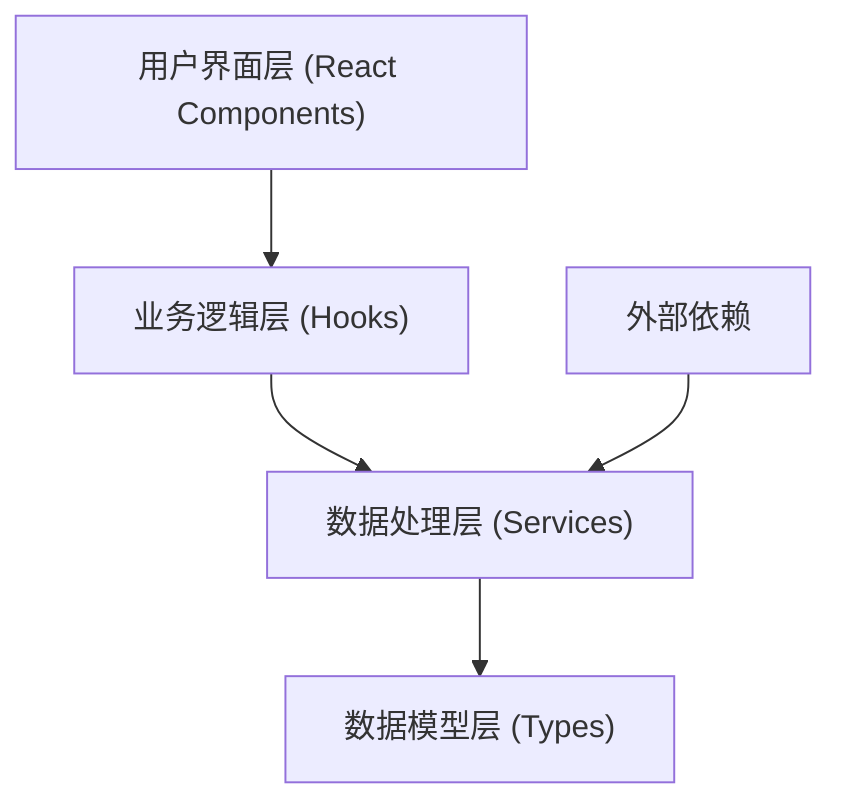

## 1. 架构设计



**分层说明：**
- **用户界面层**：React组件，负责展示和用户交互
- **业务逻辑层**：自定义Hooks，封装业务逻辑和状态管理
- **数据处理层**：Service模块，负责CSV解析、数据计算、统计分析
- **数据模型层**：TypeScript类型定义，确保类型安全
- **外部依赖**：CSV解析库、图表库等第三方依赖

## 2. 技术描述

- **前端框架**: React@18 + TypeScript + Vite@5
- **样式方案**: TailwindCSS@3
- **CSV解析**: papaparse@5
- **图表库**: recharts@2
- **图标**: lucide-react@0.344
- **状态管理**: React Hooks (useState, useReducer, useMemo)
- **初始化工具**: vite-init

## 3. 目录结构

```
src/
├── types/              # 类型定义
│   └── index.ts
├── services/           # 业务服务
│   ├── csvParser.ts    # CSV解析服务
│   ├── dataAnalyzer.ts # 数据分析服务
│   └── dataExporter.ts # 数据导出服务
├── hooks/              # 自定义Hooks
│   ├── useSalesAnalysis.ts
│   └── useFileUpload.ts
├── components/         # UI组件
│   ├── FileUpload.tsx
│   ├── StatsCard.tsx
│   ├── DishList.tsx
│   ├── DishCard.tsx
│   ├── TrendChart.tsx
│   ├── DishDetailModal.tsx
│   └── TabNavigation.tsx
├── utils/              # 工具函数
│   ├── formatters.ts
│   └── dateUtils.ts
├── App.tsx
├── main.tsx
└── index.css
```

## 4. 核心数据模型

```typescript
// 原始订单数据
interface OrderRecord {
  orderDate: Date;
  dishName: string;
  quantity: number;
  unitPrice: number;
  costPrice: number;
}

// 菜品统计数据
interface DishStats {
  dishName: string;
  totalQuantity: number;
  totalSales: number;
  totalCost: number;
  totalProfit: number;
  profitMargin: number;
  weeklyTrend: WeeklySales[];
}

// 周销量数据
interface WeeklySales {
  week: string;
  weekStart: Date;
  weekEnd: Date;
  quantity: number;
  sales: number;
}

// 整体统计概览
interface OverallStats {
  totalOrders: number;
  totalDishes: number;
  totalSales: number;
  totalProfit: number;
  avgProfitMargin: number;
  dateRange: { start: Date; end: Date };
}

// 分类菜品
interface CategorizedDishes {
  starDishes: DishStats[];      // 销量前10
  slowDishes: DishStats[];      // 销量后5
  problemDishes: DishStats[];   // 毛利率<20%
}
```

## 5. 可扩展性设计

### 5.1 插件化分析器

采用策略模式，支持新增分析维度：

```typescript
interface IAnalyzer<T> {
  name: string;
  analyze(records: OrderRecord[]): T;
}

class SalesAnalyzer implements IAnalyzer<DishStats[]> { ... }
class TrendAnalyzer implements IAnalyzer<WeeklySales[]> { ... }
```

### 5.2 数据格式适配器

支持多种数据源格式：

```typescript
interface DataAdapter<T> {
  parse(raw: string): T[];
  validate(data: any[]): boolean;
}

class CSVAdapter implements DataAdapter<OrderRecord> { ... }
// 未来可扩展: ExcelAdapter, JSONAdapter, APIAdapter
```

### 5.3 可配置阈值

分类阈值通过配置注入，便于调整：

```typescript
const ANALYSIS_CONFIG = {
  starDishCount: 10,
  slowDishCount: 5,
  problemMarginThreshold: 0.2,
  weekStartsOn: 1, // 1 = 周一
} as const;
```

## 6. 路由定义

| Route | Purpose |
|-------|---------|
| / | 首页，包含上传、统计、菜品列表 |

## 7. 关键技术决策

1. **纯前端架构**：所有数据处理在浏览器端完成，保护用户数据隐私，无需后端部署
2. **内存计算**：使用 useMemo 缓存计算结果，优化大数据量性能
3. **流式解析**：CSV解析采用流式处理，支持大文件上传
4. **虚拟滚动**：菜品列表支持虚拟滚动，处理上千条菜品数据
5. **错误边界**：React Error Boundary 捕获渲染错误，优雅降级
