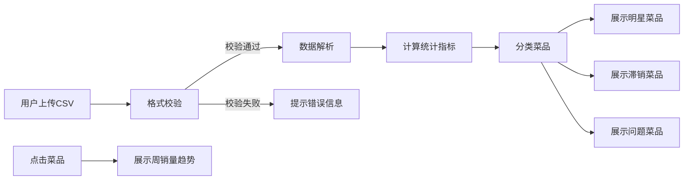

## 1. 产品概述

餐厅菜单销量分析工具，帮助餐厅经营者通过订单数据分析菜品销售表现，识别明星菜品、滞销菜品和问题菜品，优化菜单结构和定价策略。

- 面向餐厅管理者、厨师长、运营人员，提供数据驱动的决策支持
- 纯前端应用，用户上传CSV即可完成数据分析，保护数据隐私

## 2. 核心 Features

### 2.1 用户角色

| 角色 | 注册方式 | 核心权限 |
|------|----------|----------|
| 普通用户 | 无需注册 | 上传CSV、查看分析报告、浏览趋势图表 |

### 2.2 Feature 模块

1. **数据上传模块**: CSV文件拖拽上传、格式校验、数据预览
2. **统计概览模块**: 总销量、总销售额、总毛利、平均毛利率等核心指标
3. **菜品分类模块**: 明星菜品（销量前10）、滞销菜品（销量后5）、问题菜品（毛利率<20%）
4. **趋势分析模块**: 按周统计销量趋势，点击菜品查看详细趋势图
5. **数据导出模块**: 支持分析结果导出

### 2.3 页面详情

| 页面名称 | 模块名称 | Feature 描述 |
|----------|----------|--------------|
| 首页 | 上传区域 | 支持拖拽/点击上传CSV，实时解析校验，展示数据预览 |
| 首页 | 统计概览 | 展示关键业务指标卡片，包含数值和同比/环比展示 |
| 首页 | 菜品分类 | 三个Tab切换展示明星、滞销、问题菜品列表 |
| 详情弹窗 | 趋势图表 | 点击菜品弹出详情，展示每周销量趋势折线图 |

## 3. 核心流程

1. 用户进入首页，看到上传区域和示例数据说明
2. 用户上传符合格式的CSV文件
3. 系统解析CSV，校验列名和数据格式
4. 系统自动计算所有统计指标，生成菜品分类列表
5. 用户浏览各分类菜品，点击感兴趣的菜品查看详细趋势
6. 用户可导出分析报告

## 4. 用户界面设计

### 4.1 设计风格

- 主色调：深绿(#1a472a) + 金色(#d4af37)，体现餐饮行业的专业和品质
- 辅助色：橙色(#ff6b35) 用于高亮警告，浅灰用于背景
- 按钮风格：圆角4px，微立体阴影，hover状态有轻微上浮动画
- 字体：标题使用 Playfair Display 体现优雅，正文使用 Inter 保证可读性
- 布局风格：卡片式布局，清晰的信息层级，充足的留白
- 图标：使用线性图标，保持简洁专业

### 4.2 页面设计概览

| 页面名称 | 模块名称 | UI Elements |
|----------|----------|-------------|
| 首页 | 上传区域 | 大尺寸拖拽框，虚线边框，上传时显示进度动画 |
| 首页 | 统计概览 | 4个指标卡片横向排列，数值大号字体，标签小号字体，背景使用渐变色 |
| 首页 | 菜品分类 | Tab切换，每个Tab下是响应式网格布局的菜品卡片 |
| 菜品卡片 | 列表项 | 菜品名称、销量、毛利率、毛利，hover时背景微变 |
| 详情弹窗 | 趋势图表 | 圆角弹窗，顶部标题，中间折线图，底部数据表格 |

### 4.3 响应式

- Desktop-first设计，适配1920px、1440px、1024px
- 平板端：统计卡片改为2x2布局，菜品列表改为2列
- 移动端：统计卡片纵向堆叠，菜品列表单列，优化触控区域
- 弹窗在移动端改为全屏显示

### 4.4 动效设计

- 页面加载：统计卡片依次淡入上移（staggered animation）
- 数据上传：上传区域从虚线边框变为实色，显示loading动画
- 卡片hover：轻微上浮(transform: translateY(-2px))，阴影加深
- 弹窗出现：从下往上滑入，背景遮罩渐显
- 图表加载：线条从左到右绘制动画
