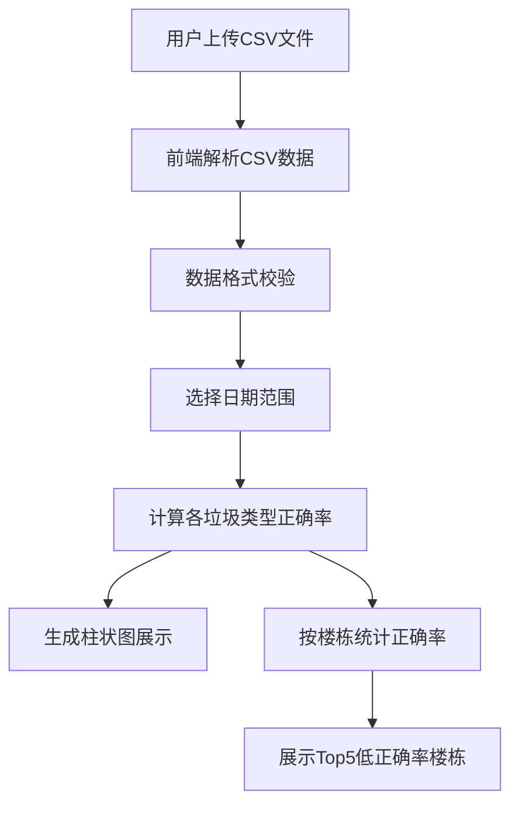

## 1. 产品概述

垃圾分类投放正确率统计系统，帮助物业管理人员通过上传小区垃圾投放记录CSV文件，快速统计和分析各垃圾类型的投放正确率，识别需要加强宣传教育的楼栋。

- 主要功能：CSV数据上传、日期范围筛选、正确率可视化统计、低正确率楼栋排名
- 目标用户：物业管理人员、社区工作者、环保相关工作人员

## 2. 核心功能

### 2.1 用户角色
无需复杂角色区分，所有用户拥有完整功能权限

| 角色 | 注册方式 | 核心权限 |
|------|----------|----------|
| 普通用户 | 无需登录 | 上传CSV、查看统计图表、筛选数据 |

### 2.2 功能模块
1. **数据上传区**：CSV文件拖拽/点击上传，格式校验
2. **日期筛选区**：日期范围选择器，数据过滤
3. **统计图表区**：各垃圾类型投放正确率柱状图
4. **楼栋排名区**：正确率最低的5个楼号列表展示

### 2.3 页面详情
| 页面名称 | 模块名称 | 功能描述 |
|-----------|-------------|---------------------|
| 主页面 | 数据上传区 | 支持拖拽上传CSV，显示上传状态和数据条数 |
| 主页面 | 日期筛选区 | 开始/结束日期选择，实时过滤统计数据 |
| 主页面 | 统计图表区 | 四种垃圾类型（可回收、厨余、有害、其他）正确率柱状图 |
| 主页面 | 楼栋排名区 | 按正确率升序排列，显示Top5低正确率楼号 |

## 3. 核心流程

用户上传CSV文件后，系统在前端解析数据，用户可选择日期范围，系统实时计算并展示各垃圾类型的投放正确率柱状图，同时在右侧展示正确率最低的5个楼栋。

## 4. 用户界面设计

### 4.1 设计风格
- 主色调：环保绿色系（#2E7D32），搭配蓝色辅助色
- 按钮风格：圆角矩形，悬停微动效
- 字体：Noto Sans SC，清晰易读
- 布局风格：卡片式布局，左侧图表区，右侧排名区
- 图标：简洁线性图标，与环保主题呼应

### 4.2 页面设计概述
| 页面名称 | 模块名称 | UI元素 |
|-----------|-------------|-------------|
| 主页面 | 数据上传区 | 拖拽区域、文件选择按钮、上传状态提示 |
| 主页面 | 日期筛选区 | 日期选择器、快捷选择按钮（本周/本月） |
| 主页面 | 统计图表区 | 柱状图、图例、数值标签 |
| 主页面 | 楼栋排名区 | 排名列表、进度条、百分比显示 |

### 4.3 响应性
- 桌面端：双栏布局（左7右3）
- 平板端：图表在上，排名在下
- 移动端：单列布局，优化触控区域
