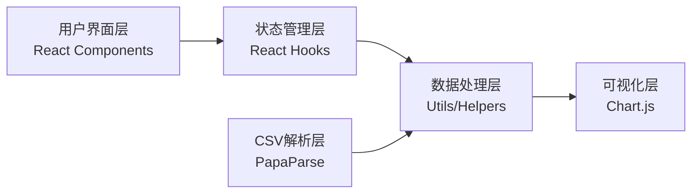

## 1. 架构设计

纯前端应用架构，数据处理完全在浏览器端完成，无需后端服务。



## 2. 技术描述

- **前端框架**: React@18 + TypeScript + Vite
- **样式方案**: TailwindCSS@3
- **CSV解析**: PapaParse（高性能CSV解析库）
- **图表库**: Chart.js + react-chartjs-2（柱状图渲染）
- **日期处理**: date-fns（轻量级日期工具库）
- **代码规范**: ESLint + Prettier
- **构建工具**: Vite（快速开发构建）

## 3. 目录结构设计

```
src/
├── components/          # UI组件
│   ├── FileUpload.tsx   # CSV文件上传组件
│   ├── DateFilter.tsx   # 日期范围筛选组件
│   ├── StatsChart.tsx   # 统计柱状图组件
│   └── BuildingRank.tsx # 楼栋排名组件
├── hooks/               # 自定义Hooks
│   ├── useCsvParser.ts  # CSV解析Hook
│   ├── useDataStats.ts  # 数据统计Hook
│   └── useDateFilter.ts # 日期筛选Hook
├── types/               # TypeScript类型定义
│   └── index.ts         # 数据类型、接口定义
├── utils/               # 工具函数
│   ├── csvParser.ts     # CSV解析工具
│   ├── statistics.ts    # 统计计算工具
│   └── dateUtils.ts     # 日期处理工具
├── App.tsx              # 主应用组件
└── main.tsx             # 入口文件
```

## 4. 数据模型

### 4.1 TypeScript类型定义

```typescript
// 原始投放记录
interface GarbageRecord {
  bagId: string;           // 垃圾袋ID
 投放时间: Date;           // 投放时间
  buildingNumber: string;  // 居民楼号
  garbageType: GarbageType; // 垃圾类型
  isCorrect: boolean;      // 是否正确投放
}

// 垃圾类型枚举
type GarbageType = 'recyclable' | 'kitchen' | 'harmful' | 'other';

// 垃圾类型统计结果
interface TypeStats {
  type: GarbageType;
  typeName: string;
  total: number;
  correct: number;
  accuracy: number;
}

// 楼栋统计结果
interface BuildingStats {
  buildingNumber: string;
  total: number;
  correct: number;
  accuracy: number;
}

// 应用状态
interface AppState {
  records: GarbageRecord[];
  dateRange: { start: Date | null; end: Date | null };
  filteredRecords: GarbageRecord[];
  typeStats: TypeStats[];
  buildingStats: BuildingStats[];
  isLoading: boolean;
  error: string | null;
}
```

## 5. 核心模块设计

### 5.1 CSV解析模块
- 支持大文件流式解析
- 自动检测编码
- 数据格式校验（必填列、数据类型）
- 错误行收集与提示

### 5.2 统计计算模块
- 按垃圾类型分组统计正确率
- 按楼栋分组统计正确率
- 日期范围过滤
- Top N 排名算法

### 5.3 数据可视化模块
- 响应式柱状图
- 自定义颜色（四种垃圾类型对应不同颜色）
- 数值标签显示
- 悬停交互效果

## 6. 可维护性与扩展性设计

### 6.1 可维护性
- 模块化设计，关注点分离
- TypeScript强类型约束
- 纯函数工具类，易于单元测试
- 统一的错误处理机制

### 6.2 扩展性
- 垃圾类型可配置（支持新增类型）
- 统计指标可扩展（如增加错误类型分析）
- 图表类型可替换（支持切换饼图、折线图等）
- 导出功能预留接口（支持导出Excel/PDF）
