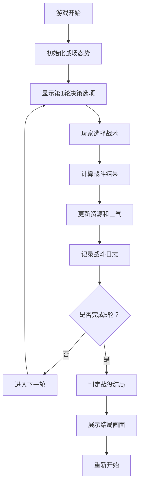

## 1. 产品概述
长城守卫战略决策模拟游戏，玩家扮演边关将领，面对匈奴来犯，通过5轮战略决策决定战役结局。
- 核心目的：提供沉浸式古代战争决策体验，考验玩家资源管理和战略判断能力
- 目标用户：喜欢策略类文字游戏、对古代军事题材感兴趣的玩家

## 2. 核心功能

### 2.1 用户角色
| 角色 | 注册方式 | 核心权限 |
|------|----------|----------|
| 玩家 | 无需注册，直接开始 | 进行战略决策，查看战场态势，获取战役结局 |

### 2.2 功能模块
1. **游戏主界面**：战场态势显示、资源面板、决策选项、战斗日志
2. **决策系统**：每轮3个战术选项，不同选择带来不同战果
3. **战斗计算引擎**：根据决策计算胜/负/平，更新资源和士气
4. **结局判定**：5轮后根据最终资源状态判定大捷/惨胜/城破

### 2.3 页面详情
| 页面名称 | 模块名称 | 功能描述 |
|----------|----------|----------|
| 游戏主界面 | 战场态势面板 | 显示敌方兵力、距离、己方兵力、粮草、城墙耐久、士气、当前轮次 |
| 游戏主界面 | 决策选项区 | 每轮显示3个不同战术选项（出城迎战、坚守待援、夜袭敌营等） |
| 游戏主界面 | 战斗日志区 | 记录每轮决策结果和战场变化 |
| 游戏主界面 | 进度条组件 | 可视化展示各资源状态 |
| 游戏主界面 | 结局展示 | 5轮后显示最终战役结局和总结 |

## 3. 核心流程
玩家进入游戏 → 查看初始战场态势（敌方兵力、距离，己方资源）→ 选择战术决策 → 系统计算战果并更新资源 → 重复上述步骤共5轮 → 根据最终资源状态判定战役结局

## 4. 界面设计

### 4.1 设计风格
- **主色调**：土黄色（城墙）、深红色（战火）、深青色（夜幕），体现古代战争氛围
- **辅助色**：金色（胜利）、暗灰色（城池）
- **按钮风格**：仿古木质边框，立体浮雕效果，悬停时有暖色光晕
- **字体**：标题使用衬线宋体类古风字体，正文使用清晰易读的黑体类
- **布局风格**：卷轴式布局，左右分栏（左侧战场态势，右侧决策和日志）
- **图标风格**：使用古风emoji（⚔️ 🏰 🛡️ 🔥 🏹）配合文字

### 4.2 页面设计概述
| 页面名称 | 模块名称 | UI元素 |
|----------|----------|--------|
| 游戏主界面 | 战场态势面板 | 半透明深色背景，进度条带纹理效果，数值用金色字体显示 |
| 游戏主界面 | 决策选项区 | 三个等宽卡片式按钮，悬停放大，点击有按压动画 |
| 游戏主界面 | 战斗日志区 | 滚动列表，最新消息从下往上滑入，不同结果用不同颜色标记 |
| 游戏主界面 | 结局展示 | 全屏遮罩层，大号结局文字，渐入动画，总结报告样式 |

### 4.3 响应性
- 桌面端优先设计，采用左右双栏布局
- 移动端自适应为上下布局，态势面板在上，决策区在中，日志区在下
- 触摸优化：按钮最小高度48px，间距充足

### 4.4 视觉动效
- 页面加载：卷轴展开效果
- 资源变化：数字跳动动画，进度条平滑过渡
- 战斗结果：胜利用金色闪光，失败用红色闪烁
- 决策选择：卡片点击缩放反馈
- 结局画面：淡入效果，文字逐行显现
