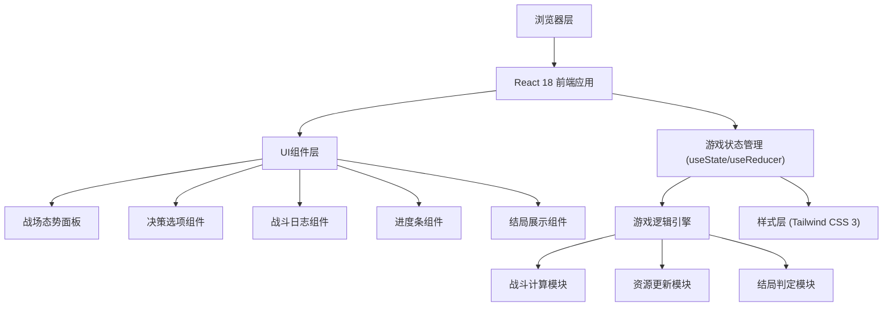

## 1. 架构设计



## 2. 技术描述
- **前端**：React@18 + TailwindCSS@3 + Vite
- **初始化工具**：Vite
- **后端**：无（纯前端单页应用，游戏逻辑全部在客户端实现）
- **数据库**：无（使用React状态管理，无需持久化存储）

## 3. 路由定义
| 路由 | 用途 |
|------|------|
| / | 游戏主界面（单页面应用，无其他路由） |

## 4. 数据模型

### 4.1 游戏状态定义

```typescript
// 资源状态
interface Resources {
  enemyTroops: number;      // 敌方兵力 (初始: 1000-3000)
  enemyDistance: number;    // 敌方距离 (初始: 100, 逐渐减少)
  ownTroops: number;        // 己方兵力 (初始: 800-1500)
  provisions: number;       // 粮草 (初始: 100)
  wallDurability: number;   // 城墙耐久 (初始: 100)
  morale: number;           // 士气 (初始: 80)
}

// 决策选项
interface DecisionOption {
  id: string;
  name: string;
  description: string;
  icon: string;
  successRate: number;      // 成功率
  effects: {
    enemyTroops?: number;   // 敌方兵力变化
    enemyDistance?: number; // 敌方距离变化
    ownTroops?: number;     // 己方兵力变化
    provisions?: number;    // 粮草变化
    wallDurability?: number;// 城墙耐久变化
    morale?: number;        // 士气变化
  };
}

// 战斗结果
interface BattleResult {
  decision: DecisionOption;
  outcome: 'victory' | 'defeat' | 'draw';
  message: string;
  resourceChanges: Partial<Resources>;
}

// 游戏日志
interface GameLog {
  round: number;
  timestamp: Date;
  result: BattleResult;
}

// 游戏状态
interface GameState {
  currentRound: number;
  maxRounds: number;
  resources: Resources;
  currentOptions: DecisionOption[];
  battleLogs: GameLog[];
  gameStatus: 'playing' | 'ended';
  finalOutcome: 'greatVictory' | 'victory' | 'defeat' | null;
}
```

### 4.2 决策选项池

```typescript
// 预设决策选项，每轮随机选取3个
const decisionPool: DecisionOption[] = [
  {
    id: 'attack',
    name: '出城迎战',
    description: '主动出击，与匈奴正面交战',
    icon: '⚔️',
    successRate: 0.6,
    effects: { enemyTroops: -300, ownTroops: -200, morale: 10, provisions: -10 }
  },
  {
    id: 'defend',
    name: '坚守待援',
    description: '依托城防，等待援军到来',
    icon: '🏰',
    successRate: 0.8,
    effects: { wallDurability: -15, provisions: -15, morale: 5, enemyDistance: 10 }
  },
  {
    id: 'nightRaid',
    name: '夜袭敌营',
    description: '趁夜偷袭敌军大营',
    icon: '🔥',
    successRate: 0.4,
    effects: { enemyTroops: -500, ownTroops: -100, provisions: -5, morale: 15 }
  },
  {
    id: 'archers',
    name: '弓弩齐发',
    description: '以弓箭远距离压制敌军',
    icon: '🏹',
    successRate: 0.7,
    effects: { enemyTroops: -200, provisions: -5, morale: 5 }
  },
  {
    id: 'patrol',
    name: '加强巡逻',
    description: '加强城防巡逻，防止偷袭',
    icon: '🛡️',
    successRate: 0.9,
    effects: { wallDurability: 5, provisions: -5, morale: 5, enemyTroops: -50 }
  },
  {
    id: 'ambush',
    name: '设伏诱敌',
    description: '设下埋伏，诱敌深入',
    icon: '⚡',
    successRate: 0.5,
    effects: { enemyTroops: -400, ownTroops: -150, morale: 10, provisions: -10 }
  }
];
```

### 4.3 结局判定规则

```typescript
function determineFinalOutcome(resources: Resources): 'greatVictory' | 'victory' | 'defeat' {
  const { enemyTroops, ownTroops, wallDurability, morale } = resources;
  
  // 大捷：敌军被消灭80%以上，己方保存较好
  if (enemyTroops <= 500 && ownTroops >= 500 && wallDurability >= 40 && morale >= 50) {
    return 'greatVictory';
  }
  
  // 惨胜：敌军被击退，但己方损失惨重
  if (enemyTroops <= 800 && (ownTroops >= 200 || wallDurability >= 20)) {
    return 'victory';
  }
  
  // 城破：己方兵力或城墙归零
  return 'defeat';
}
```
