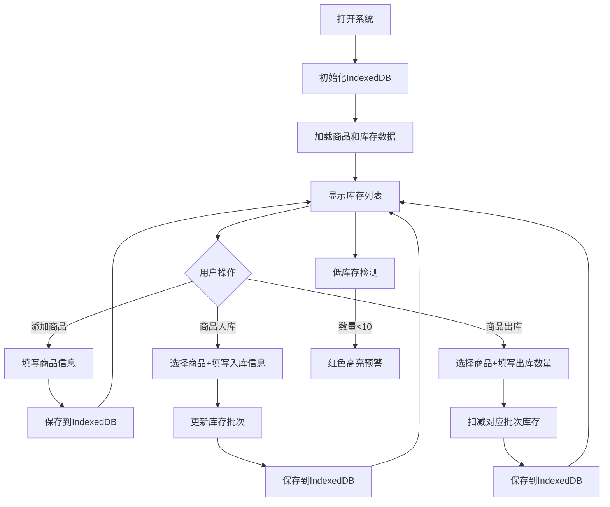

## 1. 产品概述

小型仓库进销存管理系统，为小型企业或个人提供简洁高效的库存管理工具。系统支持商品信息管理、入库出库操作、实时库存查看及低库存预警，所有数据本地存储，无需后端服务。

- 主要用途：管理仓库商品的进销存全流程
- 目标用户：小型商家、仓库管理员、个人创业者
- 核心价值：轻量化、本地化、易用的库存管理解决方案

## 2. 核心功能

### 2.1 用户角色
| 角色 | 注册方式 | 核心权限 |
|------|----------|----------|
| 普通用户 | 无需注册，直接使用 | 所有功能操作，数据本地存储 |

### 2.2 功能模块
1. **商品管理**：添加、查看商品信息（商品名、分类、单位）
2. **入库管理**：商品入库操作，记录批次、生产日期、入库时间
3. **出库管理**：商品出库操作，扣减对应库存
4. **库存查询**：实时显示库存列表，展示总数量和批次明细
5. **预警系统**：低库存自动标红预警（低于10个）

### 2.3 页面详情
| 页面名称 | 模块名称 | 功能描述 |
|---------|----------|----------|
| 主页面 | 商品管理面板 | 添加商品表单，商品列表展示，支持删除操作 |
| 主页面 | 入库操作面板 | 选择商品，填写入库数量、批次号、生产日期，执行入库 |
| 主页面 | 出库操作面板 | 选择商品，填写出库数量，执行出库 |
| 主页面 | 库存列表面板 | 展示所有商品库存、总数量、各批次明细，低库存预警 |

## 3. 核心流程

用户打开系统 → 查看当前库存状态 → 进行入库/出库操作 → 系统自动更新库存 → 低库存商品自动标红预警

## 4. 用户界面设计

### 4.1 设计风格
- 主色调：深绿色系（#166534），象征仓储、稳重、专业
- 辅助色：橙色（#ea580c）用于预警提示，蓝色（#2563eb）用于操作按钮
- 背景色：浅灰绿色渐变背景，营造专业仓储氛围
- 按钮风格：圆角矩形，微立体阴影，悬停动效
- 字体：标题使用 Noto Serif SC 展示字体，正文使用 Inter 无衬线字体
- 布局：卡片式分栏布局，顶部导航，主体四面板排列
- 图标：使用 Font Awesome 图标增强视觉识别

### 4.2 页面设计概述
| 页面名称 | 模块名称 | UI元素 |
|---------|----------|--------|
| 主页面 | 顶部导航 | 系统标题、Logo、当前时间显示 |
| 主页面 | 商品管理卡片 | 表单输入框、添加按钮、商品列表表格 |
| 主页面 | 入库操作卡片 | 商品下拉选择、数量输入、批次号、日期选择、入库按钮 |
| 主页面 | 出库操作卡片 | 商品下拉选择、数量输入、出库按钮 |
| 主页面 | 库存列表卡片 | 数据表格、商品名、总数量、批次明细展开行、预警标红 |

### 4.3 响应式设计
- 桌面端（默认）：四卡片网格布局，2x2排列
- 平板端：两列布局，每列两张卡片
- 移动端：单列布局，卡片垂直堆叠
- 所有表单元素支持触摸操作，按钮最小44x44px

### 4.4 动效设计
- 页面加载：卡片渐入动画， staggered 延迟效果
- 按钮交互：悬停上浮 + 阴影加深，点击缩放反馈
- 数据更新：库存数量变化时数字滚动动画
- 预警提示：低库存行轻微呼吸闪烁效果
- 批次展开：平滑高度过渡动画
