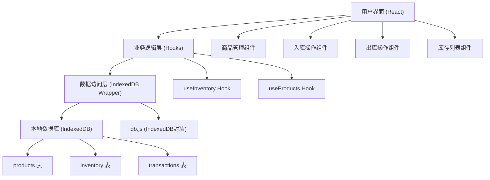
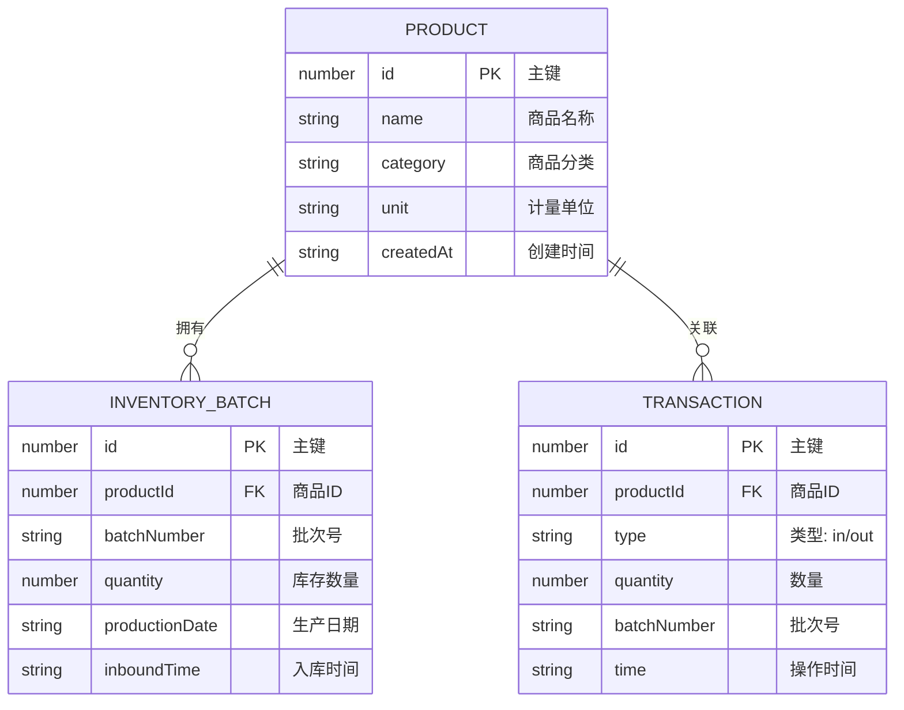

## 1. 架构设计



## 2. 技术描述

- **前端框架**：React@18 + TypeScript + Vite
- **样式方案**：TailwindCSS@3 + CSS Variables
- **图标库**：Font Awesome
- **本地数据库**：IndexedDB（原生API封装，idb轻量库）
- **状态管理**：React Hooks + Context
- **构建工具**：Vite@5
- **无后端服务**：纯前端应用，数据本地持久化

## 3. 数据模型

### 3.1 实体关系图



### 3.2 IndexedDB 存储结构

**数据库名称**: `inventoryDB`
**版本**: 1

**Object Store 定义**:

1. **products** 表
   - 主键: `id` (自增)
   - 索引: `name` (唯一)

2. **inventory** 表
   - 主键: `id` (自增)
   - 索引: `productId`, `batchNumber`

3. **transactions** 表
   - 主键: `id` (自增)
   - 索引: `productId`, `type`, `time`

## 4. 核心模块说明

### 4.1 IndexedDB 封装层 (src/db/index.ts)
- `initDB()`: 初始化数据库，创建表结构
- `addProduct()`: 添加商品
- `getProducts()`: 获取所有商品
- `deleteProduct()`: 删除商品
- `stockIn()`: 商品入库（新增批次）
- `stockOut()`: 商品出库（扣减批次，先进先出）
- `getInventory()`: 获取库存列表（含批次汇总）
- `addTransaction()`: 记录操作日志

### 4.2 业务 Hooks
- `useProducts()`: 商品管理逻辑
- `useInventory()`: 库存管理逻辑（入库、出库、查询）

### 4.3 UI 组件
- `ProductForm`: 商品添加表单
- `ProductList`: 商品列表
- `StockInForm`: 入库表单
- `StockOutForm`: 出库表单
- `InventoryTable`: 库存列表（含批次明细展开）

### 4.4 工具函数
- `calculateTotalQuantity()`: 计算商品总库存
- `isLowStock()`: 判断是否低库存
- `formatDate()`: 日期格式化
- `generateBatchNumber()`: 自动生成批次号

## 5. 出库扣减策略

采用 **先进先出 (FIFO)** 策略：
1. 按入库时间排序，优先扣减最早入库的批次
2. 如果当前批次数量足够，直接扣减
3. 如果当前批次数量不足，扣完当前批次后继续扣减下一批次
4. 更新剩余批次数量，删除已扣完的批次
5. 记录出库交易日志

## 6. 低库存预警逻辑

- 预警阈值：10个单位（可配置常量）
- 触发条件：商品总库存数量 < 10
- 表现形式：
  - 库存列表行背景色变为浅红色
  - 数量文字变为深红色加粗
  - 显示预警图标
  - 轻微呼吸动画效果

## 7. 项目目录结构

```
src/
├── components/
│   ├── Header.tsx          # 顶部导航
│   ├── ProductForm.tsx     # 商品添加表单
│   ├── ProductList.tsx     # 商品列表
│   ├── StockInForm.tsx     # 入库表单
│   ├── StockOutForm.tsx    # 出库表单
│   └── InventoryTable.tsx  # 库存列表
├── db/
│   └── index.ts            # IndexedDB 封装
├── hooks/
│   ├── useProducts.ts      # 商品管理 Hook
│   └── useInventory.ts     # 库存管理 Hook
├── types/
│   └── index.ts            # TypeScript 类型定义
├── utils/
│   └── helpers.ts          # 工具函数
├── App.tsx                 # 主应用组件
├── main.tsx                # 入口文件
└── index.css               # 全局样式
```
