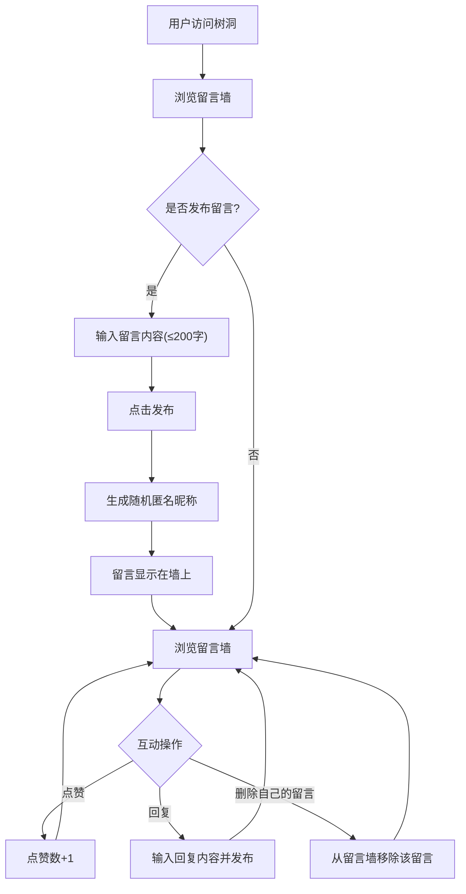

## 1. 产品概述
匿名校园树洞留言板——一个无需登录的匿名校园社区，学生可自由发布心事、吐槽或分享，通过匿名昵称保护隐私，以点赞和回复形成轻互动。
- 解决校园匿名表达需求，提供安全、无压力的倾诉与交流空间
- 目标用户为在校大学生，强调匿名性与即时互动

## 2. 核心功能

### 2.1 用户角色
无需区分角色，所有访客均为匿名用户，无需注册登录。

### 2.2 功能模块
1. **留言墙页面**：留言输入区、留言列表、点赞互动、回复功能、删除功能

### 2.3 页面详情
| 页面名称 | 模块名称 | 功能描述 |
|----------|----------|----------|
| 留言墙 | 留言输入区 | 200字以内文本输入框，发布按钮，字数计数器 |
| 留言墙 | 留言卡片 | 显示匿名昵称、留言内容、发布时间、点赞按钮及计数、回复按钮、删除按钮（仅自己的留言） |
| 留言墙 | 回复区域 | 每条留言下方可展开回复列表，支持输入回复内容 |
| 留言墙 | 留言列表 | 按时间倒序排列，最多显示30条留言 |

## 3. 核心流程

用户访问页面 → 输入留言内容 → 点击发布 → 留言显示在墙上（自动生成匿名昵称）→ 其他用户可点赞/回复 → 同会话用户可删除自己的留言

## 4. 用户界面设计

### 4.1 设计风格
- 主色调：深夜蓝（#1a1a2e）搭配暖橙色（#ff6b35）点缀，营造"树洞"的温暖隐秘感
- 辅助色：深紫色（#16213e）、暗蓝（#0f3460），浅橙色（#ff9a56）
- 按钮风格：圆角胶囊按钮，带微光晕效果
- 字体：标题使用 ZCOOL QingKe HuangYou（站酷庆科黄油体），正文使用 Noto Sans SC
- 布局风格：居中卡片式布局，留言以浮动卡片形式呈现，带微弱阴影和渐变边框
- 图标/表情风格：使用 emoji 风格（👍），配合手绘风装饰元素

### 4.2 页面设计概览
| 页面名称 | 模块名称 | UI元素 |
|----------|----------|--------|
| 留言墙 | 头部标题 | 渐变背景，大标题"校园树洞"，副标题描述，浮动粒子动画 |
| 留言墙 | 留言输入区 | 圆角文本框，字数计数器，渐变发布按钮，hover光晕效果 |
| 留言墙 | 留言卡片 | 半透明磨砂玻璃卡片，昵称色标签，时间戳，点赞按钮动画，回复折叠区 |
| 留言墙 | 回复输入 | 内联小输入框，简洁回复按钮 |

### 4.3 响应式设计
- 桌面端优先，最大宽度640px居中
- 移动端自适应全宽，触控优化按钮尺寸

### 4.4 3D场景指导
不适用
