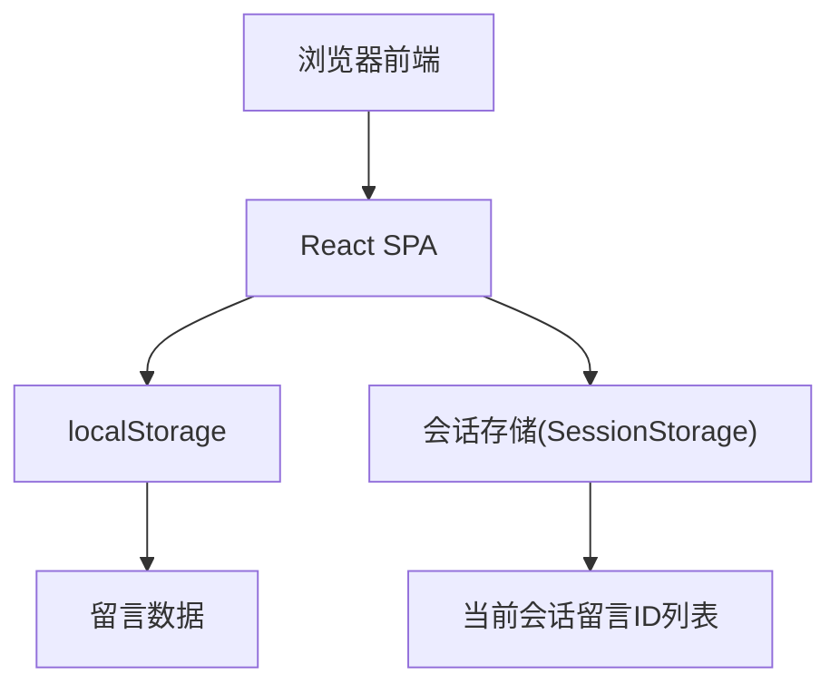
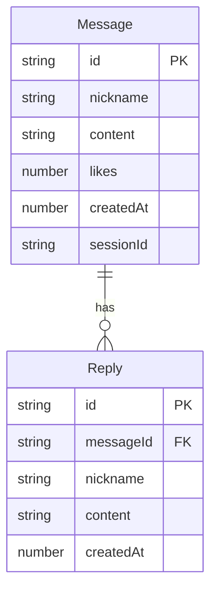

## 1. 架构设计



纯前端架构，无后端服务。所有数据持久化在浏览器 localStorage 中，会话标识存储在 sessionStorage 中用于判断留言归属。

## 2. 技术说明
- 前端：React@18 + tailwindcss@3 + vite
- 初始化工具：vite-init
- 后端：无
- 数据库：浏览器 localStorage

## 3. 路由定义
| 路由 | 用途 |
|------|------|
| / | 留言墙主页面（单页应用，仅一个路由） |

## 4. API定义
不适用（纯前端，无后端API）

## 5. 服务器架构图
不适用

## 6. 数据模型

### 6.1 数据模型定义



### 6.2 数据定义语言

**localStorage 键值设计：**

- `treehole_messages`：存储留言数组，最多30条
- `treehole_session_id`：存储当前会话ID（sessionStorage）

**Message 数据结构：**
```typescript
interface Message {
  id: string;          // UUID
  nickname: string;    // 随机匿名昵称，如"游客123"
  content: string;     // 留言内容，最长200字
  likes: number;       // 点赞数
  createdAt: number;   // 时间戳
  sessionId: string;   // 发布者的会话ID
}

interface Reply {
  id: string;          // UUID
  messageId: string;   // 所属留言ID
  nickname: string;    // 随机匿名昵称
  content: string;     // 回复内容
  createdAt: number;   // 时间戳
}
```

**存储策略：**
- 留言存储在 localStorage 的 `treehole_messages` 键中
- 回复嵌套存储在对应 Message 对象的 `replies` 数组中
- 当前会话ID存储在 sessionStorage 的 `treehole_session_id` 键中
- 新增留言时若超过30条，移除最早的一条
- 点赞状态记录在 localStorage 的 `treehole_liked` 键中（已点赞的留言ID集合）
