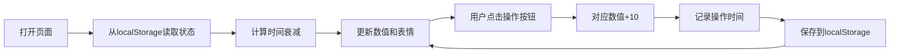

## 1. 产品概述
桌面像素宠物养成工具，用户可以喂养、清洁、陪伴一只像素风格的虚拟宠物（猫咪或狗狗），通过互动维持宠物的各项数值，体验养成乐趣。
- 主要目的：提供轻松治愈的虚拟宠物养成体验
- 目标用户：喜欢休闲养成类游戏的用户
- 产品价值：无需下载即可在浏览器中体验宠物养成的乐趣，数据自动保存

## 2. 核心 Features

### 2.1 用户角色
| 角色 | 注册方式 | 核心权限 |
|------|----------|----------|
| 普通用户 | 无需注册 | 完整使用所有养成功能 |

### 2.2 功能模块
1. **主页面**：宠物展示区、数值状态栏、操作按钮区、时间信息区

### 2.3 页面详情
| 页面名称 | 模块名称 | 功能描述 |
|---------|----------|----------|
| 主页面 | 宠物展示区 | 显示像素风格宠物图标（猫咪/狗狗可切换），根据数值显示不同表情（正常/哭/笑） |
| 主页面 | 数值状态栏 | 显示饥饿值、清洁值、快乐值的进度条和具体数值（0-100） |
| 主页面 | 操作按钮区 | 喂食、洗澡、玩耍三个按钮，点击后对应数值+10 |
| 主页面 | 时间信息区 | 显示最后一次喂食、洗澡、玩耍的时间 |
| 主页面 | 宠物切换 | 可切换猫咪或狗狗形象 |

## 3. 核心流程
用户打开页面 → 从 localStorage 恢复宠物状态 → 实时计算时间衰减（每小时-5点）→ 显示当前数值和表情 → 用户点击交互按钮 → 更新数值和最后操作时间 → 保存到 localStorage

## 4. 用户界面设计

### 4.1 设计风格
- **主色调**：温暖的像素游戏风格，使用粉色系（#FF9EAA）作为主色，淡蓝色（#9ED8FF）作为辅助色
- **按钮风格**：像素风格按钮，带立体边框效果，圆角4px
- **字体**：使用像素风格字体 'Press Start 2P' 或等宽字体，营造复古游戏氛围
- **布局**：居中卡片式布局，像素边框装饰
- **图标**：使用像素艺术风格的 emoji 或 CSS 绘制的像素图形

### 4.2 页面设计概述
| 页面名称 | 模块名称 | UI 元素 |
|---------|----------|---------|
| 主页面 | 宠物展示区 | 大尺寸像素宠物图标，表情动画效果，点击有反馈 |
| 主页面 | 数值状态栏 | 三个彩色进度条，带数值标签，颜色随数值变化 |
| 主页面 | 操作按钮区 | 三个像素风格按钮，带有图标和文字，悬停动画 |
| 主页面 | 时间信息区 | 小字体显示最后操作时间，带时间图标 |
| 主页面 | 宠物切换 | 小型切换按钮在角落 |

### 4.3 响应性
- 桌面端优先设计，居中卡片布局（宽度480px）
- 移动端自适应，卡片宽度占满屏幕（最小320px）
- 按钮在移动端增大点击区域（最小44px）

### 4.4 动效设计
- 数值变化时有数字跳动动画
- 宠物表情切换时有平滑过渡
- 点击按钮有按压反馈和数值飘字效果
- 进度条填充有动画效果
