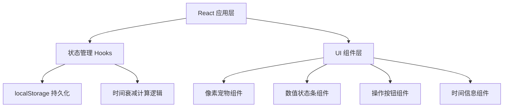
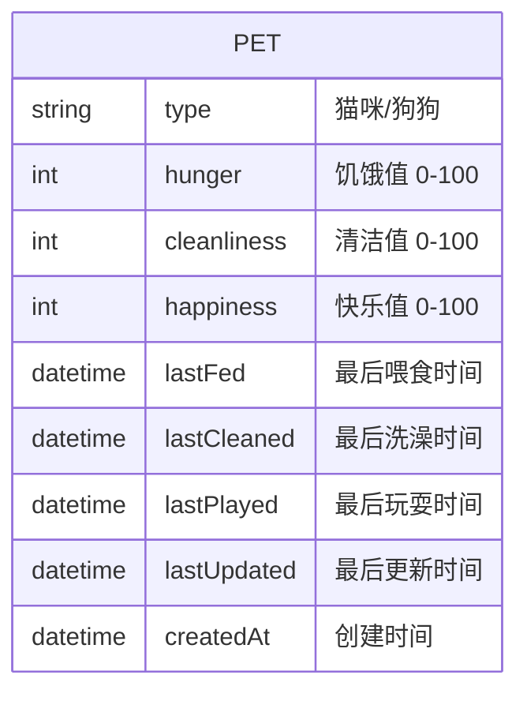

## 1. 架构设计



## 2. 技术描述
- **前端**：React@18 + tailwindcss@3 + vite
- **初始化工具**：vite-init
- **后端**：无（纯前端应用）
- **数据存储**：localStorage（浏览器本地存储）
- **字体**：Google Fonts - Press Start 2P（像素风格字体）

## 3. 路由定义
| 路由 | 用途 |
|------|------|
| / | 主页面 - 宠物养成界面 |

## 4. 数据模型

### 4.1 数据模型定义



### 4.2 数据结构定义
```typescript
interface PetState {
  type: 'cat' | 'dog';
  hunger: number;
  cleanliness: number;
  happiness: number;
  lastFed: string;
  lastCleaned: string;
  lastPlayed: string;
  lastUpdated: string;
  createdAt: string;
}

interface ActionType {
  FEED: 'feed';
  CLEAN: 'clean';
  PLAY: 'play';
}
```

## 5. 核心逻辑

### 5.1 时间衰减计算
- 衰减速率：每小时衰减5点
- 计算方式：`当前时间 - 最后更新时间` 计算出经过的小时数
- 衰减公式：`衰减值 = floor(经过小时数) * 5`
- 数值范围：始终保持在 0-100 之间

### 5.2 表情判定规则
- 任意数值 < 30 → 哭泣表情 😢
- 所有数值 > 80 → 开心表情 😊
- 其他情况 → 正常表情 😐

### 5.3 localStorage 操作
- 存储键名：`pixel-pet-state`
- 页面加载时读取并计算时间衰减
- 每次操作后立即保存
- 数据格式：JSON 字符串

### 5.4 操作逻辑
- 喂食：`hunger = min(hunger + 10, 100)`，更新 lastFed
- 洗澡：`cleanliness = min(cleanliness + 10, 100)`，更新 lastCleaned
- 玩耍：`happiness = min(happiness + 10, 100)`，更新 lastPlayed
- 每次操作同时更新 lastUpdated
