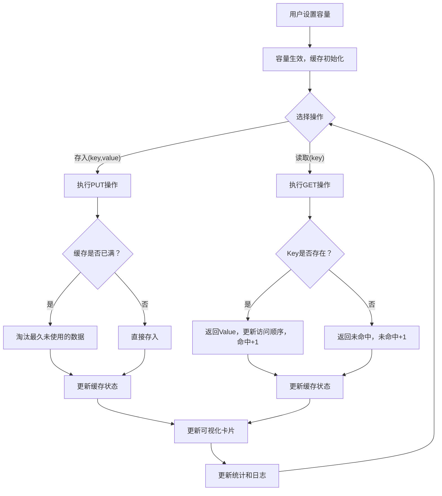

## 1. 产品概述

LRU缓存模拟器是一个交互式可视化工具，用于帮助开发者理解和学习LRU（最近最少使用）缓存淘汰算法的工作原理。用户可以设置缓存容量、执行存入和读取操作，并实时观察缓存内部状态的变化。目标用户为计算机科学学生和面试准备者。

## 2. 核心功能

### 2.1 功能模块

1. **缓存控制面板**：容量设置（1-10）、存入/读取操作按钮
2. **缓存可视化区域**：卡片形式展示缓存数据，按最近使用顺序排列
3. **统计面板**：命中次数、未命中次数、命中率
4. **操作日志**：侧边栏记录每次操作的详细信息

### 2.2 页面详情

| 页面名称 | 模块名称 | 功能描述 |
|----------|----------|----------|
| 主页面 | 容量设置 | 滑块/输入框设置1-10的缓存容量，修改后清空当前缓存 |
| 主页面 | 存入操作 | 输入key和value，执行put操作；缓存满时淘汰最久未使用的数据 |
| 主页面 | 读取操作 | 输入key，执行get操作；命中则返回value并更新访问顺序，未命中则提示 |
| 主页面 | 缓存卡片展示 | 以卡片形式展示当前缓存中所有数据，最近使用的在最左侧，支持淘汰动画 |
| 主页面 | 命中/未命中统计 | 实时显示命中次数、未命中次数和命中率百分比 |
| 主页面 | 操作日志 | 侧边栏滚动显示所有操作记录，包含时间戳、操作类型、结果 |

## 3. 核心流程

用户设置缓存容量后，可通过存入和读取操作与缓存交互。每次操作后界面即时更新，展示缓存状态、统计数据和操作日志。

## 4. 用户界面设计

### 4.1 设计风格

- **主色调**：深色背景（#0a0f1a）配霓虹青绿色（#00ffc8）和橙色（#ff6b35）点缀
- **风格**：赛博朋克/终端风格，科技感强烈
- **字体**：JetBrains Mono（主字体，终端感）+ Outfit（辅助字体，现代几何感）
- **布局**：左侧操作面板 + 中间缓存可视化 + 右侧操作日志，三栏布局
- **卡片风格**：圆角卡片，带微光边框效果，淘汰时有淡出动画
- **图标**：lucide-react 图标库

### 4.2 页面设计概览

| 页面名称 | 模块名称 | UI元素 |
|----------|----------|--------|
| 主页面 | 容量设置 | 滑块组件+数字显示，霓虹青色高亮 |
| 主页面 | 存入/读取操作 | 两个操作区域，各有输入框和按钮，按钮带悬停发光效果 |
| 主页面 | 缓存卡片区域 | 水平排列的卡片，最近使用在最左，淘汰时向右滑出动画 |
| 主页面 | 统计面板 | 三个数据卡片（命中/未命中/命中率），数字大号显示 |
| 主页面 | 操作日志 | 右侧侧边栏，深色半透明背景，操作条目带彩色标签区分类型 |

### 4.3 响应式设计

- 桌面优先设计，三栏布局
- 平板端：操作日志折叠为底部抽屉
- 移动端：单列布局，所有模块垂直堆叠
