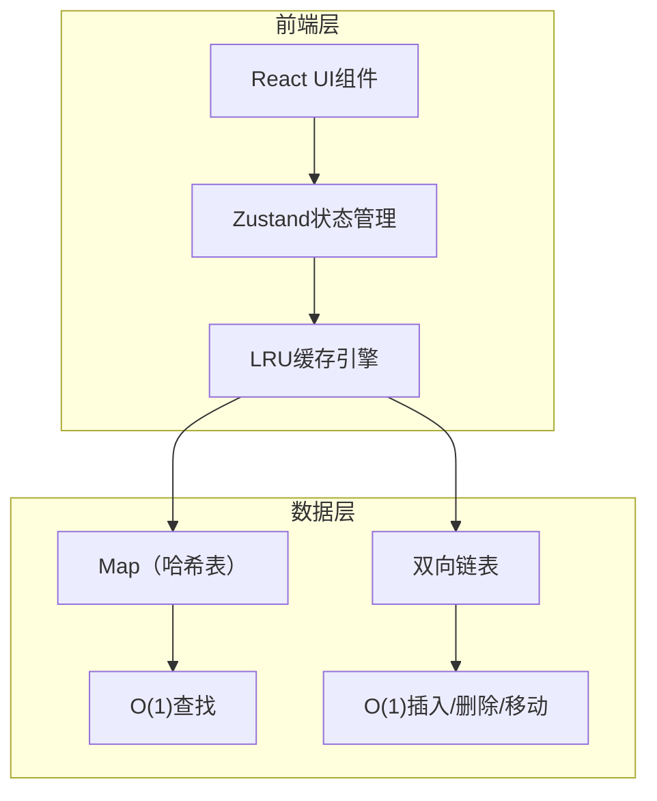
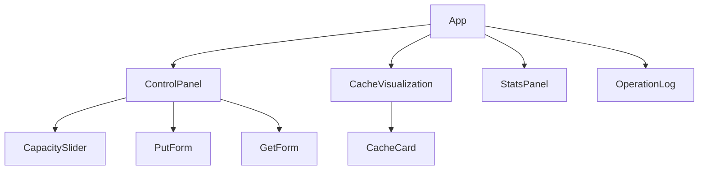

## 1. 架构设计



## 2. 技术说明

- **前端**：React@18 + TypeScript + Tailwind CSS + Vite
- **初始化工具**：vite-init（react-ts模板）
- **状态管理**：Zustand
- **后端**：无（纯前端应用）
- **数据库**：无

## 3. 路由定义

| 路由 | 用途 |
|------|------|
| / | 主页面，包含缓存模拟器的所有功能 |

## 4. 核心数据结构

### 4.1 LRU缓存实现

采用 **Map + 双向链表** 的经典O(1)实现方案：

- **Map<key, Node>**：O(1)时间查找节点
- **双向链表**：O(1)时间完成节点的插入、删除和移动
- 链表头部为最近使用，尾部为最久未使用

### 4.2 双向链表节点

```typescript
interface ListNode {
  key: string;
  value: string;
  prev: ListNode | null;
  next: ListNode | null;
}
```

### 4.3 LRU缓存操作

| 操作 | 时间复杂度 | 说明 |
|------|-----------|------|
| get(key) | O(1) | Map查找 → 移动到链表头部 |
| put(key, value) | O(1) | Map查找 → 存在则更新并移到头部；不存在则创建新节点插入头部，超容量则删除尾部 |

### 4.4 状态模型

```typescript
interface CacheState {
  capacity: number;
  hits: number;
  misses: number;
  log: LogEntry[];
  getCacheOrder: () => { key: string; value: string }[];
  setCapacity: (cap: number) => void;
  put: (key: string, value: string) => void;
  get: (key: string) => string | null;
  reset: () => void;
}

interface LogEntry {
  timestamp: number;
  type: 'put' | 'get' | 'evict' | 'reset';
  key: string;
  value?: string;
  result: string;
}
```

## 5. 组件结构



| 组件 | 职责 |
|------|------|
| App | 主布局，三栏结构 |
| ControlPanel | 容量设置、存入/读取操作表单 |
| CacheVisualization | 缓存卡片容器，按最近使用顺序展示 |
| CacheCard | 单个缓存条目卡片，显示key-value |
| StatsPanel | 命中/未命中/命中率统计 |
| OperationLog | 操作日志侧边栏 |
