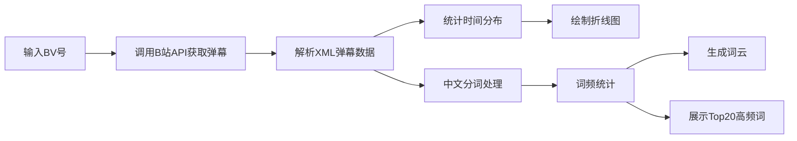

## 1. 产品概述

B站弹幕数据抓取与词频分析系统，用户输入视频BV号即可获取弹幕数据，进行可视化分析。

- 主要用途：B站视频弹幕数据的抓取、分析和可视化展示
- 目标用户：内容创作者、数据分析人员、B站爱好者
- 产品价值：快速了解视频弹幕的热点话题和观众互动趋势

## 2. 核心功能

### 2.1 用户角色
| 角色 | 注册方式 | 核心权限 |
|------|----------|----------|
| 普通用户 | 无需注册 | 输入BV号查询、查看分析结果 |

### 2.2 功能模块
1. **首页**：BV号输入区、数据抓取状态展示
2. **分析页面**：弹幕时间分布折线图、词云展示、高频词列表

### 2.3 页面详情
| 页面名称 | 模块名称 | 功能描述 |
|----------|----------|----------|
| 首页 | BV号输入模块 | 用户输入BV号，触发数据抓取 |
| 首页 | 状态展示模块 | 显示数据抓取进度和结果状态 |
| 分析页面 | 时间分布图 | 弹幕发送时间分布折线图 |
| 分析页面 | 词云展示 | 弹幕文本词频可视化词云 |
| 分析页面 | 高频词列表 | 前20高频词排名展示 |

## 3. 核心流程

用户在输入框中输入视频BV号，系统调用B站公开API获取弹幕XML数据，解析后统计弹幕发送时间分布并绘制折线图，提取文本进行中文分词和词频统计，生成词云图并展示前20高频词。

## 4. 用户界面设计

### 4.1 设计风格
- 主色调：B站标志性粉色（#FB7299）配合深灰色
- 按钮风格：圆角按钮，hover时有缩放动效
- 字体：使用现代无衬线字体，标题醒目，正文清晰
- 布局风格：卡片式布局，分模块展示不同分析结果
- 图标风格：简洁线性图标，配合B站特色元素

### 4.2 页面设计概述
| 页面名称 | 模块名称 | UI元素 |
|----------|----------|--------|
| 首页 | 输入区域 | 居中布局，大输入框，粉色提交按钮 |
| 分析页面 | 图表区域 | 左右分栏，上方折线图，下方词云 |
| 分析页面 | 高频词列表 | 右侧列表，带排名序号和词频条 |

### 4.3 响应性
- Desktop-first设计，移动端自适应
- 图表在移动端自动调整为单列布局
- 确保触摸交互友好
