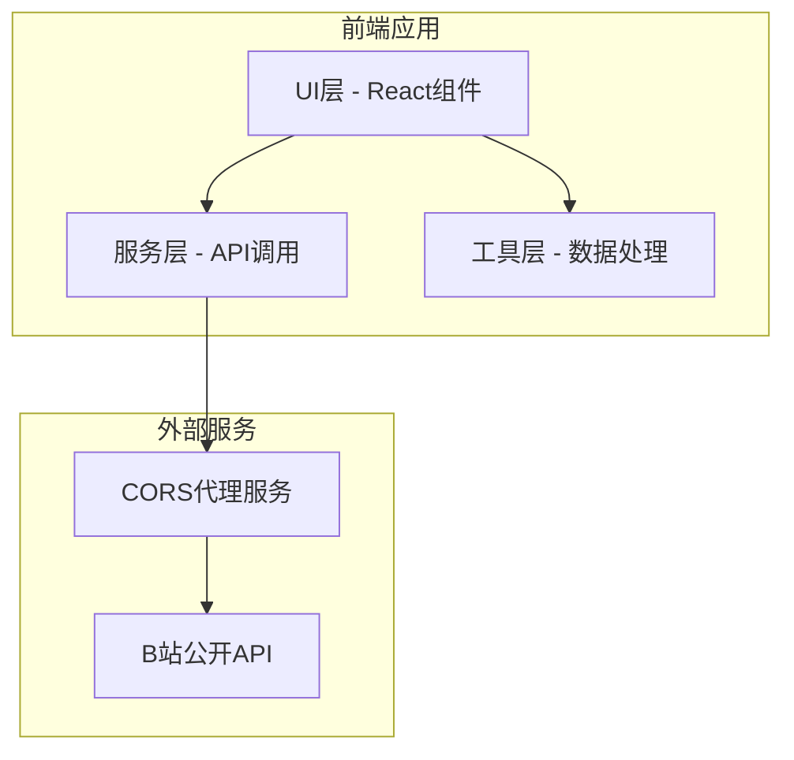

## 1. 架构设计



## 2. 技术描述

- 前端框架：React@18 + TypeScript
- 构建工具：Vite@5
- 样式方案：TailwindCSS@3
- 图表库：Chart.js + react-chartjs-2
- 词云库：wordcloud2.js
- 中文分词：@node-rs/jieba
- XML解析：fast-xml-parser
- HTTP请求：axios

## 3. 项目结构

```
src/
├── components/          # React组件
│   ├── BvInput.tsx      # BV号输入组件
│   ├── TimeChart.tsx    # 时间分布折线图
│   ├── WordCloud.tsx    # 词云组件
│   └── TopWords.tsx     # 高频词列表
├── services/            # 服务层
│   └── bilibiliApi.ts   # B站API调用
├── utils/               # 工具函数
│   ├── danmakuParser.ts # 弹幕解析
│   ├── wordSegment.ts   # 中文分词
│   └── wordFrequency.ts # 词频统计
├── types/               # TypeScript类型定义
│   └── index.ts
├── App.tsx
└── main.tsx
```

## 4. 核心数据类型

```typescript
interface Danmaku {
  time: number;      // 视频内时间点(秒)
  text: string;      // 弹幕文本
  sendTime: number;  // 发送时间戳
}

interface TimeDistribution {
  bucket: number;    // 时间桶(秒)
  count: number;     // 弹幕数量
}

interface WordCount {
  word: string;
  count: number;
}
```

## 5. 模块职责

1. **components/**：UI展示层，负责用户交互和数据可视化
2. **services/**：API调用层，封装B站弹幕数据获取逻辑
3. **utils/**：业务逻辑层，弹幕解析、分词、词频统计
4. **types/**：类型定义，确保数据结构一致性
