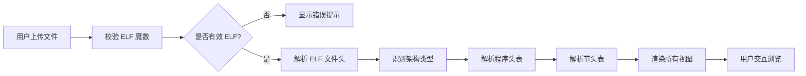

## 1. 产品概述
ELF 文件解析器是一个纯前端二进制分析工具，允许用户上传 ELF（可执行与可链接格式）文件并在线解析其结构，帮助开发者和安全研究人员快速了解二进制文件的内部构成。
- 主要功能：ELF 文件头解析、程序头表/节头表展示、十六进制原始数据查看、架构自动识别
- 目标用户：逆向工程师、系统程序员、安全研究人员、计算机科学学生
- 市场价值：提供轻量级、无需安装的 ELF 分析工具，降低二进制分析门槛

## 2. 核心功能

### 2.1 用户角色
| 角色 | 注册方式 | 核心权限 |
|------|----------|----------|
| 访客用户 | 无需注册 | 上传 ELF 文件、查看解析结果、导出数据 |

### 2.2 功能模块
1. **文件上传区**：拖拽/点击上传 ELF 文件，文件校验
2. **ELF 头信息展示**：魔数、类别、字节序、版本、OS ABI、类型、机器、入口点等核心信息
3. **程序头表**：以表格形式展示所有程序头条目（类型、偏移、虚拟地址、文件大小、内存大小、对齐等）
4. **节头表**：以表格形式展示所有节头条目（名称、类型、偏移、虚拟地址、大小、对齐等）
5. **十六进制查看器**：支持文件原始数据的十六进制浏览，支持地址跳转
6. **架构识别**：自动识别 x86、ARM、RISC-V 等常见架构并高亮显示

### 2.3 页面详情
| 页面名称 | 模块名称 | 功能描述 |
|----------|----------|----------|
| 主页面 | 文件上传模块 | 支持拖拽上传、点击选择文件、文件格式校验、上传进度显示 |
| 主页面 | 文件头信息模块 | 卡片式展示 ELF 头各字段，包含架构标识徽章 |
| 主页面 | 程序头表模块 | 可排序、可过滤的表格展示程序头条目 |
| 主页面 | 节头表模块 | 可排序、可过滤的表格展示节头条目，支持点击跳转至十六进制视图 |
| 主页面 | 十六进制查看模块 | 左栏地址、中间十六进制、右栏 ASCII 显示，支持按字节/半字/字分组 |
| 主页面 | 导航模块 | Tab 切换不同视图，支持快速定位 |

## 3. 核心流程
用户上传 ELF 文件 → 系统校验文件魔数 → 解析 ELF 头信息 → 识别目标架构 → 解析程序头表和节头表 → 渲染各视图 → 用户切换 Tab 查看不同信息 → 点击节头表条目可跳转至十六进制视图对应偏移

## 4. 界面设计

### 4.1 设计风格
- **主色调**：深色科技风格，深灰背景 (#0f172a)，搭配电子蓝 (#3b82f6) 作为主色，青绿 (#10b981) 作为成功色，琥珀 (#f59e0b) 作为警告色
- **按钮风格**：圆角 8px，带有微妙的发光效果，hover 时边框高亮
- **字体**：等宽字体 (JetBrains Mono) 用于数据展示，搭配现代无衬线字体用于界面文本
- **布局风格**：三栏式布局，左侧导航，中间主内容区，右侧十六进制查看器
- **图标风格**：简洁线性图标，使用统一的线宽和风格

### 4.2 页面设计概述
| 页面名称 | 模块名称 | UI 元素 |
|----------|----------|----------|
| 主页面 | 文件上传区 | 拖拽区域边框动画、文件图标、上传按钮、文件大小显示 |
| 主页面 | ELF 头信息卡 | 网格布局、字段标签、值显示、架构徽章、字节序标识 |
| 主页面 | 数据表格 | 斑马纹、可排序列、悬停高亮、滚动容器、列宽可调整 |
| 主页面 | 十六进制查看器 | 三列布局（地址/十六进制/ASCII）、同步滚动、选中高亮、地址跳转输入框 |
| 主页面 | 导航标签 | 底部边框高亮、过渡动画、徽章显示数量 |

### 4.3 响应式
- 桌面端：三栏布局，内容宽度 1200px+
- 平板端：两栏布局，十六进制查看器折叠至底部
- 移动端：单栏布局，Tab 切换各模块，优化触摸交互

### 4.4 视觉特效
- 页面加载时各模块渐入动画（staggered fade-in）
- 表格行悬停时背景色微妙变化
- 十六进制视图选中字节时的高亮脉冲效果
- 架构识别成功时的徽章弹跳动画
- 代码块使用语法高亮配色方案
