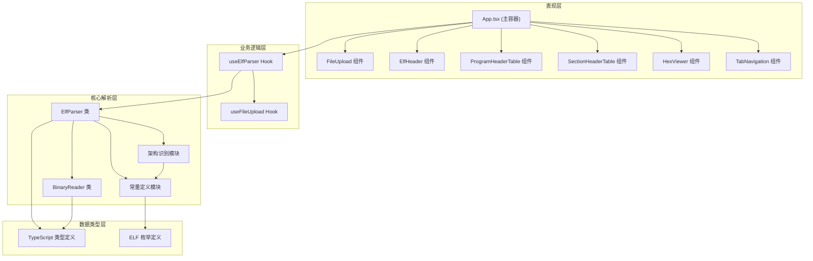
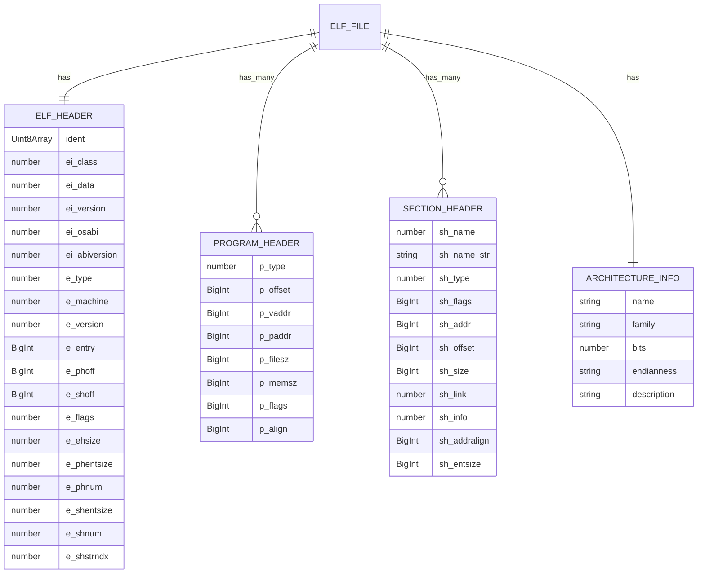

## 1. 架构设计



## 2. 技术描述
- **前端框架**: React@18 + TypeScript@5 + Vite@5
- **样式方案**: TailwindCSS@3 + CSS 变量主题系统
- **状态管理**: React Hooks (useState, useReducer, useCallback)
- **图标库**: lucide-react
- **构建工具**: Vite
- **部署**: 纯静态部署，无后端依赖

### 核心架构特点
1. **纯前端解析**: 所有二进制解析在浏览器端完成，保护用户隐私
2. **可扩展架构识别**: 采用策略模式设计架构识别模块，易于新增 MIPS、PowerPC 等架构
3. **分层设计**: 解析逻辑与 UI 完全分离，核心解析器可独立复用
4. **类型安全**: 全程 TypeScript 严格模式，定义完整的 ELF 数据结构类型

## 3. 路由定义
| 路由 | 用途 |
|------|------|
| / | 主应用页面，包含所有解析功能 |

## 4. 数据模型

### 4.1 ELF 核心类型定义



### 4.2 类型定义

```typescript
// ELF 标识位枚举
enum EI_CLASS { ELFCLASS32 = 1, ELFCLASS64 = 2 }
enum EI_DATA { ELFDATA2LSB = 1, ELFDATA2MSB = 2 }
enum E_TYPE { ET_NONE = 0, ET_REL = 1, ET_EXEC = 2, ET_DYN = 3, ET_CORE = 4 }

// 机器架构枚举（可扩展）
enum EM_MACHINE {
  EM_NONE = 0, EM_386 = 3, EM_ARM = 40, EM_X86_64 = 62, 
  EM_AARCH64 = 183, EM_RISCV = 243
}

// 架构识别策略接口
interface IArchitectureRecognizer {
  recognize(machine: number): ArchitectureInfo | null;
  supportedArchitectures(): string[];
}

// 程序头类型
enum PT_TYPE {
  PT_NULL = 0, PT_LOAD = 1, PT_DYNAMIC = 2, PT_INTERP = 3,
  PT_NOTE = 4, PT_SHLIB = 5, PT_PHDR = 6
}

// 节头类型
enum SH_TYPE {
  SHT_NULL = 0, SHT_PROGBITS = 1, SHT_SYMTAB = 2, 
  SHT_STRTAB = 3, SHT_RELA = 4, SHT_HASH = 5, SHT_DYNAMIC = 6
}
```

## 5. 模块设计

### 5.1 核心解析模块 (`src/parser/`)
| 文件 | 职责 |
|------|------|
| `BinaryReader.ts` | 封装 DataView，支持大小端、32/64 位整数读取 |
| `ElfParser.ts` | ELF 格式主解析器，负责解析文件头、程序头、节头 |
| `ArchitectureRecognizer.ts` | 架构识别模块，策略模式，易于扩展 |
| `ElfConstants.ts` | ELF 常量定义（类型、机器、标志位等） |
| `ElfTypes.ts` | TypeScript 类型定义 |

### 5.2 UI 组件模块 (`src/components/`)
| 文件 | 职责 |
|------|------|
| `FileUpload.tsx` | 文件上传组件，支持拖拽和点击 |
| `ElfHeaderView.tsx` | ELF 头信息展示卡片 |
| `ProgramHeaderTable.tsx` | 程序头表组件 |
| `SectionHeaderTable.tsx` | 节头表组件，支持跳转十六进制视图 |
| `HexViewer.tsx` | 十六进制查看器组件 |
| `ArchitectureBadge.tsx` | 架构标识徽章组件 |
| `TabNavigation.tsx` | 标签导航组件 |

### 5.3 Hooks 模块 (`src/hooks/`)
| 文件 | 职责 |
|------|------|
| `useElfParser.ts` | 封装 ELF 解析逻辑的 React Hook |
| `useFileUpload.ts` | 封装文件上传逻辑的 Hook |

## 6. 扩展性设计

### 6.1 架构识别扩展
采用策略模式，新增架构只需：
1. 在 `EM_MACHINE` 枚举中添加新的机器码
2. 实现 `IArchitectureRecognizer` 接口或扩展现有识别器
3. 在 `ArchitectureRecognizerRegistry` 中注册

### 6.2 节头/程序头类型扩展
常量定义集中在 `ElfConstants.ts`，新增类型只需在对应枚举中添加值和描述映射。

### 6.3 数据展示扩展
表格组件采用可配置列设计，新增字段只需修改列配置数组，无需修改组件逻辑。
