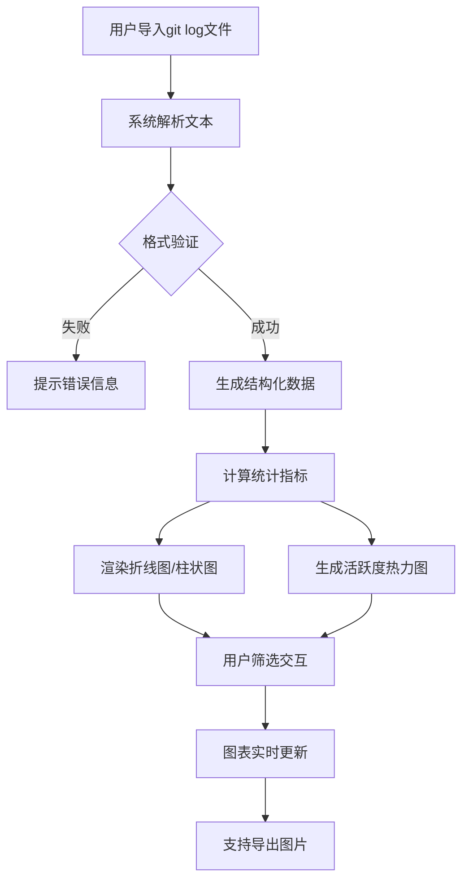

## 1. 产品概述

Git提交日志分析系统，帮助开发团队可视化分析代码提交历史。系统支持导入git log文本文件，解析后生成多维度统计图表，包括提交频率趋势、代码行数变化、作者贡献对比和活跃度热力图。

- 核心价值：将原始Git日志转化为直观的数据可视化，帮助团队洞察开发节奏、识别活跃贡献者、优化工作流程
- 目标用户：开发团队负责人、项目经理、代码审查员
- 主要问题：解决git log原始数据难以直观分析、缺乏时间维度聚合统计、无法快速识别贡献模式的问题

## 2. 核心功能

### 2.1 用户角色

| 角色 | 注册方式 | 核心权限 |
|------|----------|----------|
| 普通用户 | 无需注册，本地使用 | 导入日志文件、查看分析图表、筛选数据、导出图表 |

### 2.2 功能模块

1. **首页/主面板**：文件导入区、数据概览卡片、图表展示区、筛选控制面板
2. **数据解析模块**：git log文本解析、数据清洗、结构化存储
3. **统计分析模块**：按周聚合统计、作者贡献计算、活跃度矩阵生成
4. **图表可视化模块**：折线图（时间趋势）、柱状图（作者对比）、热力图（提交时间分布）
5. **筛选交互模块**：作者筛选、时间范围筛选、数据导出

### 2.3 页面详情

| 页面名称 | 模块名称 | 功能描述 |
|----------|----------|----------|
| 主面板 | 文件导入区 | 拖拽或点击上传git log文本文件，显示解析进度和结果统计 |
| 主面板 | 数据概览 | 显示总提交数、总作者数、总代码行数、时间跨度等关键指标 |
| 主面板 | 折线图 | 按周展示提交次数和代码增删行数的时间趋势，支持多系列叠加 |
| 主面板 | 柱状图 | 对比各作者的提交次数、增删行数贡献，支持排序切换 |
| 主面板 | 热力图 | 以小时（横轴）和星期（纵轴）展示提交密集度，颜色深浅表示活跃度 |
| 主面板 | 筛选面板 | 支持多选作者、设置起止日期、重置筛选条件 |
| 主面板 | 原始数据 | 可展开查看解析后的原始提交记录表格 |

## 3. 核心流程

用户导入git log文本文件 → 系统解析并验证数据格式 → 生成结构化数据并缓存 → 展示数据概览和多维度图表 → 用户通过筛选面板交互 → 图表实时更新 → 支持导出分析结果

## 4. 用户界面设计

### 4.1 设计风格

- **主色调**：深科技蓝（#1e3a5f）作为主色，搭配活力橙（#ff6b35）作为强调色
- **辅助色**：蓝绿渐变用于折线图系列，暖色系渐变用于热力图
- **字体**：使用Space Mono等宽字体展示数据指标，搭配Sora作为UI字体
- **布局**：卡片式布局，顶部为导入区和概览指标，中部为双栏图表区，底部为热力图
- **交互**：卡片悬停时的微妙缩放、图表数据点的tooltip、筛选时的平滑过渡动画
- **背景**：深色主题，带有细微网格纹理和渐变光晕效果

### 4.2 页面设计概述

| 页面名称 | 模块名称 | UI元素 |
|----------|----------|----------|
| 主面板 | 文件导入区 | 拖拽边框、上传图标、文件名称显示、解析进度条 |
| 主面板 | 数据概览 | 四个指标卡片，带图标和趋势箭头 |
| 主面板 | 折线图 | 双Y轴图表，图例切换，数据点hover显示详情 |
| 主面板 | 柱状图 | 分组柱状图，支持按提交数/增删行排序 |
| 主面板 | 热力图 | 7x24网格，hover显示具体提交数和时间 |
| 主面板 | 筛选面板 | 作者多选下拉、日期范围选择器、重置按钮 |

### 4.3 响应式

- 桌面端（>1024px）：双栏布局，折线图与柱状图并排显示
- 平板端（768px-1024px）：图表堆叠为单列，热力图自适应宽度
- 移动端（<768px）：筛选面板折叠为抽屉式，图表简化显示
- 触控优化：增大点击区域，支持手势缩放图表

### 4.4 动画效果

- 页面加载：卡片渐入+上移，依次延迟出现
- 文件上传：拖拽时边框高亮动画，上传成功后进度条填充
- 图表渲染：数据点逐个弹出，线条平滑绘制
- 筛选交互：图表数据平滑过渡，热力图颜色渐变更新
