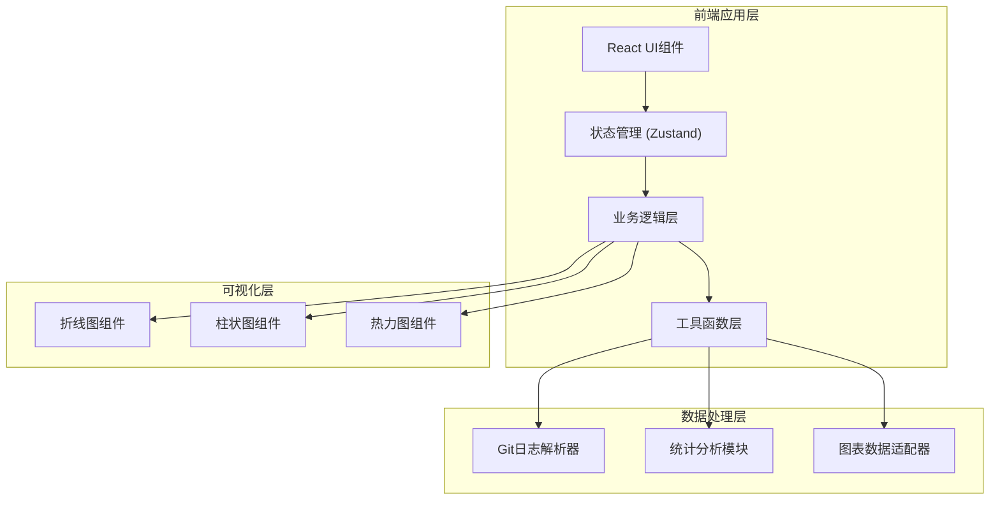

## 1. 架构设计



## 2. 技术描述

- **前端框架**：React 18 + TypeScript
- **构建工具**：Vite 5
- **样式方案**：TailwindCSS 3
- **状态管理**：Zustand
- **图表库**：ECharts 5
- **图标库**：Lucide React
- **后端**：无（纯前端应用，数据在浏览器端处理）
- **数据库**：无（使用浏览器内存存储，支持LocalStorage缓存）

## 3. 目录结构

```
src/
├── components/          # React组件
│   ├── FileUpload.tsx   # 文件上传组件
│   ├── StatsCard.tsx    # 统计卡片组件
│   ├── LineChart.tsx    # 折线图组件
│   ├── BarChart.tsx     # 柱状图组件
│   ├── Heatmap.tsx      # 热力图组件
│   ├── FilterPanel.tsx  # 筛选面板组件
│   └── DataTable.tsx    # 原始数据表格
├── hooks/               # 自定义Hooks
│   └── useGitLog.ts     # Git日志处理Hook
├── store/               # Zustand状态管理
│   └── useStore.ts      # 全局状态
├── utils/               # 工具函数
│   ├── parser.ts        # Git日志解析器
│   ├── statistics.ts    # 统计分析函数
│   └── dateUtils.ts     # 日期处理工具
├── types/               # TypeScript类型定义
│   └── index.ts         # 类型定义
├── pages/               # 页面组件
│   └── Dashboard.tsx    # 主面板页面
├── App.tsx              # 应用入口
└── main.tsx             # React入口
```

## 4. 路由定义

| 路由 | 页面 | 功能 |
|------|------|------|
| / | Dashboard | 主分析面板，包含所有功能模块 |

## 5. 数据模型

### 5.1 数据类型定义

```typescript
// 单次提交记录
interface GitCommit {
  id: string;
  author: string;
  email: string;
  date: Date;
  message: string;
  filesChanged: number;
  insertions: number;
  deletions: number;
}

// 按周统计数据
interface WeeklyStats {
  weekStart: Date;
  weekEnd: Date;
  weekLabel: string;
  commits: number;
  insertions: number;
  deletions: number;
  byAuthor: Record<string, AuthorWeeklyStats>;
}

interface AuthorWeeklyStats {
  commits: number;
  insertions: number;
  deletions: number;
}

// 作者统计
interface AuthorStats {
  name: string;
  totalCommits: number;
  totalInsertions: number;
  totalDeletions: number;
  firstCommit: Date;
  lastCommit: Date;
}

// 活跃度热力图数据
interface HeatmapData {
  hour: number;
  weekday: number;
  count: number;
}

// 筛选条件
interface FilterOptions {
  authors: string[];
  startDate: Date | null;
  endDate: Date | null;
}

// 应用状态
interface AppState {
  commits: GitCommit[];
  filteredCommits: GitCommit[];
  weeklyStats: WeeklyStats[];
  authorStats: AuthorStats[];
  heatmapData: HeatmapData[][];
  filters: FilterOptions;
  isLoading: boolean;
  error: string | null;
  fileName: string | null;
}
```

### 5.2 Git日志格式说明

支持的git log输出格式（通过以下命令生成）：

```bash
git log --pretty=format:"%H|%an|%ae|%ad|%s" --numstat --date=iso
```

每条提交记录格式：
```
<commit_hash>|<author_name>|<author_email>|<date>|<message>
<insertions>\t<deletions>\t<filename>
<insertions>\t<deletions>\t<filename>
...
(空行分隔下一条提交)
```

## 6. 核心功能模块

### 6.1 Git日志解析器 (`src/utils/parser.ts`)

- `parseGitLog(text: string): GitCommit[]` - 解析原始文本为结构化数据
- `validateFormat(text: string): boolean` - 验证输入格式
- `cleanData(commits: GitCommit[]): GitCommit[]` - 数据清洗和去重

### 6.2 统计分析模块 (`src/utils/statistics.ts`)

- `calculateWeeklyStats(commits: GitCommit[]): WeeklyStats[]` - 按周统计
- `calculateAuthorStats(commits: GitCommit[]): AuthorStats[]` - 作者统计
- `generateHeatmapData(commits: GitCommit[]): HeatmapData[][]` - 生成热力图数据
- `filterCommits(commits: GitCommit[], filters: FilterOptions): GitCommit[]` - 筛选数据

### 6.3 图表数据适配器

- 转换统计数据为ECharts所需格式
- 处理颜色映射和图例配置
- 支持数据排序和格式化

## 7. 性能优化

- 使用React.memo优化图表组件重渲染
- 大数据量时分批解析（Web Worker可选）
- 使用useMemo缓存计算结果
- 图表懒加载，数据就绪后再渲染
