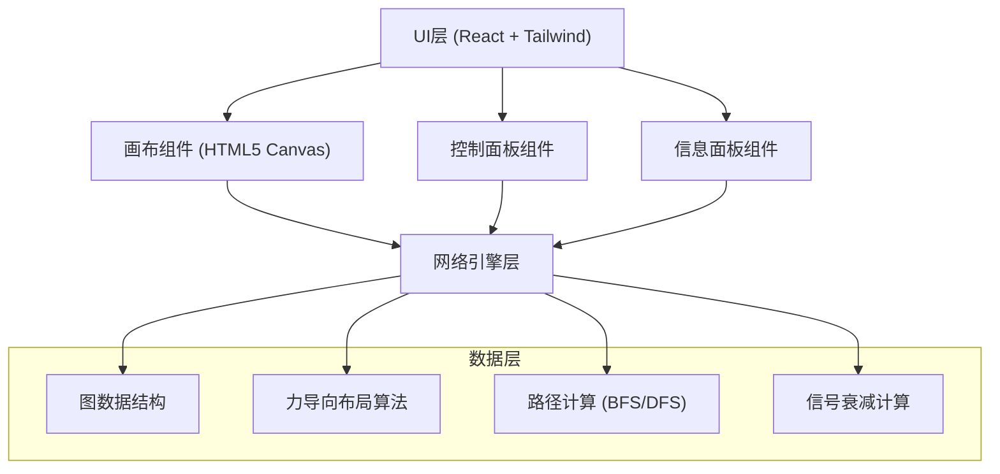
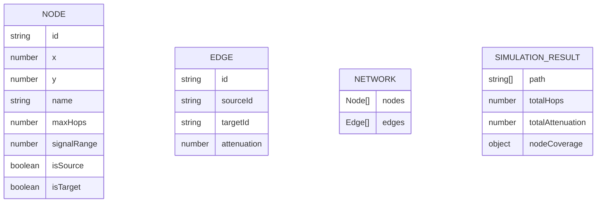

## 1. 架构设计


## 2. 技术描述
- 前端：React@18 + TypeScript + Vite
- 样式：TailwindCSS@3
- 画布渲染：HTML5 Canvas API
- 状态管理：React useState/useReducer
- 图标：Lucide React

## 3. 路由定义
| 路由 | 用途 |
|-------|---------|
| / | 主页面 - 网络拓扑模拟器 |

## 4. 数据模型
### 4.1 数据模型定义


### 4.2 核心数据结构
```typescript
interface Node {
  id: string;
  x: number;
  y: number;
  name: string;
  maxHops: number;
  signalRange: number;
  isSource: boolean;
  isTarget: boolean;
}

interface Edge {
  id: string;
  sourceId: string;
  targetId: string;
  attenuation: number;
}

interface PathResult {
  nodes: string[];
  hops: number;
  attenuation: number;
  valid: boolean;
}
```

## 5. 核心算法
### 5.1 信号衰减公式
```
衰减(dB) = 20 * log10(distance) + 20 * log10(frequency) - 147.55
简化版: 衰减 = distance * 0.1 + 基础损耗
```

### 5.2 路径搜索算法
- BFS搜索所有跳数限制内的路径
- 筛选有效路径（信号强度 > 阈值）
- 选择最优路径（跳数最少 / 衰减最小）

### 5.3 力导向布局
- 节点间斥力：F_repulsion = k / distance²
- 连线引力：F_attraction = k * (distance - restLength)
- 中心引力：防止整体漂移
