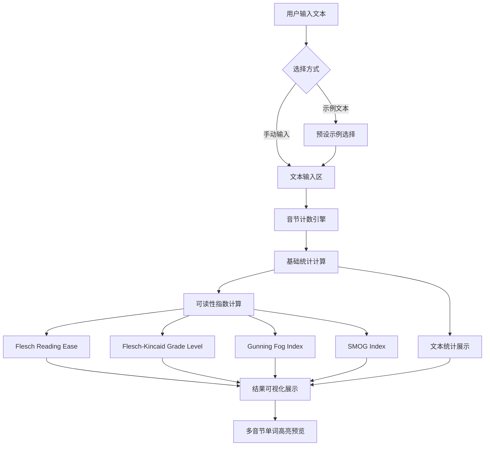

## 1. 产品概述

英文文本可读性分析工具，用户输入英文文本后，系统自动计算多种经典可读性指数（Flesch Reading Ease、Flesch-Kincaid Grade Level、Gunning Fog Index、SMOG Index），并展示详细文本统计数据。面向教育工作者、编辑、内容创作者和语言学习者，帮助他们评估文本难易程度并优化写作。

## 2. 核心功能

### 2.1 功能模块

1. **文本输入页**：文本输入区域、示例文本快捷选择、实时分析结果展示

### 2.2 页面详情

| 页面名称 | 模块名称 | 功能描述 |
|---------|---------|---------|
| 文本输入页 | 文本输入区 | 大文本框供用户输入或粘贴英文文本，支持实时分析 |
| 文本输入页 | 示例文本选择 | 提供多种预设示例文本（总统演讲、技术文档、儿童读物、新闻报道、学术论文），一键加载 |
| 文本输入页 | 可读性指数展示 | 展示四项可读性指数的数值、等级标签和详细解释 |
| 文本输入页 | 文本统计信息 | 展示句子数量、单词数量、平均单词长度、多音节单词比例、总音节数等 |
| 文本输入页 | 音节高亮预览 | 将文本中的多音节单词高亮标注，帮助用户直观识别复杂词汇 |

## 3. 核心流程

用户在文本输入区输入或粘贴英文文本，也可从示例文本中选择。系统实时计算文本的音节数、句子数等基础数据，然后基于这些数据计算四项可读性指数，并以可视化卡片形式展示各项指数的数值与解读，同时展示文本统计信息。

## 4. 界面设计

### 4.1 设计风格

- **主色调**：深蓝墨色系（#1a1a2e）搭配暖金色点缀（#e2b714），营造学术与典雅氛围
- **辅助色**：柔和的奶白色（#f5f0e8）作为内容区背景，深灰蓝（#16213e）作为卡片底色
- **按钮风格**：圆角胶囊按钮，悬停时微缩放动效
- **字体**：展示字体使用 Playfair Display（标题），正文使用 Source Serif 4（内容），等宽字体用 JetBrains Mono（数据数值）
- **布局风格**：左右双栏布局，左侧输入区，右侧结果区
- **动效**：数值变化时的计数动画，卡片入场淡入效果

### 4.2 页面设计概览

| 页面名称 | 模块名称 | UI元素 |
|---------|---------|--------|
| 文本输入页 | 文本输入区 | 深色背景文本框，等宽字体占位提示，字符计数器 |
| 文本输入页 | 示例文本选择 | 横向胶囊按钮组，选中态金色高亮 |
| 文本输入页 | 可读性指数卡片 | 四张独立卡片，每张含指数名称、数值（大字号）、等级标签、解释文字 |
| 文本输入页 | 文本统计面板 | 水平排列的统计数据项，图标+数值+标签 |
| 文本输入页 | 音节高亮预览 | 原文展示区，多音节词以金色下划线+背景色高亮 |

### 4.3 响应式设计

- 桌面优先，宽屏双栏布局
- 平板端：双栏缩窄，卡片网格调整
- 移动端：单栏堆叠布局，输入区在上，结果区在下
