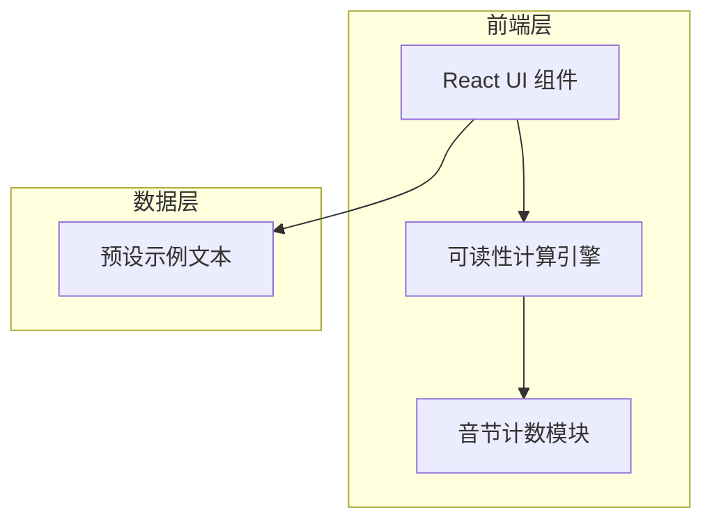
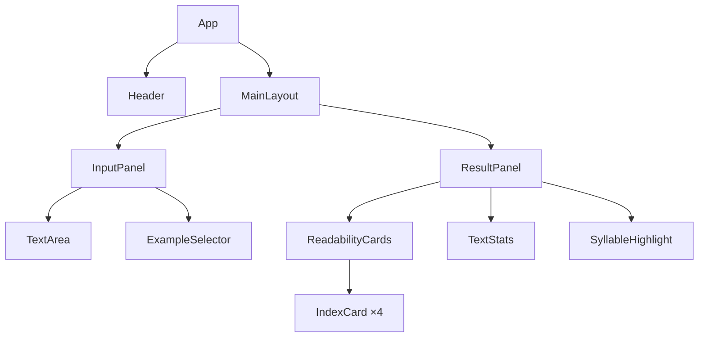

## 1. 架构设计



纯前端应用，所有可读性计算逻辑在浏览器端完成，无需后端服务。

## 2. 技术说明

- **前端**：React@18 + TailwindCSS@3 + Vite
- **初始化工具**：Vite (react-ts 模板)
- **后端**：无
- **数据库**：无（预设示例文本硬编码）

## 3. 路由定义

| 路由 | 用途 |
|------|------|
| / | 主页面，包含文本输入与分析结果展示 |

## 4. 核心算法说明

### 4.1 音节计数规则

- 将单词转为小写
- 移除末尾的 "e"（特殊处理）
- 计算连续元音群（a, e, i, o, u, y）的数量
- 每个元音群算一个音节
- 最少为 1 个音节

### 4.2 可读性指数公式

**Flesch Reading Ease**:
`206.835 - 1.015 × (总词数/总句数) - 84.6 × (总音节数/总词数)`

**Flesch-Kincaid Grade Level**:
`0.39 × (总词数/总句数) + 11.8 × (总音节数/总词数) - 15.59`

**Gunning Fog Index**:
`0.4 × ((总词数/总句数) + 100 × (复杂词数/总词数))`
（复杂词 = 3个及以上音节的单词）

**SMOG Index**:
`1.043 × √(30以上音节词数 × 30/总句数) + 3.1291`

## 5. 组件架构



## 6. 数据模型

### 6.1 核心类型定义

```typescript
interface ReadabilityResult {
  fleschReadingEase: number;
  fleschKincaidGrade: number;
  gunningFogIndex: number;
  smogIndex: number;
}

interface TextStatistics {
  sentenceCount: number;
  wordCount: number;
  syllableCount: number;
  avgWordLength: number;
  polysyllableRatio: number;
  complexWordCount: number;
}

interface ExampleText {
  id: string;
  title: string;
  category: string;
  content: string;
}
```
