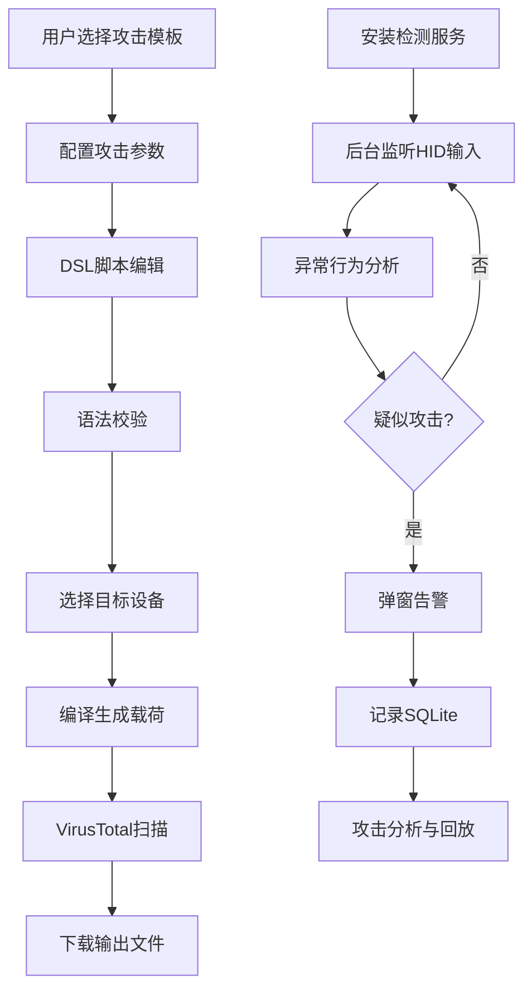

## 1. 产品概述

USB HID攻击载荷生成与检测框架是一个综合性的网络安全工具，专为红队渗透测试人员和蓝队防御人员设计。它提供了恶意HID设备（如USB Rubber Ducky）的攻击脚本生成、多设备格式转换功能，同时具备实时检测和防御BadUSB攻击的能力。

- 核心价值：桥接红队攻击模拟与蓝队防御检测，帮助安全人员理解和防御HID攻击
- 目标用户：渗透测试工程师、安全研究员、企业安全运维人员
- 市场定位：首款集攻击生成与防御检测于一体的HID安全综合框架

## 2. 核心功能

### 2.1 用户角色

| 角色 | 使用场景 | 核心权限 |
|------|----------|----------|
| 红队人员 | 生成攻击载荷，模拟USB攻击 | 攻击脚本生成、多设备编译、VirusTotal扫描 |
| 蓝队人员 | 检测和分析BadUSB攻击 | HID检测服务、攻击告警、事件回放、签名库更新 |
| 安全管理员 | 部署防御服务 | Windows服务安装、系统配置、日志审计 |

### 2.2 功能模块

1. **载荷生成模块**：DSL编辑器、攻击模板库、参数配置、多格式输出
2. **设备编译模块**：Arduino Leonardo、Raspberry Pi Pico、BadUSB、Flipper Zero
3. **HID检测模块**：原始输入监听、异常行为识别、实时告警
4. **事件管理模块**：SQLite存储、攻击事件查询、证据导出
5. **服务控制模块**：Windows服务安装、开机自启、后台运行
6. **分析工具模块**：输入序列回放、攻击行为分析、VirusTotal扫描
7. **签名更新模块**：YAML签名库、远程更新、攻击模式定义

### 2.3 页面详情

| 页面名称 | 模块名称 | 功能描述 |
|-----------|-------------|---------------------|
| 首页仪表板 | 状态概览 | 检测服务状态、最近攻击事件、系统资源使用 |
| 载荷生成页 | 脚本编辑器 | DSL语法高亮、实时编译预览、模板选择、参数配置 |
| 模板库页 | 攻击模板 | Windows反向shell、MacOS提权、Linux SSH窃取、UAC绕过、Defender禁用、U盘启动执行 |
| 设备编译页 | 格式转换 | 选择目标设备、编译固件bin、生成JSON配置、下载输出 |
| 检测监控页 | 实时监控 | HID设备列表、输入事件流、异常检测状态、实时告警弹窗 |
| 事件查询页 | 攻击日志 | 事件列表、设备VID/PID、输入序列、时间轴、详情查看 |
| 服务控制页 | 服务管理 | 安装/卸载服务、启动/停止、开机自启配置、运行参数 |
| 分析工具页 | 回放与扫描 | 输入序列回放控制、VirusTotal扫描、检测率展示 |
| 签名管理页 | 签名更新 | 本地签名库、远程更新检查、YAML编辑器、自定义规则 |
| 系统设置页 | 配置管理 | API密钥配置、检测阈值调整、日志级别、数据库路径 |

## 3. 核心流程

### 3.1 攻击载荷生成流程
用户选择攻击模板 → 配置自定义参数(IP/端口等) → DSL脚本编辑 → 语法校验 → 选择目标设备 → 编译生成固件/配置 → VirusTotal扫描 → 下载输出文件

### 3.2 HID检测流程
安装Windows服务 → 启动后台监听 → 捕获原始HID输入 → 异常行为分析(速度/模式/快捷键) → 匹配攻击签名 → 触发告警弹窗 → 记录SQLite数据库 → 通知用户处理

### 3.3 攻击分析流程
选择历史攻击事件 → 查看完整输入序列 → 启动回放功能 → 观察攻击执行效果 → 导出分析报告 → 更新防御规则

## 4. 用户界面设计

### 4.1 设计风格
- **设计基调**：赛博朋克/黑客风格，深色主题为主，配合霓虹色高光
- **主色调**：深灰蓝 #0f172a (背景)，霓虹绿 #10b981 (安全/正常)，霓虹红 #ef4444 (告警/危险)，霓虹紫 #8b5cf6 (高亮/强调)
- **辅助色**：琥珀黄 #f59e0b (警告)，天蓝 #3b82f6 (信息)
- **按钮风格**：圆角矩形，发光边框效果，hover时有脉冲动画
- **字体**：Fira Code (等宽字体，适合代码编辑) + JetBrains Mono (显示字体)
- **布局风格**：卡片式布局，网格系统，左侧导航栏 + 主内容区 + 右侧信息面板
- **视觉效果**：终端风格输出、代码高亮、扫描线动画、数据流动画、故障艺术效果(glitch)

### 4.2 页面设计概览

| 页面名称 | 模块名称 | UI元素 |
|-----------|-------------|-------------|
| 首页仪表板 | 状态概览 | 状态指示灯卡片、攻击事件时间线、实时数据图表、系统资源环形图 |
| 载荷生成页 | 脚本编辑器 | 分屏布局(左侧编辑器+右侧预览)、语法高亮、行号、代码折叠、编译错误提示 |
| 模板库页 | 攻击模板 | 卡片网格、模板分类标签、参数配置表、一键应用按钮、模板预览窗口 |
| 设备编译页 | 格式转换 | 设备选择标签页、编译进度条、输出文件列表、VT扫描结果环形图 |
| 检测监控页 | 实时监控 | HID设备树状列表、事件流滚动面板、告警横幅、异常评分仪表盘 |
| 事件查询页 | 攻击日志 | 数据表格、筛选器、时间范围选择器、详情抽屉、导出按钮 |
| 服务控制页 | 服务管理 | 服务状态卡片、控制按钮组、配置表单、运行日志终端 |
| 分析工具页 | 回放与扫描 | 时间轴播放器、速度控制、VT扫描报告、检测率进度条 |
| 签名管理页 | 签名更新 | 签名列表、YAML编辑器、更新状态指示器、规则测试工具 |
| 系统设置页 | 配置管理 | 分组表单、API密钥输入框、阈值滑块、保存/重置按钮 |

### 4.3 响应式设计
- **桌面端优先**：最小支持分辨率1280x800，优化1920x1080及以上
- **自适应布局**：使用Flex和Grid布局，根据窗口宽度动态调整列数
- **触摸优化**：按钮最小尺寸44x44px，滚动区域支持触摸手势
- **导航响应**：小屏幕下左侧导航栏可折叠为图标模式

### 4.4 交互与动画
- 页面加载：渐进式显示，元素从下往上淡入
- 按钮交互：hover时发光效果，点击时缩放反馈
- 告警动画：红色脉冲呼吸效果，屏幕边缘闪烁
- 数据更新：数字滚动动画，图表平滑过渡
- 终端输出：打字机效果逐行显示
- 模态窗口：毛玻璃背景，缩放进入动画
