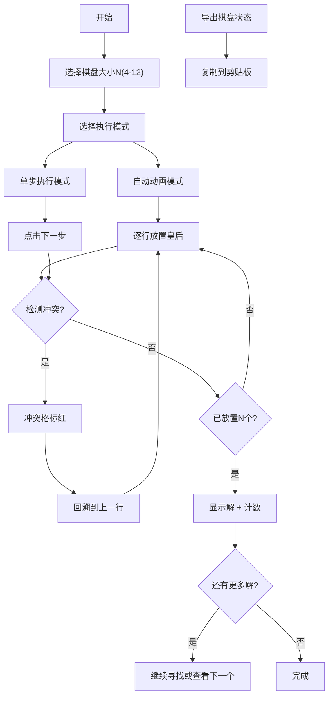

## 1. 产品概述

N皇后问题可视化求解器是一个交互式的算法演示工具，通过动画展示回溯法求解经典N皇后问题的完整过程。帮助用户理解回溯算法的工作原理，直观观察皇后放置、冲突检测和回溯的每一步。

- 核心目标：教育性算法可视化工具，展示回溯法求解N皇后问题
- 目标用户：计算机科学学习者、算法爱好者、教师和学生
- 产品价值：将抽象的算法逻辑转化为直观的视觉演示，降低学习门槛

## 2. 核心功能

### 2.1 用户角色
| 角色 | 注册方式 | 核心权限 |
|------|----------|----------|
| 普通用户 | 无需注册 | 使用所有可视化和交互功能 |

### 2.2 功能模块
1. **主页面**：棋盘可视化区、控制面板、解决方案展示、统计图表
2. **算法演示模块**：自动动画演示、单步执行、速度调节
3. **解决方案浏览模块**：解数量统计、翻页查看不同解
4. **导出模块**：棋盘状态导出为文本

### 2.3 页面详情
| 页面名称 | 模块名称 | 功能描述 |
|-----------|-------------|---------------------|
| 主页面 | 棋盘可视化区 | 动态显示N×N棋盘，皇后位置、冲突格子标红、当前尝试位置高亮 |
| 主页面 | 控制面板 | 选择棋盘大小(4-12)、开始/暂停/重置、单步执行、速度调节滑块 |
| 主页面 | 解决方案展示 | 显示总解数、当前查看第几个解、上一个/下一个解按钮 |
| 主页面 | 统计图表 | 显示不同N值对应的解数量趋势图 |
| 主页面 | 导出功能 | 将当前棋盘状态导出为文本格式并复制到剪贴板 |

## 3. 核心流程

用户选择棋盘大小 → 选择执行模式（自动/单步）→ 观看回溯算法演示 → 冲突时格子标红并回溯 → 找到一个解后显示 → 可翻页查看其他解 → 查看解法统计 → 导出棋盘状态

## 4. 用户界面设计

### 4.1 设计风格
- **主色调**：深紫色 (#6366f1) 作为主色，配合深灰背景营造科技感
- **辅助色**：红色 (#ef4444) 标记冲突，绿色 (#10b981) 标记成功放置
- **字体**：使用 JetBrains Mono 等宽字体展示算法相关内容，Inter 作为界面字体
- **布局风格**：三栏布局 - 左侧控制面板、中间棋盘区、右侧统计信息
- **按钮风格**：圆角矩形、悬停阴影、点击反馈动画
- **整体风格**：深色主题、赛博朋克/科技感、简洁现代

### 4.2 页面设计概述
| 页面名称 | 模块名称 | UI元素 |
|-----------|-------------|-------------|
| 主页面 | 标题区 | 渐变文字标题、副标题说明、装饰性几何图形 |
| 主页面 | 控制面板 | 卡片式设计、滑块控件、图标按钮组、状态指示器 |
| 主页面 | 棋盘区 | 网格布局、交替颜色格子、皇后图标动画、冲突闪烁效果 |
| 主页面 | 统计区 | 折线图展示解数趋势、数据卡片、动画数字 |
| 主页面 | 解浏览区 | 分页控件、当前解预览缩略图 |

### 4.3 响应式
- 桌面端：三栏布局（20% - 50% - 30%）
- 平板端：两栏布局（控制面板在上，棋盘和统计在下）
- 移动端：单列布局，依次堆叠各模块
- 棋盘大小根据屏幕宽度自适应，保持正方形

## 5. 动画效果

- 皇后放置：从顶部滑入 + 缩放动画
- 冲突检测：红色闪烁 + 震动效果
- 回溯：淡出 + 上滑消失动画
- 找到解：金色光芒扩散效果
- 单步模式：当前尝试位置脉冲高亮
- 数字变化：滚动数字动画
