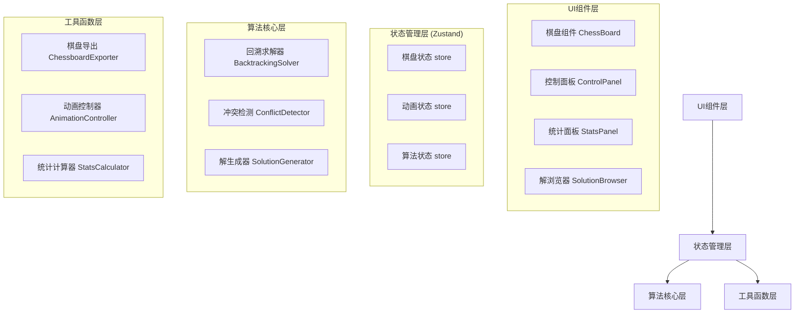

## 1. 架构设计



## 2. 技术描述

- **前端**: React@18 + TypeScript + Vite + TailwindCSS@3
- **状态管理**: Zustand
- **图表**: Recharts
- **图标**: Lucide React
- **初始化工具**: vite-init
- **后端**: 无（纯前端应用）
- **部署**: 静态资源部署

## 3. 核心数据结构

### 3.1 棋盘状态
```typescript
// 皇后位置：索引为行号，值为列号 (-1 表示未放置)
type QueenPositions = number[];

// 单元格状态
type CellState = {
  hasQueen: boolean;
  isConflict: boolean;
  isCurrentAttempt: boolean;
  isBacktracking: boolean;
};

// 算法步骤记录
type AlgorithmStep = {
  row: number;
  col: number;
  action: 'place' | 'conflict' | 'backtrack' | 'solution';
  board: QueenPositions;
  conflictCells: [number, number][];
};
```

### 3.2 应用状态
```typescript
type AppState = {
  // 配置
  boardSize: number;
  animationSpeed: number;
  isStepMode: boolean;
  
  // 算法状态
  isRunning: boolean;
  isPaused: boolean;
  currentStepIndex: number;
  steps: AlgorithmStep[];
  solutions: QueenPositions[];
  currentSolutionIndex: number;
  
  // 显示状态
  currentBoard: QueenPositions;
  conflictCells: [number, number][];
  currentAttemptCell: [number, number] | null;
};
```

## 4. 目录结构

```
src/
├── components/
│   ├── ChessBoard/
│   │   ├── ChessBoard.tsx      # 主棋盘组件
│   │   ├── ChessCell.tsx       # 单元格组件
│   │   └── Queen.tsx           # 皇后图标组件
│   ├── ControlPanel/
│   │   ├── ControlPanel.tsx    # 控制面板
│   │   ├── SizeSelector.tsx    # 棋盘大小选择器
│   │   └── SpeedSlider.tsx     # 速度滑块
│   ├── StatsPanel/
│   │   ├── StatsPanel.tsx      # 统计面板
│   │   └── SolutionChart.tsx   # 解数量趋势图
│   └── SolutionBrowser/
│       └── SolutionBrowser.tsx # 解浏览器组件
├── hooks/
│   ├── useQueenSolver.ts       # 求解器hook
│   ├── useAnimation.ts         # 动画控制hook
│   └── useExport.ts            # 导出功能hook
├── store/
│   └── useAppStore.ts          # Zustand状态管理
├── utils/
│   ├── backtracking.ts         # 回溯算法核心
│   ├── conflictDetection.ts    # 冲突检测逻辑
│   ├── stats.ts                # 统计计算
│   └── export.ts               # 导出功能
├── types/
│   └── index.ts                # TypeScript类型定义
├── constants/
│   └── index.ts                # 常量定义
├── App.tsx                     # 主应用组件
├── main.tsx                    # 入口文件
└── index.css                   # 全局样式
```

## 5. 核心模块说明

### 5.1 回溯算法模块 (`utils/backtracking.ts`)
- 生成完整的算法执行步骤记录
- 支持暂停和恢复
- 预先生成所有解以便快速浏览

### 5.2 动画控制模块 (`hooks/useAnimation.ts`)
- 管理自动播放和单步执行模式
- 根据动画速度控制步骤间隔
- 处理开始、暂停、重置、单步前进

### 5.3 状态管理模块 (`store/useAppStore.ts`)
- 集中管理应用所有状态
- 提供清晰的状态更新action

## 6. 预设统计数据

N皇后问题已知解的数量（用于统计图表）：
| N | 解的数量 |
|---|---------|
| 4 | 2 |
| 5 | 10 |
| 6 | 4 |
| 7 | 40 |
| 8 | 92 |
| 9 | 352 |
| 10 | 724 |
| 11 | 2680 |
| 12 | 14200 |
