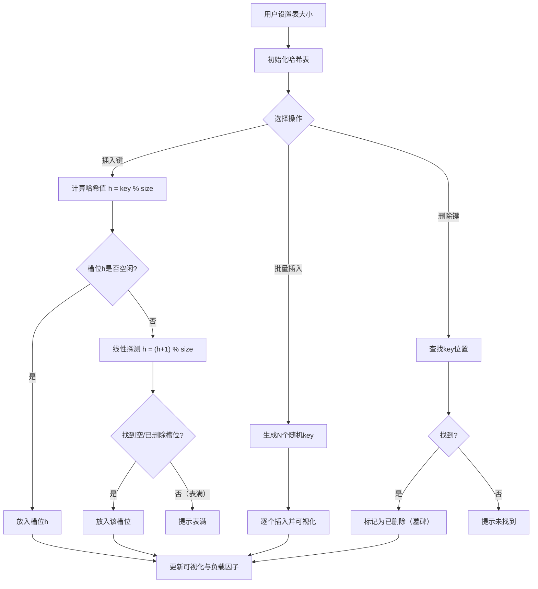

## 1. 产品概述

哈希表线性探测可视化工具，帮助用户直观理解哈希表中线性探测冲突解决策略的工作原理、负载因子变化以及聚类现象的产生过程。面向计算机科学学习者和算法教学场景。

## 2. 核心功能

### 2.1 功能模块
1. **哈希表主界面**：哈希表数组可视化、操作控件、状态统计面板

### 2.2 页面详情
| 页面名称 | 模块名称 | 功能描述 |
|----------|----------|----------|
| 哈希表主界面 | 表大小设置 | 用户可设置哈希表大小（5-50），初始化/重置哈希表 |
| 哈希表主界面 | 哈希函数选择 | 选择哈希函数类型（取模：key % size） |
| 哈希表主界面 | 键值对插入 | 输入整数key，系统计算哈希位置，冲突时线性探测，可视化展示探测路径 |
| 哈希表主界面 | 批量随机插入 | 可调数量的批量随机键插入，加速观察聚类现象 |
| 哈希表主界面 | 键删除 | 输入key删除，标记为"已删除"（墓碑标记），保持探测链不断 |
| 哈希表主界面 | 哈希表可视化 | 数组形式展示每个槽位的状态（空/已占用/已删除），显示key值 |
| 哈希表主界面 | 负载因子显示 | 实时显示当前负载因子（已用槽位/总大小） |
| 哈希表主界面 | 聚类可视化 | 高亮显示连续占用的槽位区域，直观展示聚类现象 |
| 哈希表主界面 | 操作日志 | 记录每次操作的过程（哈希计算、探测步数等） |

## 3. 核心流程

1. 用户设置哈希表大小并初始化
2. 用户输入key插入，系统计算哈希值定位
3. 若无冲突直接放入，若有冲突则线性探测到下一个空/已删除槽位
4. 可视化动画展示探测路径
5. 批量插入时观察聚类现象的逐渐形成
6. 删除操作标记为墓碑，不破坏探测链

## 4. 用户界面设计

### 4.1 设计风格
- 主色调：深蓝黑底色 + 青色/琥珀色强调色，科技感终端风格
- 按钮风格：圆角胶囊按钮，带微光边框效果
- 字体：等宽字体（JetBrains Mono）用于数据展示，无衬线字体用于UI文案
- 布局：左侧控件面板 + 右侧/中央哈希表可视化
- 动画：槽位状态变化时的渐变过渡，探测路径的步进高亮

### 4.2 页面设计概览
| 页面名称 | 模块名称 | UI元素 |
|----------|----------|--------|
| 哈希表主界面 | 控制面板 | 表大小滑块、哈希函数下拉、插入/删除输入框、批量插入控件 |
| 哈希表主界面 | 哈希表可视化 | 横向/网格排列的槽位卡片，三色状态（空=暗灰、占用=青色、已删除=琥珀色），聚类区域高亮 |
| 哈希表主界面 | 统计面板 | 负载因子进度条、已用/空/已删除槽位计数、平均探测长度 |
| 哈希表主界面 | 操作日志 | 滚动日志列表，记录每步操作详情 |

### 4.3 响应式
- 桌面优先设计，宽屏横向展示哈希表
- 窄屏自动切换为网格布局

### 4.4 3D场景指导
- 不适用
