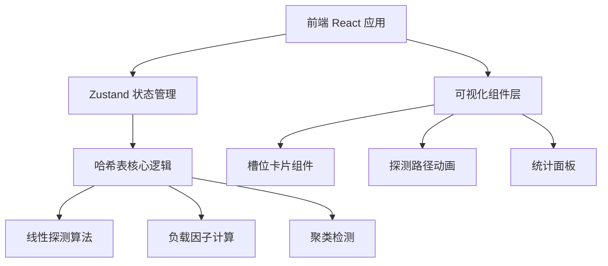
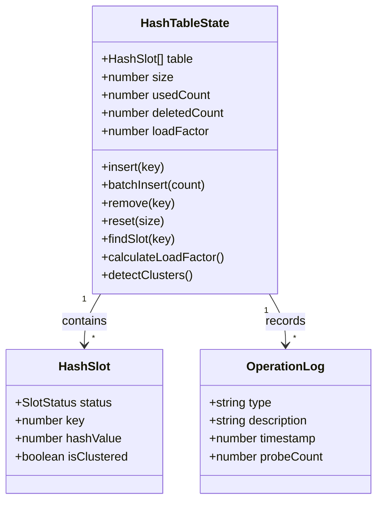

## 1. 架构设计



纯前端项目，无后端服务。所有哈希表逻辑在客户端 Zustand store 中完成。

## 2. 技术说明
- 前端：React@18 + TypeScript + Tailwind CSS@3 + Vite
- 初始化工具：vite-init（react-ts 模板）
- 状态管理：Zustand
- 后端：无
- 数据库：无

## 3. 路由定义
| 路由 | 用途 |
|------|------|
| / | 哈希表可视化主页面（单页应用） |

## 4. API定义
无后端API，所有逻辑在前端完成。

## 5. 服务器架构图
不适用（纯前端项目）

## 6. 数据模型

### 6.1 数据模型定义



### 6.2 核心数据结构

```typescript
enum SlotStatus {
  EMPTY = "EMPTY",
  OCCUPIED = "OCCUPIED",
  DELETED = "DELETED"
}

interface HashSlot {
  status: SlotStatus;
  key: number | null;
  hashValue: number | null;
  isClustered: boolean;
}

interface OperationLog {
  type: "insert" | "delete" | "batch" | "reset";
  description: string;
  timestamp: number;
  probeCount: number;
}
```

### 6.3 关键算法

- **哈希函数**：h(key) = key % tableSize
- **线性探测**：当 h(key) 冲突时，依次尝试 (h+1) % size, (h+2) % size, ... 直到找到空槽或已删除槽位
- **删除策略**：标记为 DELETED（墓碑标记），不影响后续探测链
- **负载因子**：loadFactor = (usedCount + deletedCount) / size
- **聚类检测**：遍历数组，标记连续 ≥2 个 OCCUPIED 槽位为聚类区域
