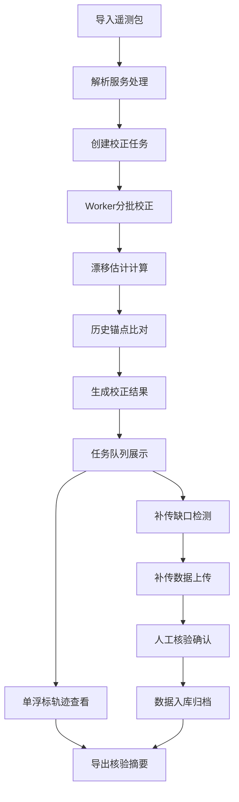

# 浮标漂移校正台 PRD

## 1. 产品概述
浮标漂移校正台是为近海观测团队设计的专业数据处理平台，用于批量处理浮标遥测数据包，自动校正浮标漂移位置，管理数据补传缺口，并提供人工核验机制。
- **目标用户**：海洋观测站值班人员、数据质量控制工程师
- **核心价值**：提高浮标数据质量，自动化校正流程，保留完整的人工审核痕迹

## 2. 核心功能

### 2.1 用户角色
| 角色 | 登录方式 | 核心权限 |
|------|----------|----------|
| 值班人员 | 账号密码登录 | 导入遥测包、查看校正任务、轨迹浏览、人工核验 |
| 管理员 | 管理员账号 | 系统配置、数据导出、用户管理 |

### 2.2 功能模块
1. **任务队列页**：导入遥测包、任务列表、状态监控、批量操作
2. **单浮标轨迹页**：轨迹可视化、漂移估计展示、校正前后对比、锚点比对
3. **补传核验页**：缺口检测、补传片段管理、人工确认、审核痕迹
4. **导出模块**：单浮标核验摘要导出、批量数据导出（预留）
5. **海域分组筛选**：按海域分类查看浮标（预留增强点）

### 2.3 页面详情
| 页面名称 | 模块名称 | 功能描述 |
|----------|----------|----------|
| 任务队列页 | 遥测包导入 | 支持批量上传遥测数据包文件，自动解析入库 |
| 任务队列页 | 任务列表 | 展示所有校正任务，按状态/时间筛选，支持搜索 |
| 任务队列页 | 状态监控 | 实时显示任务进度、待处理/处理中/已完成数量 |
| 单浮标轨迹页 | 轨迹地图 | 可视化展示浮标原始轨迹和校正后轨迹 |
| 单浮标轨迹页 | 漂移估计 | 显示漂移距离、方向、置信度等参数 |
| 单浮标轨迹页 | 锚点比对 | 对比历史锚点位置，计算偏差 |
| 补传核验页 | 缺口检测 | 自动识别数据断档区域，标注时间范围 |
| 补传核验页 | 补传管理 | 上传补传数据片段，合并验证 |
| 补传核验页 | 人工核验 | 确认/驳回补传数据，记录核验人、时间、意见 |

## 3. 核心流程

值班人员登录系统后，首先在任务队列页导入遥测数据包，系统自动解析并创建校正任务。Worker后台分批处理校正任务，完成漂移估计和锚点比对。数据处理完成后，值班人员可在单浮标轨迹页查看校正效果，在补传核验页处理数据缺口，进行人工确认。所有操作痕迹均被记录，支持导出核验摘要。

## 4. 用户界面设计

### 4.1 设计风格
- **主色调**：深海蓝 (#0F4C81) - 体现海洋观测专业属性
- **辅助色**：青绿色 (#20B2AA) - 代表数据验证通过
- **警示色**：珊瑚橙 (#FF6B6B) - 标记待处理、异常数据
- **中性色**：石板灰、白色 - 保证内容可读性
- **按钮风格**：扁平化设计，轻微圆角，hover时有透明度变化
- **字体**：系统无衬线字体，标题加粗，数据区域使用等宽字体
- **布局风格**：卡片式布局，顶部导航 + 侧边栏 + 主内容区
- **图标风格**：线性图标，海洋主题元素（浮标、海浪、定位）

### 4.2 页面设计概述
| 页面名称 | 模块名称 | UI元素 |
|----------|----------|--------|
| 任务队列页 | 顶部导航栏 | 系统标题、用户信息、通知图标、海域筛选下拉（预留） |
| 任务队列页 | 导入区域 | 拖拽上传框、文件列表、导入进度条 |
| 任务队列页 | 任务列表 | 数据表格、状态标签、操作按钮列、分页 |
| 单浮标轨迹页 | 轨迹地图 | 可交互地图、轨迹线、锚点标记、图例 |
| 单浮标轨迹页 | 信息面板 | 浮标基本信息、漂移参数卡片、校正前后对比 |
| 补传核验页 | 缺口列表 | 时间线展示、缺口卡片、状态标识 |
| 补传核验页 | 核验面板 | 补传数据预览、确认/驳回按钮、意见输入框 |

### 4.3 响应式
- 采用桌面优先设计，主要适配 1920×1080 及以上分辨率
- 侧边栏在平板尺寸可折叠，在移动端转为底部导航
- 数据表格在小屏幕转为卡片式列表展示
- 地图组件保持响应式缩放，触控设备支持手势操作

### 4.4 交互与动效
- 页面加载：元素淡入，内容区域 staggered reveal
- 状态变更：平滑过渡动画，状态标签颜色渐变
- 数据导入：上传进度动画，完成后有确认反馈
- 地图交互：轨迹线绘制动画，锚点弹跳提示
- 按钮交互：hover 时轻微上浮效果，点击有涟漪反馈
