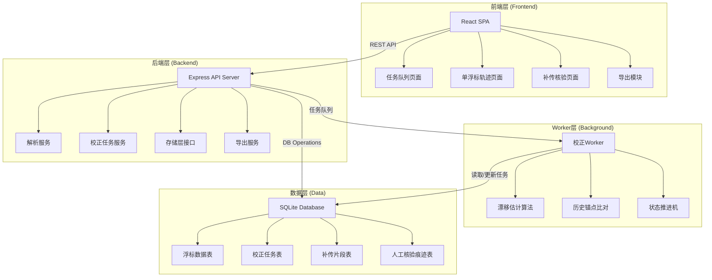
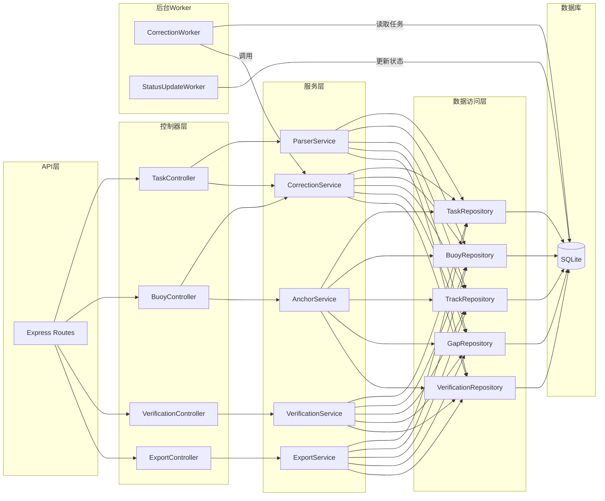
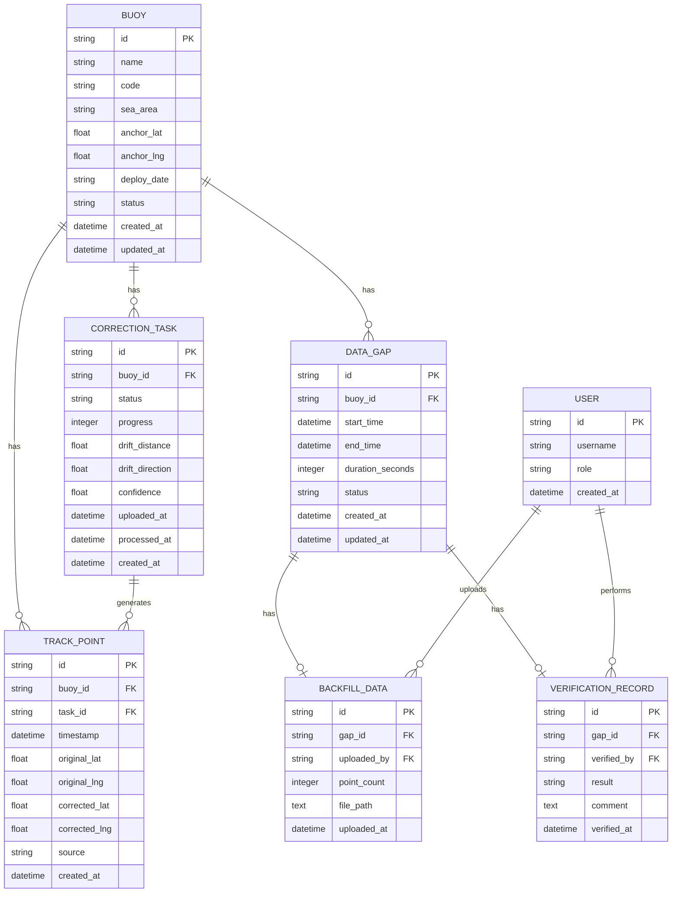

# 浮标漂移校正台 技术架构文档

## 1. 架构设计



## 2. 技术描述

### 2.1 技术栈选择
- **前端**：React@18 + TypeScript + Vite + TailwindCSS@3 + React Router + React Query
- **地图可视化**：Leaflet + React-Leaflet
- **后端**：Express@4 + TypeScript
- **数据库**：SQLite3 + better-sqlite3（内置数据库，无需额外安装）
- **任务队列**：BullMQ + Redis（或简化版内存队列）
- **构建工具**：Vite (前端) / ts-node (后端)
- **代码规范**：ESLint + Prettier

### 2.2 目录结构
```
project-root/
├── frontend/                 # 前端应用
│   ├── src/
│   │   ├── pages/           # 页面组件
│   │   │   ├── TaskQueue/   # 任务队列页
│   │   │   ├── BuoyTrack/   # 单浮标轨迹页
│   │   │   └── Verification/ # 补传核验页
│   │   ├── components/      # 通用组件
│   │   ├── hooks/           # 自定义Hooks
│   │   ├── services/        # API服务
│   │   ├── types/           # TypeScript类型
│   │   └── utils/           # 工具函数
│   ├── package.json
│   └── vite.config.ts
├── backend/                  # 后端服务
│   ├── src/
│   │   ├── controllers/     # 控制器层
│   │   ├── services/        # 业务服务层
│   │   │   ├── parser/      # 遥测包解析服务
│   │   │   ├── correction/  # 校正任务服务
│   │   │   └── export/      # 导出服务
│   │   ├── repositories/    # 数据访问层
│   │   ├── workers/         # 后台Worker
│   │   ├── middleware/      # 中间件
│   │   ├── types/           # 类型定义
│   │   └── server.ts        # 入口文件
│   ├── package.json
│   └── tsconfig.json
├── database/                 # 数据库
│   ├── migrations/          # 数据库迁移脚本
│   └── seed/                # 种子数据
└── package.json             # 根package.json
```

## 3. 路由定义

### 3.1 前端路由
| 路由路径 | 页面名称 | 功能描述 |
|----------|----------|----------|
| `/` | 任务队列页 | 导入遥测包、任务列表、状态监控 |
| `/buoy/:id` | 单浮标轨迹页 | 轨迹可视化、漂移估计、锚点比对 |
| `/buoy/:id/verification` | 补传核验页 | 缺口检测、补传管理、人工核验 |
| `/sea-area/:areaId` | 海域分组页 | 按海域筛选浮标（预留） |

### 3.2 API路由
| 方法 | 路径 | 功能描述 |
|------|------|----------|
| POST | `/api/telemetry/upload` | 上传遥测数据包 |
| GET | `/api/tasks` | 获取校正任务列表 |
| GET | `/api/tasks/:id` | 获取单个任务详情 |
| GET | `/api/buoys/:id` | 获取浮标详情 |
| GET | `/api/buoys/:id/track` | 获取浮标轨迹数据 |
| GET | `/api/buoys/:id/gaps` | 获取数据缺口列表 |
| POST | `/api/buoys/:id/backfill` | 上传补传数据片段 |
| POST | `/api/verification/:gapId/confirm` | 确认补传数据 |
| POST | `/api/verification/:gapId/reject` | 驳回补传数据 |
| GET | `/api/buoys/:id/export` | 导出单浮标核验摘要 |
| GET | `/api/sea-areas` | 获取海域列表（预留） |
| GET | `/api/sea-areas/:id/buoys` | 按海域获取浮标（预留） |

## 4. API 类型定义

```typescript
// 浮标基本信息
interface Buoy {
  id: string;
  name: string;
  code: string;
  seaArea: string;
  deployDate: string;
  anchorPoint: {
    lat: number;
    lng: number;
  };
  status: 'active' | 'inactive' | 'drifting';
}

// 校正任务
interface CorrectionTask {
  id: string;
  buoyId: string;
  status: 'pending' | 'processing' | 'completed' | 'failed';
  progress: number;
  uploadedAt: string;
  processedAt?: string;
  driftEstimate?: {
    distance: number;
    direction: number;
    confidence: number;
  };
}

// 轨迹点
interface TrackPoint {
  id: string;
  buoyId: string;
  timestamp: string;
  originalLat: number;
  originalLng: number;
  correctedLat?: number;
  correctedLng?: number;
  source: 'telemetry' | 'backfill';
}

// 数据缺口
interface DataGap {
  id: string;
  buoyId: string;
  startTime: string;
  endTime: string;
  duration: number;
  status: 'open' | 'backfilled' | 'verified' | 'rejected';
  backfillData?: BackfillData;
  verification?: VerificationRecord;
}

// 补传数据
interface BackfillData {
  id: string;
  gapId: string;
  uploadedAt: string;
  uploadedBy: string;
  pointCount: number;
  fileUrl: string;
}

// 核验记录
interface VerificationRecord {
  id: string;
  gapId: string;
  verifiedAt: string;
  verifiedBy: string;
  result: 'confirmed' | 'rejected';
  comment: string;
}

// 导出摘要
interface ExportSummary {
  buoyInfo: Buoy;
  correctionResult: {
    originalTrack: TrackPoint[];
    correctedTrack: TrackPoint[];
    driftStatistics: {
      maxDrift: number;
      avgDrift: number;
      totalCorrections: number;
    };
  };
  verificationHistory: VerificationRecord[];
  gapSummary: {
    totalGaps: number;
    verifiedGaps: number;
    totalDuration: number;
  };
  exportedAt: string;
  exportedBy: string;
}
```

## 5. 服务端架构图



## 6. 数据模型

### 6.1 ER图



### 6.2 DDL 语句

```sql
-- 浮标表
CREATE TABLE buoy (
  id TEXT PRIMARY KEY,
  name TEXT NOT NULL,
  code TEXT UNIQUE NOT NULL,
  sea_area TEXT,
  anchor_lat REAL NOT NULL,
  anchor_lng REAL NOT NULL,
  deploy_date TEXT,
  status TEXT DEFAULT 'active',
  created_at TEXT DEFAULT CURRENT_TIMESTAMP,
  updated_at TEXT DEFAULT CURRENT_TIMESTAMP
);

-- 校正任务表
CREATE TABLE correction_task (
  id TEXT PRIMARY KEY,
  buoy_id TEXT NOT NULL,
  status TEXT DEFAULT 'pending',
  progress INTEGER DEFAULT 0,
  drift_distance REAL,
  drift_direction REAL,
  confidence REAL,
  uploaded_at TEXT DEFAULT CURRENT_TIMESTAMP,
  processed_at TEXT,
  created_at TEXT DEFAULT CURRENT_TIMESTAMP,
  FOREIGN KEY (buoy_id) REFERENCES buoy(id)
);

-- 轨迹点表
CREATE TABLE track_point (
  id TEXT PRIMARY KEY,
  buoy_id TEXT NOT NULL,
  task_id TEXT,
  timestamp TEXT NOT NULL,
  original_lat REAL NOT NULL,
  original_lng REAL NOT NULL,
  corrected_lat REAL,
  corrected_lng REAL,
  source TEXT DEFAULT 'telemetry',
  created_at TEXT DEFAULT CURRENT_TIMESTAMP,
  FOREIGN KEY (buoy_id) REFERENCES buoy(id),
  FOREIGN KEY (task_id) REFERENCES correction_task(id)
);

-- 数据缺口表
CREATE TABLE data_gap (
  id TEXT PRIMARY KEY,
  buoy_id TEXT NOT NULL,
  start_time TEXT NOT NULL,
  end_time TEXT NOT NULL,
  duration_seconds INTEGER NOT NULL,
  status TEXT DEFAULT 'open',
  created_at TEXT DEFAULT CURRENT_TIMESTAMP,
  updated_at TEXT DEFAULT CURRENT_TIMESTAMP,
  FOREIGN KEY (buoy_id) REFERENCES buoy(id)
);

-- 补传数据表
CREATE TABLE backfill_data (
  id TEXT PRIMARY KEY,
  gap_id TEXT NOT NULL,
  uploaded_by TEXT NOT NULL,
  point_count INTEGER NOT NULL,
  file_path TEXT,
  uploaded_at TEXT DEFAULT CURRENT_TIMESTAMP,
  FOREIGN KEY (gap_id) REFERENCES data_gap(id)
);

-- 核验记录表
CREATE TABLE verification_record (
  id TEXT PRIMARY KEY,
  gap_id TEXT NOT NULL,
  verified_by TEXT NOT NULL,
  result TEXT NOT NULL,
  comment TEXT,
  verified_at TEXT DEFAULT CURRENT_TIMESTAMP,
  FOREIGN KEY (gap_id) REFERENCES data_gap(id)
);

-- 用户表
CREATE TABLE user (
  id TEXT PRIMARY KEY,
  username TEXT UNIQUE NOT NULL,
  password_hash TEXT NOT NULL,
  role TEXT DEFAULT 'operator',
  created_at TEXT DEFAULT CURRENT_TIMESTAMP
);

-- 索引
CREATE INDEX idx_track_point_buoy_time ON track_point(buoy_id, timestamp);
CREATE INDEX idx_correction_task_status ON correction_task(status);
CREATE INDEX idx_data_gap_buoy_status ON data_gap(buoy_id, status);
```
