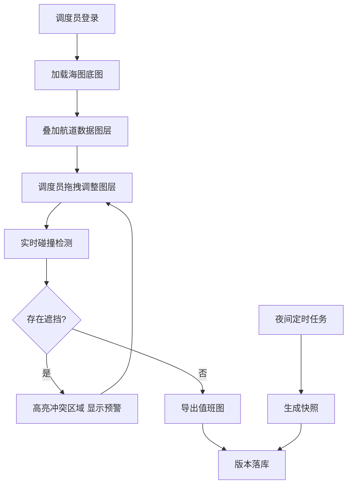

## 1. 产品概述

引航站海图工作台是一款专业的海事调度工具，用于在电子海图上叠加显示航道注记、临时警示区、锚地编号和计划靠泊点等多层信息。调度员可通过拖拽调整图层位置，系统实时检测文字遮挡情况，确保航行安全信息清晰可见。

- **主要用途**：海事引航调度、航道管理、船舶靠泊计划制定
- **目标用户**：引航站调度员、海事管理人员、船舶引航员
- **产品价值**：提升调度效率，减少信息遮挡导致的安全隐患，实现值班图标准化导出

## 2. 核心功能

### 2.1 用户角色

| 角色 | 登录方式 | 核心权限 |
|------|----------|----------|
| 调度员 | 账号密码登录 | 图层操作、拖拽调整、导出值班图、查看碰撞检测结果 |
| 管理员 | 账号密码登录 | 全部调度员权限 + 版本管理、夜间快照配置 |

### 2.2 功能模块

1. **海图主界面**：底图加载、多图层叠加显示、视口控制
2. **图层控制面板**：图层开关、透明度调节、层级调整
3. **碰撞检测系统**：实时检测文字遮挡、高亮冲突区域、智能避让建议
4. **导出中心**：值班图导出、格式选择、历史版本查看
5. **系统设置**：夜间模式、快照配置、数据备份

### 2.3 页面详情

| 页面名称 | 模块名称 | 功能描述 |
|----------|----------|----------|
| 海图工作台 | 海图容器 | 加载海图底图，支持缩放、平移、旋转操作 |
| 海图工作台 | 图层管理 | 控制航道注记、警示区、锚地编号、靠泊点图层的显示/隐藏 |
| 海图工作台 | 拖拽交互 | 支持拖拽移动图层元素，实时更新位置 |
| 海图工作台 | 碰撞检测面板 | 实时显示文字遮挡预警，高亮冲突区域 |
| 导出中心 | 值班图导出 | 支持PNG/PDF格式导出，可添加时间戳和值班人员信息 |
| 版本管理 | 历史快照 | 查看夜间自动生成的快照，支持版本对比和回滚 |

## 3. 核心流程

调度员登录系统后，海图工作台自动加载最新的航道数据。调度员可根据需要开关各图层，通过拖拽调整注记位置。每一次位置变更都会触发碰撞检测算法，系统立即判断是否存在文字遮挡主航线或关键点位的情况。如有冲突，在面板中显示预警并高亮问题区域。确认无误后，调度员可导出当前视图作为值班图存档。系统每日夜间自动生成快照，用于版本追溯和审计。

## 4. 用户界面设计

### 4.1 设计风格

- **主色调**：深海蓝 (#0A2463) - 代表专业、可信的海事行业特性
- **辅助色**：警示红 (#D62828)、安全绿 (#2ECC71)、提示黄 (#F7B32B)
- **中性色**：深灰背景 (#1A1A2E)、浅灰文字 (#E8E8E8)
- **按钮风格**：扁平设计，直角边框，悬停时有轻微发光效果
- **字体**：主字体使用 Roboto Mono（等宽字体，适合数字和坐标显示），标题使用 Orbitron（科技感字体）
- **布局风格**：左侧控制面板 + 中央海图区 + 右侧信息面板的三栏布局
- **图标风格**：线性图标，统一2px描边，航海主题图标

### 4.2 页面设计概览

| 页面名称 | 模块名称 | UI元素 |
|----------|----------|--------|
| 海图工作台 | 顶部导航栏 | Logo、系统名称、当前值班人员、时间显示、用户菜单 |
| 海图工作台 | 左侧图层面板 | 可折叠面板、图层开关、透明度滑块、层级排序 |
| 海图工作台 | 中央海图区 | 深蓝色背景、海图网格线、可拖拽图层元素、碰撞高亮效果 |
| 海图工作台 | 右侧预警面板 | 冲突列表、问题描述、快速修复按钮 |
| 海图工作台 | 底部状态栏 | 坐标显示、缩放级别、碰撞统计、导出按钮 |

### 4.3 响应式设计

- **桌面端优先**：针对1920x1080及以上分辨率优化，充分利用大屏空间展示海图
- **平板适配**：左侧面板可自动收起为图标模式
- **触屏优化**：拖拽操作支持触摸手势，按钮最小尺寸48x48px

### 4.4 动效设计

- 图层拖拽时：跟随鼠标的半透明预览，释放时有吸附动画
- 碰撞检测触发：冲突区域脉冲式红光闪烁，吸引注意
- 面板展开/收起：平滑的滑入滑出动画，时长200ms
- 按钮悬停：边框发光效果，颜色渐变过渡
