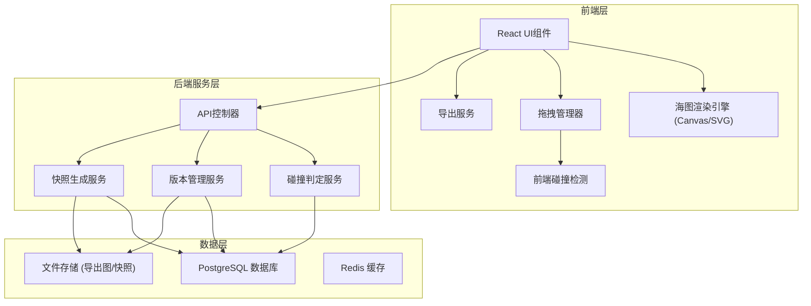
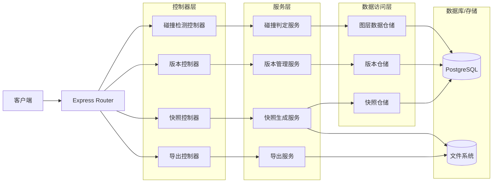
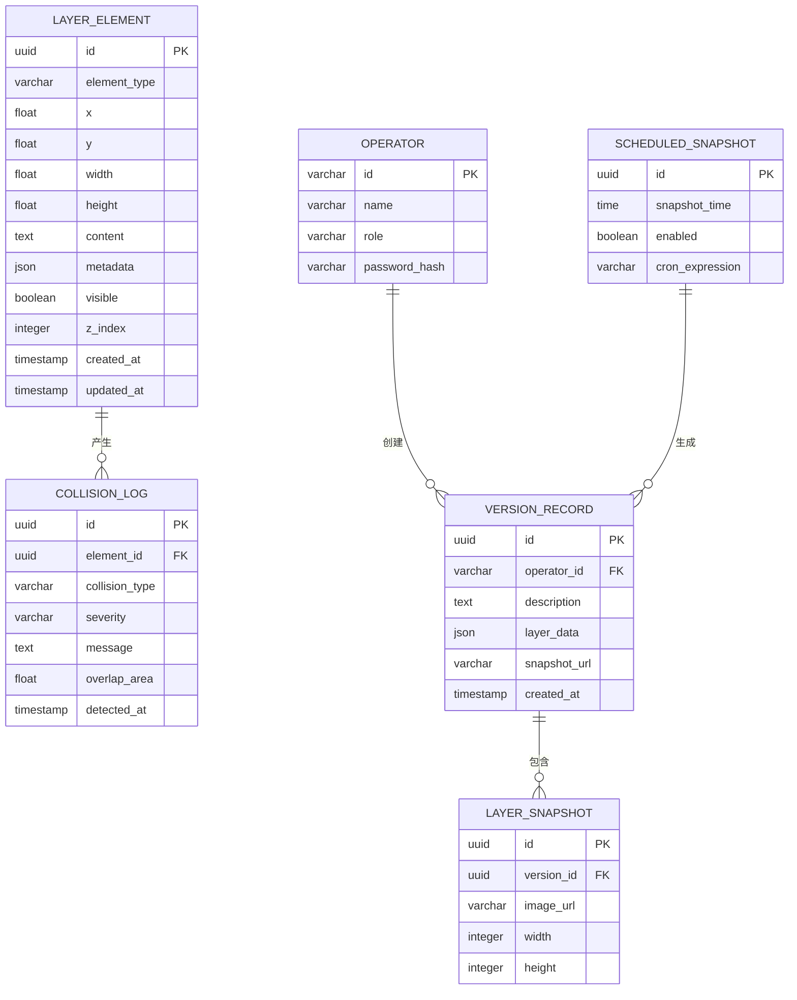

## 1. 架构设计



## 2. 技术描述

- **前端框架**: React@18 + TypeScript
- **构建工具**: Vite@5
- **样式方案**: TailwindCSS@3 + CSS Variables
- **海图渲染**: HTML5 Canvas + Konva.js (用于高性能图形绘制和拖拽)
- **状态管理**: Zustand (轻量级状态管理)
- **后端框架**: Express@4 + TypeScript
- **数据库**: PostgreSQL@15 (存储图层数据、版本记录)
- **文件存储**: 本地文件系统 (存储导出图片和快照)
- **实时通信**: Socket.io (用于实时碰撞检测结果推送)
- **导出功能**: html2canvas + jsPDF

## 3. 路由定义

| 路由 | 用途 |
|------|------|
| / | 海图工作台主界面 |
| /versions | 版本管理页面 |
| /snapshots | 快照查看页面 |
| /settings | 系统设置页面 |
| /api/collision/check | 后端碰撞检测API |
| /api/version/save | 保存版本API |
| /api/snapshot/generate | 生成快照API |
| /api/export/chart | 导出值班图API |

## 4. API 定义

### 4.1 TypeScript 类型定义

```typescript
// 图层元素基础类型
interface LayerElement {
  id: string;
  type: 'channel_note' | 'warning_zone' | 'anchorage' | 'berth_point';
  x: number;
  y: number;
  width: number;
  height: number;
  text: string;
  visible: boolean;
  opacity: number;
  zIndex: number;
}

// 航道注记
interface ChannelNote extends LayerElement {
  type: 'channel_note';
  channelId: string;
  depth?: number;
}

// 临时警示区
interface WarningZone extends LayerElement {
  type: 'warning_zone';
  warningType: 'construction' | 'danger' | 'restricted';
  startTime: Date;
  endTime: Date;
}

// 锚地编号
interface Anchorage extends LayerElement {
  type: 'anchorage';
  anchorageNo: string;
  capacity?: number;
}

// 计划靠泊点
interface BerthPoint extends LayerElement {
  type: 'berth_point';
  berthNo: string;
  vesselName?: string;
  eta?: Date;
}

// 碰撞检测结果
interface CollisionResult {
  elementId: string;
  elementText: string;
  collisionType: 'main_route' | 'key_point' | 'other_element';
  severity: 'warning' | 'danger';
  message: string;
  overlapArea: number;
}

// 版本记录
interface VersionRecord {
  id: string;
  timestamp: Date;
  operator: string;
  description: string;
  layerData: LayerElement[];
  snapshotUrl?: string;
}
```

### 4.2 API 请求响应

```typescript
// POST /api/collision/check
interface CollisionCheckRequest {
  elements: LayerElement[];
  mainRoutes: Path[];
  keyPoints: Point[];
}

interface CollisionCheckResponse {
  success: boolean;
  collisions: CollisionResult[];
  checkTime: number;
}

// POST /api/version/save
interface SaveVersionRequest {
  layerData: LayerElement[];
  operator: string;
  description: string;
  snapshot?: string;
}

interface SaveVersionResponse {
  success: boolean;
  versionId: string;
  timestamp: Date;
}

// GET /api/export/chart
interface ExportChartRequest {
  format: 'png' | 'pdf';
  includeTimestamp: boolean;
  includeOperator: boolean;
  operatorName: string;
}

interface ExportChartResponse {
  success: boolean;
  downloadUrl: string;
  filename: string;
}
```

## 5. 后端服务架构



## 6. 数据模型

### 6.1 ER 图



### 6.2 DDL 语句

```sql
-- 操作员表
CREATE TABLE operators (
    id VARCHAR(50) PRIMARY KEY,
    name VARCHAR(100) NOT NULL,
    role VARCHAR(20) NOT NULL CHECK (role IN ('dispatcher', 'admin')),
    password_hash VARCHAR(255) NOT NULL,
    created_at TIMESTAMP DEFAULT CURRENT_TIMESTAMP
);

-- 图层元素表
CREATE TABLE layer_elements (
    id UUID PRIMARY KEY DEFAULT gen_random_uuid(),
    element_type VARCHAR(20) NOT NULL CHECK (element_type IN ('channel_note', 'warning_zone', 'anchorage', 'berth_point')),
    x FLOAT NOT NULL,
    y FLOAT NOT NULL,
    width FLOAT NOT NULL,
    height FLOAT NOT NULL,
    content TEXT NOT NULL,
    metadata JSONB,
    visible BOOLEAN DEFAULT true,
    opacity FLOAT DEFAULT 1.0,
    z_index INTEGER DEFAULT 0,
    created_at TIMESTAMP DEFAULT CURRENT_TIMESTAMP,
    updated_at TIMESTAMP DEFAULT CURRENT_TIMESTAMP
);

-- 碰撞日志表
CREATE TABLE collision_logs (
    id UUID PRIMARY KEY DEFAULT gen_random_uuid(),
    element_id UUID REFERENCES layer_elements(id),
    collision_type VARCHAR(20) NOT NULL,
    severity VARCHAR(10) NOT NULL CHECK (severity IN ('warning', 'danger')),
    message TEXT,
    overlap_area FLOAT,
    detected_at TIMESTAMP DEFAULT CURRENT_TIMESTAMP
);

-- 版本记录表
CREATE TABLE version_records (
    id UUID PRIMARY KEY DEFAULT gen_random_uuid(),
    operator_id VARCHAR(50) REFERENCES operators(id),
    description TEXT,
    layer_data JSONB NOT NULL,
    snapshot_url VARCHAR(500),
    created_at TIMESTAMP DEFAULT CURRENT_TIMESTAMP
);

-- 定时快照配置表
CREATE TABLE scheduled_snapshots (
    id UUID PRIMARY KEY DEFAULT gen_random_uuid(),
    snapshot_time TIME NOT NULL,
    enabled BOOLEAN DEFAULT true,
    cron_expression VARCHAR(100),
    created_at TIMESTAMP DEFAULT CURRENT_TIMESTAMP
);

-- 索引
CREATE INDEX idx_layer_elements_type ON layer_elements(element_type);
CREATE INDEX idx_collision_logs_detected ON collision_logs(detected_at DESC);
CREATE INDEX idx_version_records_created ON version_records(created_at DESC);

-- 初始数据
INSERT INTO operators (id, name, role, password_hash) VALUES
('dispatcher01', '张调度', 'dispatcher', '$2b$10$...'),
('admin01', '李管理员', 'admin', '$2b$10$...');
```
