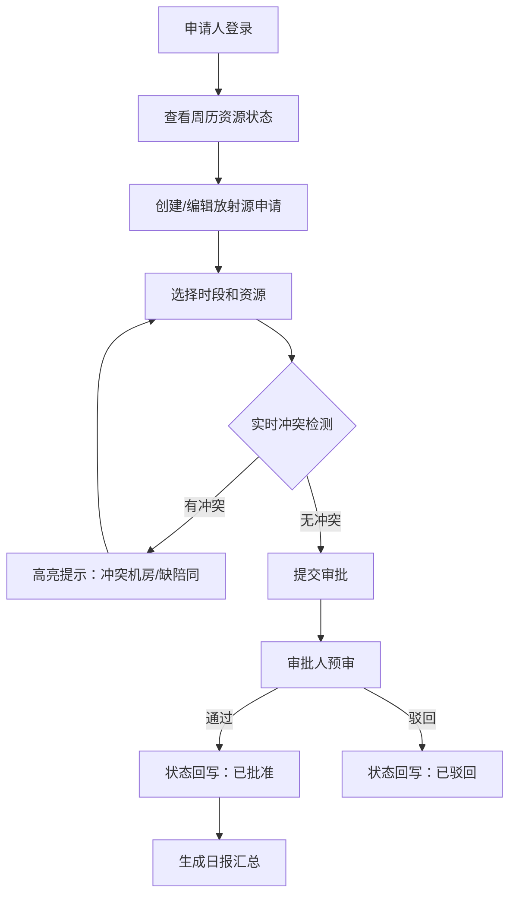

## 1. 产品概述

医院放疗科领用预审台系统，解决放射源申请、机房占用、转运窗口和陪同人员排班的统一管理问题。通过同一屏展示和实时冲突检测，提升审批效率，避免资源冲突。

- 主要目的：整合放射治疗资源管理，实现多维度资源冲突实时预警
- 目标用户：放疗科医生、物理师、技术员、行政审批人员
- 核心价值：减少人工核对错误，缩短审批周期，提高资源利用率

## 2. 核心功能

### 2.1 用户角色

| 角色 | 登录方式 | 核心权限 |
|------|----------|----------|
| 申请人 | 工号登录 | 提交放射源申请、修改时段、查看状态 |
| 审批人 | 工号登录 | 审批申请、调整资源、查看汇总报表 |
| 管理员 | 工号登录 | 人员管理、机房配置、系统设置 |

### 2.2 功能模块

1. **预审台主页面**：日历排布、多资源视图、冲突预警、申请列表
2. **申请编辑弹窗**：时段选择、放射源选择、机房选择、陪同人员分配
3. **日报汇总面板**：每日申请统计、资源利用率、异常记录导出

### 2.3 页面详情

| 页面名称 | 模块名称 | 功能描述 |
|----------|----------|----------|
| 预审台主页 | 周历视图 | 按周展示7天24小时时间轴，支持拖拽调整申请时段 |
| 预审台主页 | 资源面板 | 分栏展示机房占用、放射源库存、陪同人员排班状态 |
| 预审台主页 | 冲突预警条 | 实时高亮显示冲突机房（红色）和缺陪同人员（黄色） |
| 申请编辑 | 表单提交 | 选择放射源类型、机房、时段，自动匹配陪同人员 |
| 日报汇总 | 统计面板 | 当日申请数量、审批通过率、资源利用率统计图表 |

## 3. 核心流程

申请人在预审台提交放射源使用申请，选择时段后系统自动校验：机房是否空闲、放射源是否可用、是否有足够陪同人员。如有冲突，系统实时高亮提示，申请人调整后重新提交。审批人查看申请列表，一键通过或驳回。

## 4. 用户界面设计

### 4.1 设计风格

- 主色调：深青色 #0F766E（专业医疗感）
- 辅助色：红色 #EF4444（冲突预警）、黄色 #F59E0B（缺人提醒）、绿色 #10B981（正常状态）
- 字体：Noto Sans SC 中文显示字体，数字使用等宽字体
- 按钮风格：圆角 4px，悬停时轻微上浮和阴影
- 布局：左侧导航 + 右侧内容区，采用卡片式模块化布局
- 图标：使用线条风格图标，统一尺寸 18px

### 4.2 页面设计概述

| 页面名称 | 模块名称 | UI元素 |
|----------|----------|--------|
| 预审台主页 | 周历时间轴 | 7列网格布局、时间刻度60px高度、事件卡片拖拽交互、悬停详情气泡 |
| 预审台主页 | 状态面板 | 三栏等宽布局、状态色块标识、数字统计大字显示、滚动列表 |
| 预审台主页 | 冲突预警条 | 顶部固定位置、动态闪烁动画、点击跳转定位冲突位置 |
| 申请编辑弹窗 | 表单区域 | 分步表单、日期时间选择器、下拉选择框、实时校验反馈 |
| 日报汇总 | 统计图表 | 横向柱状图、环形占比图、数据表格、导出按钮 |

### 4.3 响应式

- 桌面端设计为主（1920x1080）
- 时间轴区域最小宽度1200px，低于此宽度出现横向滚动条
- 状态面板在小屏幕下转为垂直堆叠布局
- 触控设备支持手势滑动切换周视图

