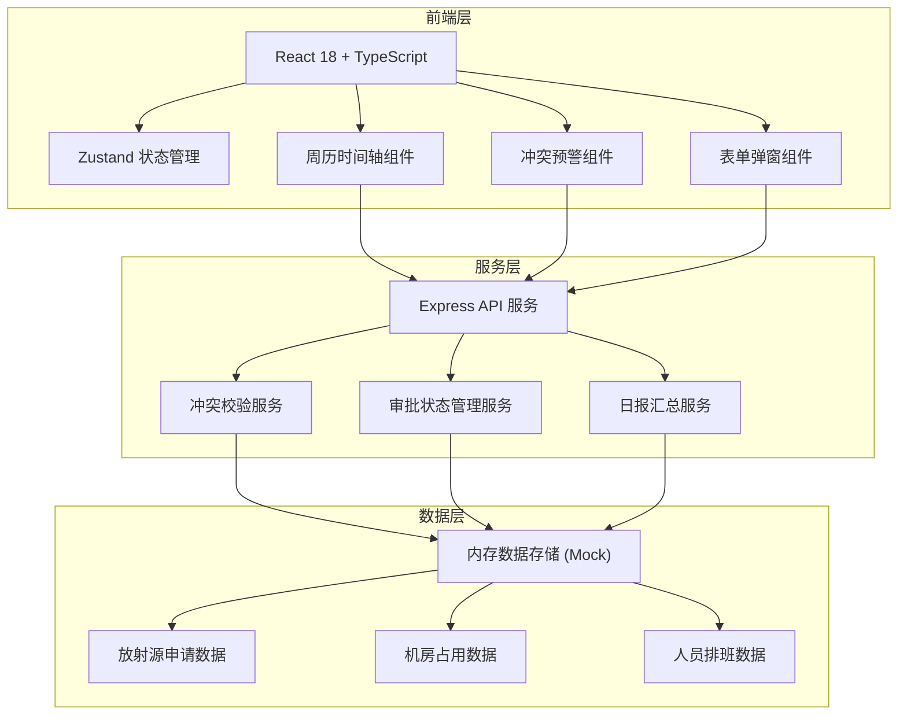
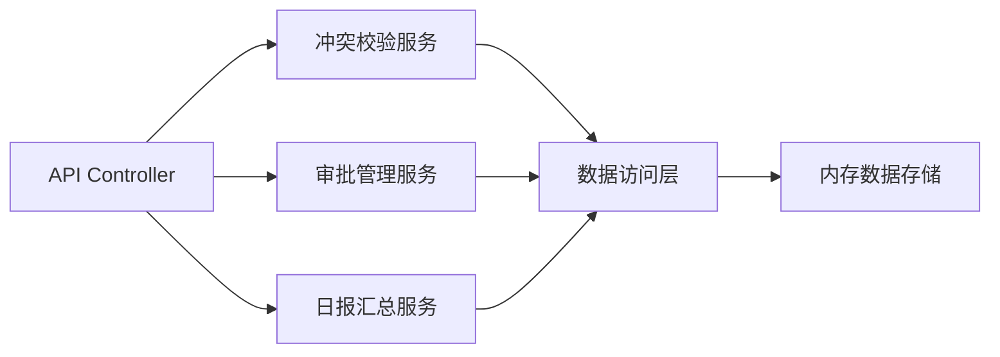
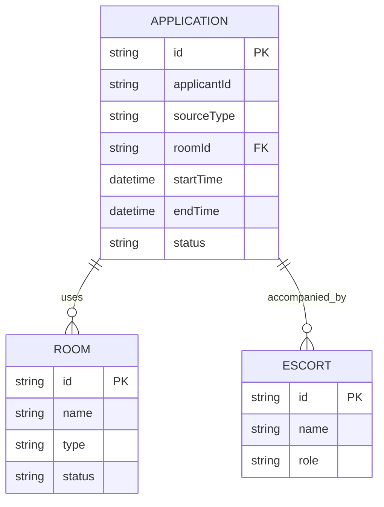

## 1. 架构设计



## 2. 技术描述

- 前端：React@18 + TypeScript + Vite + TailwindCSS@3 + Zustand
- 后端：Express@4 + TypeScript
- 数据存储：内存Mock数据（演示用，实际可替换为PostgreSQL）
- 图标库：lucide-react
- 初始化工具：vite-init (react-express-ts模板)

## 3. 路由定义

| 路由 | 用途 |
|------|------|
| / | 预审台主页面 - 周历视图和资源面板 |
| /daily-report | 日报汇总页面 - 统计图表和数据导出 |

## 4. API 定义

### 4.1 类型定义

```typescript
// 放射源申请
interface RadiationSourceApplication {
  id: string;
  applicantId: string;
  applicantName: string;
  sourceType: string;
  roomId: string;
  startTime: Date;
  endTime: Date;
  escorts: string[];
  status: 'pending' | 'approved' | 'rejected';
  createdAt: Date;
}

// 机房
interface Room {
  id: string;
  name: string;
  type: string;
  status: 'available' | 'maintenance';
}

// 陪同人员
interface Escort {
  id: string;
  name: string;
  role: string;
  schedule: { date: string; available: boolean }[];
}

// 冲突检测结果
interface ConflictResult {
  hasConflict: boolean;
  roomConflicts: string[];
  escortShortages: string[];
  sourceConflicts: string[];
}

// 日报汇总
interface DailyReport {
  date: string;
  totalApplications: number;
  approvedCount: number;
  rejectedCount: number;
  pendingCount: number;
  roomUtilization: { roomId: string; utilization: number }[];
  conflictCount: number;
}
```

### 4.2 API 端点

| 方法 | 路径 | 描述 | 请求体 | 响应 |
|------|------|------|--------|------|
| GET | /api/applications | 获取申请列表 | - | Application[] |
| POST | /api/applications | 创建申请 | ApplicationCreate | Application |
| PUT | /api/applications/:id | 更新申请 | ApplicationUpdate | Application |
| DELETE | /api/applications/:id | 删除申请 | - | { success: boolean } |
| POST | /api/applications/:id/approve | 审批通过 | - | Application |
| POST | /api/applications/:id/reject | 审批驳回 | { reason: string } | Application |
| POST | /api/conflicts/check | 冲突检测 | { startTime, endTime, roomId, excludeId? } | ConflictResult |
| GET | /api/rooms | 获取机房列表 | - | Room[] |
| GET | /api/escorts | 获取陪同人员 | - | Escort[] |
| GET | /api/reports/daily | 日报汇总 | { date? } | DailyReport |

## 5. 服务层架构



## 6. 数据模型

### 6.1 ER 图



### 6.2 初始Mock数据

- 机房：3个放疗机房（直线加速器机房1/2/3）
- 陪同人员：8名物理师/技术员轮班
- 放射源类型：钴-60、铱-192、碘-125
- 预置5条演示申请数据（含1条冲突示例）

